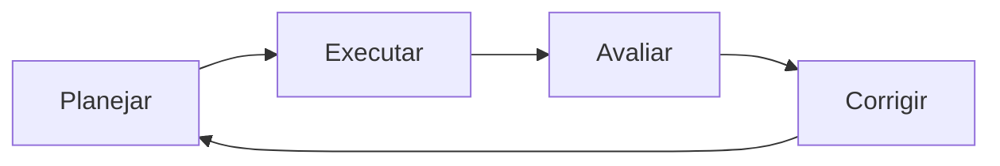

# Administração pública em uma página

## Ciclo essencial

1. **Planejar:** definir objetivo, indicador e recursos.
2. **Executar:** realizar as ações e registrar evidências.
3. **Avaliar:** comparar resultado e objetivo.
4. **Corrigir:** incorporar o aprendizado ao novo ciclo.

| Termo | Ideia central |
| --- | --- |
| Eficiência | Relação entre recursos e entregas |
| Eficácia | Alcance dos objetivos |
| Efetividade | Transformação produzida na realidade |

Memorize a taxa de acerto $T = \frac{a}{n} \times 100$.



```text
Objetivo -> indicador -> evidência -> decisão
```
