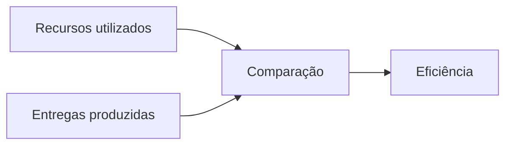

## Passo a passo

1. Identifique os **recursos utilizados**: pessoas, tempo, orçamento ou insumos.
2. Identifique as **entregas produzidas**: produtos ou serviços efetivamente entregues.
3. Compare os dois elementos. A relação entre meios e entregas caracteriza a **eficiência**.

Uma forma compacta de representar a ideia é $E = \frac{\text{entregas}}{\text{recursos}}$.

