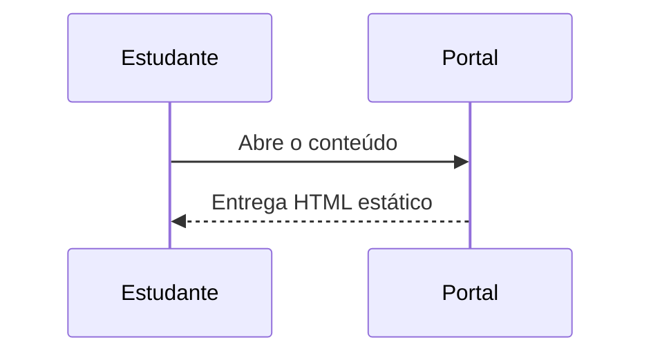

# Fundamentos de administração pública

Este material demonstra **leitura longa**, ~~uma formulação superada~~ e um endereço automático: https://concursos.helio.me.

## Revisão orientada

- [x] Diferenciar eficiência de eficácia.
- [ ] Revisar os princípios constitucionais.

| Conceito | Pergunta de controle |
| --- | --- |
| Eficiência | Os recursos foram bem utilizados? |
| Eficácia | O objetivo foi alcançado? |

Uma taxa de acerto pode ser escrita como $T = \frac{a}{n} \times 100$.

$$
\operatorname{pontuacao} = \sum_{i=1}^{n} \mathbb{1}(r_i = g_i)
$$

```ts
function percentual(acertos: number, total: number): number {
  return total === 0 ? 0 : (acertos / total) * 100;
}
```




## Síntese

O ciclo de planejamento, execução e avaliação ajuda a transformar objetivos em resultados verificáveis.
