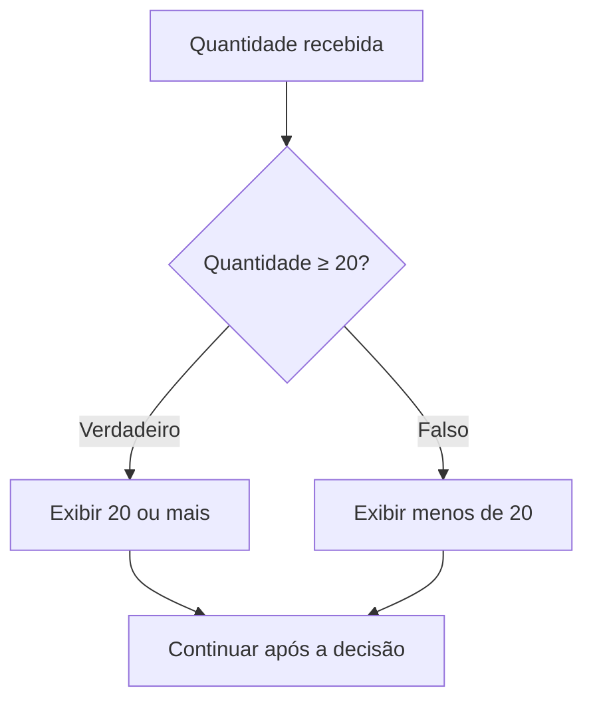

# Noções de algoritmos

Em uma situação hipotética, Ana recebe uma lista com as quantidades de três caixas: **10, 25 e 17**. Precisa informar o total de unidades e quantas caixas têm pelo menos 20 unidades. “Confira as caixas” descreve uma intenção. Para alguém executar a tarefa do mesmo modo, faltam as operações, a ordem e o critério de contagem.

Uma solução é começar com dois totais zerados, percorrer a lista, somar cada quantidade e acrescentar uma caixa à contagem quando sua quantidade for maior ou igual a 20. Ao terminar, informar os resultados. Esse procedimento já permite reconhecer o núcleo de um **algoritmo**: instruções organizadas para resolver uma tarefa.

O edital pede noções de algoritmos, sem determinar linguagem de programação. Os exemplos usam uma notação didática em português, cuja interpretação será indicada. O objetivo é entender e acompanhar a lógica, sem depender de regras de uma linguagem específica.

## 1. Da tarefa às instruções

Um algoritmo descreve passos suficientemente precisos para serem executados e produzir o resultado pretendido. No modelo introdutório de uma tarefa que deve terminar, ele deve encerrar a execução após um número finito de passos para as entradas admitidas. Uma repetição pode ter muitas execuções; isso não autoriza continuar indefinidamente sem concluir a tarefa.

Precisão também importa: “some cada quantidade ao total” indica uma operação; “melhore o resultado” deixa o executante escolher o que fazer. Um procedimento pode estar bem descrito e ainda calcular o resultado errado. Portanto, **clareza das instruções, término e correção** são requisitos que precisam ser examinados, e não efeitos automáticos de escrever uma lista.

Três papéis organizam a solução:

- **entrada:** os dados recebidos ou disponibilizados para a tarefa; no exemplo, a lista de quantidades;
- **processamento:** as operações e decisões sobre esses dados; somar e comparar com 20;
- **saída:** os resultados apresentados; total de unidades e número de caixas que atendem ao critério.

Entrada não se limita ao teclado, nem saída à impressão em papel. Um algoritmo pode receber dados de um arquivo e produzir um valor para outra etapa. Também pode trabalhar com valores previamente fixados, sem solicitar novos dados ao usuário. É necessário especificar quais entradas são admitidas: aqui, uma lista finita de quantidades inteiras não negativas. Uma quantidade negativa exige uma resposta definida, caso o procedimento pretenda tratá-la.

**Algoritmo e programa têm papéis distintos.** O algoritmo expressa a solução; um programa a implementa com instruções de uma linguagem e regras de execução. A mesma solução pode ter implementações em linguagens diferentes. Uma descrição em português ou um desenho pode representar a lógica sem, por si só, ser um programa executável por um computador. Um algoritmo também não exige inteligência artificial.

## 2. Guardar valores e executar uma sequência

Para acompanhar o procedimento, precisamos guardar resultados intermediários. Uma **variável** tem um nome e um valor atual que pode mudar durante a execução. No exemplo, `total` guarda a soma acumulada e `grandes` guarda a contagem de caixas com pelo menos 20 unidades. Uma **constante** representa um valor definido como fixo, que não pode ser alterado durante aquela execução, como um limite fixado em 20. Uma variável pode conservar o mesmo valor em um percurso; isso, por si só, não a transforma em constante.

Os valores podem ser números, textos ou resultados lógicos, como verdadeiro e falso. As operações devem ser adequadas aos valores usados: somar quantidades é diferente de juntar textos. Os tipos disponíveis e suas regras exatas dependem da linguagem ou da notação adotada.

Neste material, a seta `←` indica **atribuição**: calcular a expressão à direita usando os valores atuais e guardar o resultado na variável à esquerda. Assim:

```text
total ← 0
total ← total + 10
```

Primeiro, `total` recebe zero. Depois, a expressão `total + 10` usa esse zero e produz 10; a variável passa a guardar 10. A atribuição substitui o valor anterior. Ela não guarda automaticamente todo o histórico, nem afirma uma igualdade matemática permanente entre os dois lados.

Em uma **sequência**, as instruções são executadas na ordem indicada. Observe:

```text
x ← 2
y ← x + 3
x ← y × 2
```

O símbolo `×` representa multiplicação. Após a primeira linha, `x` vale 2. A segunda usa esse valor e atribui 5 a `y`. A terceira usa `y = 5` e atribui 10 a `x`. **Ao final, `x = 10` e `y = 5`.** Mudar `x` não recalcula retroativamente `y`. Trocar a ordem das instruções também pode mudar o resultado ou fazer uma expressão depender de um valor ainda não definido.

Para somar ou multiplicar, respeite os parênteses; na notação usada, multiplicação e divisão precedem adição e subtração. Por exemplo, `2 + 3 × 4` resulta em 14, enquanto `(2 + 3) × 4` resulta em 20.

## 3. Escolher um caminho: decisão

Uma decisão avalia uma **condição**, expressão cujo resultado é verdadeiro ou falso, e seleciona as ações correspondentes. Em nossas condições, `=` compara igualdade, `≠` compara diferença, `>` e `<` indicam desigualdade estrita, e `≥` e `≤` incluem a igualdade. Isso difere da atribuição, representada por `←`.

Para contar uma caixa com pelo menos 20 unidades:

```text
se quantidade ≥ 20 então
    grandes ← grandes + 1
fim se
```

Essa decisão é **simples**: executa o comando interno se a condição for verdadeira; caso contrário, segue após `fim se`. A quantidade 20 atende ao critério. Substituir `≥` por `>` excluiria exatamente esse limite.

Uma decisão **composta** inclui uma alternativa para a condição falsa:

```text
se quantidade ≥ 20 então
    exiba "20 ou mais"
senão
    exiba "menos de 20"
fim se
```

Cada avaliação escolhe um dos dois ramos. As instruções que estiverem depois de `fim se` continuam a sequência, independentemente do ramo escolhido.

É possível combinar condições. **E** exige que ambas sejam verdadeiras; **OU**, no sentido inclusivo usado aqui, exige ao menos uma verdadeira e aceita ambas verdadeiras; **NÃO** inverte o resultado lógico. Assim, `(quantidade ≥ 20) E (quantidade ≤ 30)` aceita de 20 a 30, incluindo os extremos. Substituir E por OU nessa expressão aceitaria, inclusive, 10: a segunda comparação seria verdadeira. Os parênteses deixam explícito o agrupamento.

Também é necessário observar a organização das decisões. Dois comandos `se` independentes avaliam suas condições separadamente e podem executar duas ações. Já uma cadeia `se ... senão se ... senão` escolhe o primeiro ramo cuja condição seja verdadeira; os seguintes dessa cadeia não são executados. Se a primeira condição for `quantidade ≥ 10`, uma caixa com 25 unidades já entra nesse ramo, mesmo que o ramo seguinte teste `quantidade ≥ 20`. A ordem dos critérios altera a classificação quando eles se sobrepõem.

Uma decisão dentro de outra é **aninhada**: a interna só é alcançada pelo caminho que contém suas instruções. A posição do bloco, indicada pela indentação e pelos delimitadores, ajuda a acompanhar o que realmente será executado.

## 4. Repetir com condição e avanço

Um **laço de repetição** permite executar um bloco de instruções várias vezes. Cada execução do bloco é uma **iteração**. É preciso acompanhar a inicialização, a condição, as ações do bloco e a mudança que permite concluir a repetição.

### ENQUANTO: testar antes

```text
i ← 1
soma ← 0
enquanto i ≤ 3 faça
    soma ← soma + i
    i ← i + 1
fim enquanto
exiba soma, i
```

A condição é testada **antes** de cada execução do bloco. Se já for falsa na primeira avaliação, o bloco executará zero vezes.

No exemplo, os valores usados na soma são 1, 2 e 3. Depois da terceira execução, `soma = 6` e `i = 4`. O novo teste `4 ≤ 3` é falso: a repetição termina e esses dois valores são exibidos. O último valor que passou no teste foi 3; o valor da variável depois de sair do laço é 4.

Retirar `i ← i + 1` mantém `i = 1`. Como o bloco não muda a condição, ela continua verdadeira e a execução não chega à saída. Já iniciar `i` com 4 faz o teste inicial falhar: `soma` permanece zero. Uma condição de parada escrita no texto precisa ser efetivamente alcançada.

### PARA: controlar a contagem ou percorrer itens

Na convenção didática `para i de 1 até 3`, os extremos estão incluídos e o avanço é de uma unidade: o bloco é executado para 1, 2 e 3. Outras notações podem definir limites e avanços de outra forma; siga a regra indicada no enunciado.

Também usaremos `para cada quantidade na lista`, que processa cada item uma vez, na ordem da lista. Uma lista vazia não executa esse bloco. Essa representação explicita o percurso sem exigir detalhes de armazenamento ou índices de uma linguagem.

### REPITA...ATÉ: testar depois

```text
i ← 1
repita
    exiba i
    i ← i + 1
até i > 3
```

Primeiro o bloco executa; depois a condição é avaliada. O laço **para quando a condição após ATÉ é verdadeira** e continua quando ela é falsa. No exemplo, são exibidos 1, 2 e 3; `i` termina valendo 4.

Esse bloco executa pelo menos uma vez, mesmo que a condição de parada pudesse ser verdadeira antes da primeira execução. Por isso, mover o teste do início para o fim pode alterar o comportamento. Não confunda “continuar enquanto verdadeiro” com “repetir até verdadeiro”: são sentidos diferentes para o teste.

## 5. Somar e contar no mesmo percurso

Voltemos à lista hipotética de Ana. **Contador** é uma variável usada para contar ocorrências, como acrescentar uma unidade por caixa que atende ao critério. **Acumulador** reúne valores sucessivos, como acrescentar a quantidade de cada caixa à soma. São papéis das variáveis no procedimento.

```text
total ← 0
grandes ← 0
para cada quantidade na lista [10, 25, 17] faça
    total ← total + quantidade
    se quantidade ≥ 20 então
        grandes ← grandes + 1
    fim se
fim para
exiba total, grandes
```

O **rastreamento**, também chamado teste de mesa, acompanha manualmente as instruções e registra o estado dos valores. Inicializamos os dois resultados em zero e seguimos a ordem:

| Item processado | Comparação com 20 | `total` após o item | `grandes` após o item |
|---|---|---|---|
| 10 | Falsa | 10 | 0 |
| 25 | Verdadeira | 35 | 1 |
| 17 | Falsa | 52 | 1 |

A saída é **52 e 1**. Somar uma unidade a `total` contaria caixas; somar a quantidade a `grandes` acumularia unidades das caixas selecionadas. Nenhuma dessas trocas realiza os dois objetivos originais.

A inicialização ocorre **antes** do laço. Se `total ← 0` fosse executado no início de cada iteração, a soma anterior seria apagada e, nesse exemplo, a saída do total seria somente 17. Para uma lista vazia, os valores inicializados continuariam zero e seriam exibidos normalmente.

## 6. Representar a mesma lógica

A descrição em linguagem comum, o pseudocódigo e o fluxograma são formas de representar um algoritmo. A representação deve conservar as operações, os caminhos e as condições da solução.

**Pseudocódigo** é uma descrição estruturada, próxima da leitura humana, que ajuda a expor a lógica. Não existe uma única sintaxe universal. As palavras, símbolos e delimitadores dos exemplos são convenções declaradas; em uma questão, respeite as convenções informadas. A ausência de uma linguagem obrigatória não torna instruções ambíguas aceitáveis.

**Fluxograma** representa o fluxo com símbolos e setas. Nos exemplos tradicionais consultados, retângulos representam operações, losangos representam decisões, e as setas indicam o caminho. Na leitura, observe os rótulos das saídas do losango e onde os caminhos se encontram ou retornam. Um retorno pode compor uma repetição; ter duas saídas de uma decisão não obriga executar ambas.

O desenho a seguir representa somente a classificação de uma quantidade já recebida:



Ele corresponde à decisão composta da seção 3. A soma e o percurso da lista não aparecem nesse desenho: uma representação parcial deve ter seu alcance identificado.

## 7. Conferir a solução e seus limites

Antes de aceitar o resultado, compare o procedimento com a tarefa e acompanhe entradas diferentes. Para a regra “pelo menos 20”, testar 19, 20 e 21 verifica o comportamento imediatamente abaixo, exatamente no limite e acima dele. Para o percurso, uma lista vazia, uma lista com um item e uma lista com vários itens verificam situações distintas. Zero pode ser um dado válido; não deve ser confundido automaticamente com ausência de dado.

Os casos escolhidos precisam respeitar o domínio definido ou examinar a resposta prevista para entradas inválidas. Se o algoritmo só admite quantidades não negativas, não se pode concluir que ele trata quantidades negativas apenas porque possui uma decisão sobre 20. A validação dessa entrada exigiria uma regra própria.

**Depuração** é localizar e corrigir defeitos na solução ou implementação, como um limite errado, uma inicialização no lugar incorreto ou um avanço ausente. Depois da correção, é preciso conferir seus efeitos. Passar em alguns testes aumenta a evidência nesses casos, mas não prova, sozinho, correção para todas as entradas possíveis.

Por fim, fazer menos operações pode melhorar a eficiência, mas não conserta automaticamente uma classificação errada. Primeiro identifique o resultado exigido e as condições de execução; depois avalie como obtê-lo com menos recursos. Para interpretar uma questão, registre os valores iniciais, percorra os comandos na ordem, teste cada condição com os valores daquele momento e só então determine a saída.
