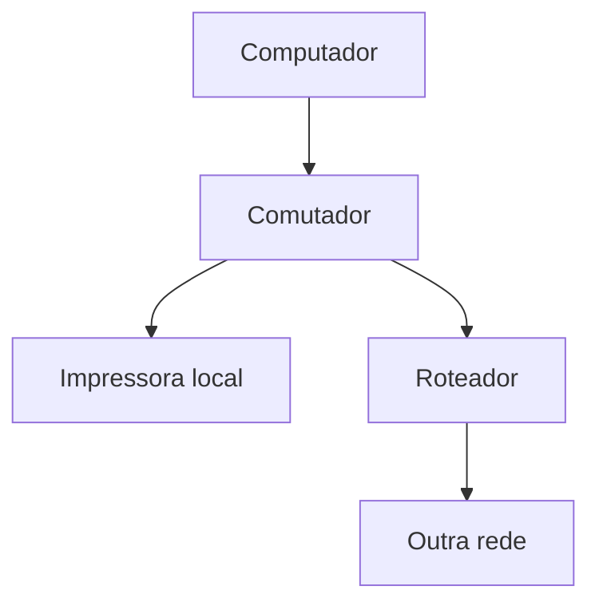

## 1. Imprimir funciona; acessar outro sistema não

**Cenário hipotético:** um computador consegue enviar um documento à impressora do setor, na mesma sub-rede local, mas não acessar um sistema em outra rede. A impressão mostra que alguma comunicação local funciona. Não prova que o caminho externo, a localização do sistema pelo nome e o serviço solicitado estejam funcionando.

Uma **rede de computadores** interliga dispositivos para trocar dados e compartilhar recursos. Um **protocolo** estabelece regras sobre formato, significado e troca das mensagens. Para a comunicação funcionar, conectar os equipamentos é apenas uma parte: precisamos identificar o destino, encaminhar os dados e usar as regras do serviço.

Quando um programa solicita um serviço, ele exerce o papel de **cliente**; o programa que o oferece exerce o de **servidor**. São papéis na comunicação, não modelos obrigatórios de máquina. Um mesmo computador pode solicitar impressão e oferecer arquivos a outros computadores.

Vamos acompanhar o caminho dos dados para distinguir **conexão → endereço → encaminhamento → serviço**. As situações didáticas seguintes também são hipotéticas.

## 2. Quem faz os dados avançarem?

Uma **interface de rede** é o ponto de conexão de um dispositivo, cabeado ou sem fio. Um trecho de comunicação direta entre participantes da rede é um **enlace**. Os dados são organizados em unidades: o **pacote** contém informações para seu encaminhamento entre redes; o **quadro** o transporta no enlace local.

O **comutador**, também chamado **<abbr title="Comutador que encaminha quadros na rede local">switch</abbr>**, conecta dispositivos da rede local. Na função de enlace, aprende endereços <abbr title="Media Access Control — controle de acesso ao meio">MAC</abbr>, que identificam interfaces naquele enlace, e os usa para encaminhar quadros. Isso não significa enviar sempre por uma única porta: destinos desconhecidos ou transmissões coletivas podem exigir envio por várias portas.

O **roteador** interliga redes e encaminha pacotes conforme seus endereços <abbr title="Internet Protocol — protocolo da Internet">IP</abbr>. Consulta rotas, isto é, informações sobre qual saída ou próximo participante usar para alcançar uma rede de destino. O **ponto de acesso sem fio** permite que clientes <abbr title="Tecnologia de rede local sem fio">Wi-Fi</abbr> se conectem à rede local.

No cenário inicial, a comunicação com a impressora permanece na rede local; a comunicação com outra rede exige roteamento. O desenho simplificado mostra essa diferença:

O mesmo aparelho pode reunir comutador, roteador e ponto de acesso. As funções continuam distintas. Também existem comutadores que fazem roteamento; a questão deve ser resolvida pela **função descrita**, não só pelo nome comercial do aparelho.

## 3. Alcance e forma de interligação

Classificar pelo **alcance** responde a “qual área a rede atende?”. Isso não determina sua tecnologia nem se seu acesso é público.

| Tipo | Alcance característico | Exemplo hipotético |
|---|---|---|
| <abbr title="Local Area Network — rede de área local">LAN</abbr> | local, como prédio ou campus | computadores e impressoras do setor |
| <abbr title="Metropolitan Area Network — rede de área metropolitana">MAN</abbr> | escala de cidade ou região metropolitana | unidades distribuídas pela cidade |
| <abbr title="Wide Area Network — rede de longa distância">WAN</abbr> | área geográfica ampla | ligação entre unidades em cidades distintas |

Uma <abbr title="Local Area Network — rede de área local">LAN</abbr> pode funcionar sem acesso à Internet. Uma <abbr title="Wide Area Network — rede de longa distância">WAN</abbr> pode ser privada. A **Internet** é a interligação mundial de redes; não é sinônimo de uma única rede local nem de um aplicativo.

**Topologia** descreve como os pontos da rede, chamados **nós**, se interligam. Em **estrela**, as conexões convergem a um ponto central. Sem caminho alternativo, a falha do cabo de uma estação tende a afetar aquela estação; a indisponibilidade do equipamento central pode afetar vários ou todos os participantes ligados a ele. Em **barramento**, há um meio principal compartilhado; em **anel**, as conexões formam um circuito. Alcance e topologia são critérios diferentes.

Ethernet é uma família de tecnologias de rede, usualmente cabeadas, padronizada pelo <abbr title="Institute of Electrical and Electronics Engineers">IEEE</abbr> 802.3. As redes locais <abbr title="Tecnologia de rede local sem fio">Wi-Fi</abbr> usam a família <abbr title="Institute of Electrical and Electronics Engineers">IEEE</abbr> 802.11. Ambas podem participar de uma rede local; “local” não significa obrigatoriamente “com cabo”.

## 4. Endereço: localizar a interface e reconhecer a rede

O **<abbr title="Internet Protocol — protocolo da Internet">IP</abbr>** fornece endereçamento e encaminhamento de pacotes. Seu endereço identifica uma interface no contexto da comunicação. Uma máquina pode ter várias interfaces e endereços; o endereço não é uma identidade pessoal permanente.

Um **bit** é um dígito binário, `0` ou `1`. Um **octeto** reúne oito bits. O **<abbr title="Internet Protocol version 4 — protocolo da Internet versão 4">IPv4</abbr>** usa endereços de **32 bits**, normalmente escritos em quatro octetos decimais, cada um de `0` a `255`, como `192.168.10.50`. O **<abbr title="Internet Protocol version 6 — protocolo da Internet versão 6">IPv6</abbr>** usa **128 bits**; sua forma hexadecimal completa tem oito grupos de números hexadecimais, escritos com os símbolos `0` a `9` e `a` a `f`.

A **máscara** ou o **prefixo** permite reconhecer a parte do endereço que identifica a rede. Em `192.168.10.50/24`, `/24` indica **24 bits iniciais de prefixo**, não 24 computadores. Nesse exemplo, com máscara `255.255.255.0`, os três primeiros octetos identificam a rede. Assim, `192.168.10.60/24` pode estar na mesma sub-rede; `192.168.20.60/24` pertence a outro prefixo. Não basta comparar o último número ou observar que os endereços começam com `192.168`.

O endereço <abbr title="Media Access Control — controle de acesso ao meio">MAC</abbr> tem papel no enlace local; o endereço <abbr title="Internet Protocol — protocolo da Internet">IP</abbr> tem papel no encaminhamento de pacotes. Para um destino remoto, o quadro do primeiro trecho é entregue ao próximo roteador, enquanto o pacote informa seu destino remoto. **Destinatário do próximo trecho e destino da comunicação são perguntas diferentes.**

### 4.1 Endereços privados não significam conteúdo protegido

Há três faixas de uso privado no <abbr title="Internet Protocol version 4 — protocolo da Internet versão 4">IPv4</abbr>:

- `10.0.0.0/8`: de `10.0.0.0` a `10.255.255.255`;
- `172.16.0.0/12`: de `172.16.0.0` a `172.31.255.255`;
- `192.168.0.0/16`: de `192.168.0.0` a `192.168.255.255`.

Esses endereços são válidos em redes privadas, mas não se destinam ao roteamento público global como tais. Podem ser reutilizados em organizações diferentes; sua unicidade deve ser administrada dentro do contexto da rede. **Privado não significa inválido nem criptografado:** o tipo de endereço não impede, por si só, leitura indevida de dados.

## 5. Configurar o computador e encontrar o destino

No exemplo em <abbr title="Internet Protocol version 4 — protocolo da Internet versão 4">IPv4</abbr>, o computador precisa de endereço, máscara e informações para sair de sua rede e consultar nomes. Essa configuração pode ser manual ou fornecida por um servidor **<abbr title="Dynamic Host Configuration Protocol — protocolo de configuração dinâmica de hosts">DHCP</abbr>**. Ele pode distribuir endereço, máscara, roteadores e endereços dos servidores de nomes. **Obter configuração não é obter uma resposta do sistema que se quer acessar.**

O **<abbr title="Roteador usado quando não há rota mais específica para o destino">gateway</abbr> padrão** é o roteador usado como próximo salto quando não existe rota mais específica para o destino. Uma comunicação na mesma sub-rede pode ocorrer diretamente; para um destino fora dela, o computador precisa de uma rota por um roteador. Uma configuração de saída incorreta pode prejudicar o acesso externo mesmo quando a impressão local funciona.

Quando conhecemos o nome do sistema, precisamos obter informações associadas a ele. O **<abbr title="Domain Name System — sistema de nomes de domínio">DNS</abbr>** é um sistema distribuído de nomes e registros. Uma de suas funções é permitir localizar endereços a partir de nomes. Não é o serviço que atribui automaticamente o endereço ao computador do usuário.

Falha na consulta de um nome não apaga automaticamente a comunicação local. E **nome resolvido não prova serviço disponível**: podemos descobrir o endereço correto e ainda encontrar um serviço fora do ar ou um caminho bloqueado. Diagnosticar exige localizar a etapa, não concluir por um único indício que “toda a rede falhou”.

## 6. Encaminhar pacotes e transportar dados são funções distintas

O <abbr title="Internet Protocol — protocolo da Internet">IP</abbr> encaminha pacotes, mas não garante sozinho sua entrega ou ordem. Na **camada de transporte**, protocolos oferecem à aplicação formas diferentes de comunicação entre programas.

O **<abbr title="Transmission Control Protocol — protocolo de controle de transmissão">TCP</abbr>** estabelece uma conexão lógica e oferece um fluxo confiável e ordenado de **bytes**, unidades de oito bits. Usa mecanismos de confirmação e retransmissão para enfrentar perdas. Conexão lógica não é cabo exclusivo, e confiável não significa infalível: falhas persistentes podem impedir a conclusão da comunicação. Tampouco confiabilidade de entrega significa proteção automática do conteúdo contra leitura indevida.

O **<abbr title="User Datagram Protocol — protocolo de datagramas do usuário">UDP</abbr>** envia **datagramas**, mensagens independentes, sem estabelecer previamente uma conexão e sem garantias próprias de entrega e ordenação. Isso não proíbe a aplicação ou outro protocolo de acrescentar mecanismos de confiabilidade. Não conclua que todo uso desse transporte necessariamente perde dados ou é sempre mais rápido.

Uma **porta de transporte** é um número usado para distinguir serviços ou processos na comunicação. Assim, vários serviços podem ser atendidos em um computador com o mesmo endereço <abbr title="Internet Protocol — protocolo da Internet">IP</abbr>. Endereço, porta e nome do serviço não são sinônimos.

As responsabilidades já vistas podem ser recuperadas assim:

| Pergunta | Função principal |
|---|---|
| Como obter configuração no exemplo de rede? | <abbr title="Dynamic Host Configuration Protocol — protocolo de configuração dinâmica de hosts">DHCP</abbr> |
| Que informação está associada ao nome? | <abbr title="Domain Name System — sistema de nomes de domínio">DNS</abbr> |
| Como endereçar e encaminhar pacotes? | <abbr title="Internet Protocol — protocolo da Internet">IP</abbr> |
| Como oferecer fluxo ordenado com recuperação de perdas? | <abbr title="Transmission Control Protocol — protocolo de controle de transmissão">TCP</abbr> |
| Como enviar mensagens sem essas garantias próprias? | <abbr title="User Datagram Protocol — protocolo de datagramas do usuário">UDP</abbr> |

## 7. Conexão sem fio não é acesso completo ao serviço

O identificador **<abbr title="Service Set Identifier — identificador da rede sem fio">SSID</abbr>** é o nome lógico da rede sem fio. Identificá-la não é conhecer sua senha nem estar autorizado a usar todo serviço disponível. O acesso e a proteção da comunicação são questões diferentes do nome mostrado.

Conectar-se por <abbr title="Tecnologia de rede local sem fio">Wi-Fi</abbr> também não garante acesso à Internet: a rede pode permitir somente comunicação local ou estar sem uma saída externa funcional. O mesmo computador pode continuar imprimindo no setor nessa condição.

A navegação e a busca desenvolvem o uso dos serviços na Internet; segurança da informação desenvolve proteção, ameaças e controles. A ponte indispensável aqui é reconhecer que **conectividade, endereço, funcionamento do serviço e autorização são condições distintas**.
