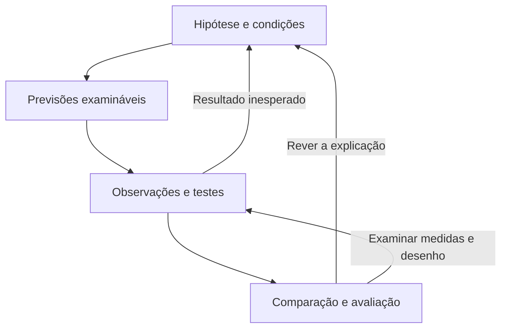

## 1. Uma diferença observada ainda pede explicação

Em um laboratório hipotético, duas porções do mesmo material secam em tempos diferentes. Uma foi mantida a 30 graus Celsius; a outra, a 20. A diferença sugere uma pergunta: **foi a temperatura que alterou a secagem?** Talvez as porções tivessem massas diferentes, recebessem fluxos de ar distintos ou fossem medidas de modos diferentes.

A investigação científica transforma essa dúvida em uma pergunta examinável e procura evidências capazes de distinguir explicações. Seu núcleo é **confrontar ideias com observações, usando raciocínio e procedimentos que possam ser examinados criticamente**.

Um roteiro como “observar, formular hipótese, testar e concluir” ajuda a organizar um estudo. Não é uma receita universal: pesquisas podem começar por uma teoria, um problema prático, dados existentes ou um resultado inesperado; podem voltar à pergunta e mudar o desenho. Também não precisam ocorrer integralmente em laboratório.

## 2. Do tema à pergunta e à hipótese

“Secagem de materiais” é um **tema**, um campo de interesse. O **problema de pesquisa** delimita o que se deseja saber:

> Para porções do material X com a mesma massa inicial, nas condições definidas do estudo, elevar a temperatura de 20 para 30 graus Celsius reduz o tempo de secagem?

A pergunta informa o material, a comparação e o resultado relevante. Consultar o conhecimento anterior ajuda a identificar o que já se sabe e quais explicações são plausíveis; não substitui o teste.

Uma **hipótese científica** é uma proposição explicativa ou sobre uma relação, formulada para ser confrontada com evidências. No cenário:

> Nas condições estudadas, a temperatura mais alta favorece a secagem do material X e reduz seu tempo de secagem.

Ela oferece uma resposta provisória ao problema. “Provisória” significa sujeita a avaliação e revisão; não significa escolha arbitrária ou ideia sem fundamento.

### 2.1. Tornar a hipótese testável

Uma hipótese é testável quando permite identificar observações relevantes que podem apoiá-la ou contrariá-la. A frase “o material seca melhor por uma força que sempre se adapta a qualquer resultado” não fornece esse confronto: qualquer resultado seria acomodado.

Para testar “seca melhor”, precisamos dizer **o que conta como melhora e como será observado**. No exemplo, adotamos como resultado o tempo até a massa deixar de variar acima de um limite previamente definido, medido pelo mesmo procedimento. Traduzir um conceito em critérios e procedimentos observáveis chama-se **operacionalização**.

Testável não significa verdadeira, fácil de testar ou já testada. Tampouco exige observação a olho nu: instrumentos, documentos e registros podem fornecer dados.

### 2.2. Hipótese não é a previsão produzida por ela

A hipótese propõe uma relação ou explicação. A **previsão** indica o resultado esperado em um teste, se a hipótese e as condições assumidas forem adequadas:

> Porções comparáveis mantidas a 30 graus Celsius deverão apresentar menor tempo médio de secagem que as mantidas a 20, pelo critério definido.

O tempo médio resume os tempos das porções; não exige que toda porção de um grupo supere toda porção do outro. Declarar a previsão e os critérios antes de examinar os resultados evita adaptar a pergunta ao resultado encontrado.

| Elemento | Função no cenário |
|---|---|
| Problema | Perguntar se a mudança de temperatura reduz o tempo de secagem. |
| Hipótese | Propor que a temperatura mais alta favorece a secagem nessas condições. |
| Previsão | Esperar menor tempo médio no grupo a 30 graus Celsius. |
| Resultado | Registrar os tempos efetivamente obtidos. |
| Conclusão | Avaliar quanto os resultados apoiam a hipótese, dadas as condições e limitações. |

## 3. O desenho torna a comparação interpretável

O **desenho de pesquisa** é o plano de como obter e analisar evidências para responder à pergunta. Ele relaciona unidades estudadas, medidas, comparações e procedimentos à conclusão pretendida.

No exemplo, a temperatura é a **variável explicativa** cujo efeito investigamos; o tempo de secagem é a **variável resposta** que medimos. Uma variável é uma característica que pode assumir valores diferentes.

### 3.1. Experimento: intervir e comparar

Em um **estudo experimental**, o pesquisador manipula uma condição e observa os resultados. Aqui, distribui porções comparáveis entre as duas temperaturas e procura manter constantes fatores relevantes, como massa inicial, material, umidade e circulação de ar. O grupo a 20 graus Celsius fornece uma condição de comparação; “controle” não precisa significar ausência de qualquer tratamento.

Se apenas o grupo a 30 graus Celsius receber mais ventilação, a diferença de secagem poderá decorrer da temperatura, da ventilação ou de ambas. A ventilação funciona como **fator de confusão**: varia junto da condição investigada e também pode afetar a resposta, dificultando separar as explicações.

Distribuir as porções por sorteio entre as condições ajuda a reduzir diferenças sistemáticas entre grupos. O sorteio não garante grupos perfeitamente idênticos, nem corrige instrumentos inadequados. Usar várias porções permite avaliar a variação dos resultados; repetir muitas vezes um erro de medição não elimina esse erro.

### 3.2. Estudo observacional: investigar sem determinar a exposição

Em um **estudo observacional**, o pesquisador registra condições existentes, sem atribuir a intervenção investigada. Poderia comparar registros de secagem feitos em dias com temperaturas diferentes. Porém, umidade e ventilação também poderiam ter mudado.

Esse estudo pode ser científico e testar previsões. A ausência de manipulação exige atenção especial às explicações alternativas; observar duas características associadas não demonstra, por si só, que uma causou a outra. A escolha do método depende do problema, da possibilidade de intervenção e de limites éticos e práticos.

Dados podem ser quantitativos, expressos por medidas ou contagens, ou qualitativos, como descrições sistematicamente analisadas. A cientificidade não depende de converter toda observação em número.

## 4. Dos resultados à conclusão: até onde a evidência permite ir?

**Observação** é o registro do que foi detectado; **inferência** é a passagem desses dados para uma interpretação. “O grupo apresentou estes tempos” registra um resultado. “A temperatura explica a diferença” é uma inferência que depende do desenho e do confronto com alternativas.

### 4.1. Resultado compatível apoia, mas não encerra a investigação

Se o grupo a 30 graus Celsius apresentar menor tempo médio em uma comparação adequada, haverá apoio à hipótese naquele estudo. Isso não demonstra que ela seja a única explicação possível nem que valha para todos os materiais e situações.

Compare também a variação entre porções e a incerteza das medidas. Uma diferença pequena diante de grande variação exige mais cautela que uma comparação consistente em diferentes testes adequados. Um número isolado não resume a qualidade do desenho.

### 4.2. Resultado contrário exige exame crítico

Se os resultados contrariarem a previsão, a hipótese pode precisar ser rejeitada ou revista. Antes da conclusão, examine também os pressupostos, as condições assumidas para interpretar o teste: a balança funcionava? Os grupos eram comparáveis? O procedimento mediu o que pretendia?

Isso não autoriza proteger a hipótese de todo resultado contrário. Uma explicação auxiliar deve ter fundamento e poder ser examinada; uma desculpa criada para tornar qualquer resultado favorável destrói o confronto empírico, isto é, baseado em observações.

A evidência também pode ser **inconclusiva**: não distinguir suficientemente as explicações. “Não houve apoio suficiente” não equivale a “foi demonstrada a impossibilidade”. O estudo pode gerar uma hipótese nova, que precisará de avaliação própria.

### 4.3. Diferentes raciocínios participam do processo

- **Dedução:** dadas uma hipótese e certas condições, derive uma consequência que deve ocorrer se essas afirmações de partida, chamadas premissas, forem verdadeiras.
- **Indução:** use os casos observados para apoiar uma generalização ou expectativa que pode falhar em outros casos.
- **Abdução:** proponha uma explicação plausível para um resultado e confronte-a com explicações alternativas.

O raciocínio **hipotético-dedutivo** articula a hipótese, suas consequências e o confronto com observações. Não é sinônimo de certeza absoluta nem exige uma sequência cronológica rígida. A <abbr title="Relação em que a conclusão não pode ser falsa se as premissas forem verdadeiras">validade</abbr> dos argumentos é aprofundada em **Argumentação e inferências lógicas**; aqui, o mínimo é perceber que prever um resultado e observá-lo não torna a hipótese necessariamente verdadeira.

O mapa resume relações e retornos possíveis, sem fixar uma ordem obrigatória para toda pesquisa:

## 5. Teoria científica: uma explicação de alcance mais amplo

Uma hipótese costuma focalizar uma relação ou conjunto delimitado de fenômenos. Uma **teoria científica** organiza uma explicação mais ampla, conectando conceitos, relações e evidências e permitindo formular novas hipóteses e previsões. Uma teoria aceita exige apoio consistente de diferentes linhas de evidência; não é um “palpite” por receber esse nome.

A diferença não é uma escada automática “hipótese comprovada → teoria → lei”. **Lei científica** geralmente descreve uma regularidade ou relação sob certas condições; teoria explica e organiza fenômenos. Obter mais evidência não promove mecanicamente uma teoria a lei.

Teorias orientam a escolha de perguntas e métodos, e também são avaliadas por seus resultados e limites. Uma teoria pode ser refinada sem que todo o conhecimento anterior perca utilidade. Admitir revisão não torna todas as explicações igualmente confiáveis: o apoio disponível e o alcance demonstrado continuam diferentes.

## 6. Comunicar também faz parte de investigar

Para que outros examinem uma conclusão, é preciso informar a pergunta, os procedimentos, os dados pertinentes, a análise, as incertezas e os limites. Novos estudos e reanálises podem confirmar, questionar ou delimitar os resultados; não se exige que toda repetição produza números exatamente idênticos.

**Generalizar** é estender uma conclusão para além das unidades observadas. Se somente porções do material X foram estudadas sob condições específicas, uma conclusão sobre qualquer material e qualquer temperatura excede a evidência. O grupo ou conjunto ao qual se pretende aplicar o resultado precisa ser compatível com o estudo.

Falhas sistemáticas na obtenção ou interpretação de dados podem direcionar a conclusão; são os vieses aprofundados em **Viés de pesquisa**. Aqui, retenha o mecanismo básico: uma comparação só esclarece a pergunta se as diferenças relevantes, as medidas e as explicações alternativas forem examinadas.

Para recuperar o núcleo, responda: qual observação poderia contrariar a hipótese? O estudo distingue a explicação das alternativas? O que foi observado e o que foi inferido? A conclusão mantém o alcance que os dados permitem?
