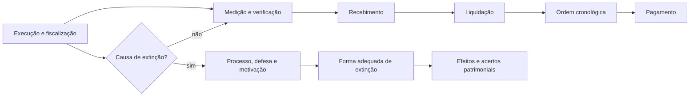

# Extinção, recebimento e pagamento

## Delimitação do assunto

Este assunto examina os arts. 137 a 146 da Lei nº 14.133/2021. O percurso começa pelas causas, formas e efeitos da extinção contratual, passa pelo recebimento de obras, serviços e compras e termina com ordem cronológica, conta vinculada, parcela incontroversa, remuneração variável, antecipação e comunicação tributária na liquidação da despesa.

Infrações e sanções, nulidade dos contratos, meios alternativos de prevenção e resolução de controvérsias e controle das contratações pertencem ao Assunto 130. Aqui, aparecem apenas remissões indispensáveis para não confundir institutos.

O estudo se concentra no regime geral nacional. Orientações do Tribunal de Contas da União (TCU), da Advocacia-Geral da União (AGU) e do Ministério da Gestão e da Inovação em Serviços Públicos (MGI) ajudam a interpretar a lei no âmbito federal, mas não constituem, por si sós, regras automaticamente aplicáveis à organização interna do TCE-MA.

> **Corte de atualização:** legislação e orientações consultadas até 15 de julho de 2026.

## 1. Extinção: término natural e encerramento antecipado

O contrato pode terminar naturalmente quando as obrigações são cumpridas ou o prazo se encerra. A Lei nº 14.133/2021 usa **extinção**, nos arts. 137 a 139, para disciplinar causas e procedimentos capazes de encerrar antecipadamente o vínculo.

Extinção e sanção não são sinônimos. A extinção rompe o vínculo contratual; a sanção pune uma infração administrativa. Um mesmo inadimplemento pode fundamentar as duas respostas, desde que cada uma observe seus pressupostos, competência, motivação, defesa e procedimento próprios.

## 2. Motivos de extinção

O art. 137 enumera nove motivos. Todos devem ser **formalmente motivados nos autos**, com garantia do contraditório e da ampla defesa:

| Motivo | Situação abrangida |
| --- | --- |
| descumprimento contratual | não cumprimento ou cumprimento irregular de normas do edital, cláusulas, especificações, projetos ou prazos |
| desobediência | desatendimento de determinações regulares do fiscal ou de autoridade superior |
| mudança empresarial | alteração social, da finalidade ou da estrutura que restrinja a capacidade de concluir o contrato |
| crise ou fim do contratado | falência, insolvência civil, dissolução da sociedade ou falecimento do contratado |
| impedimento inevitável | caso fortuito ou força maior comprovados e impeditivos da execução |
| licenciamento ambiental | atraso, impossibilidade de obtenção ou alteração substancial do anteprojeto resultante da licença, ainda que ela seja obtida no prazo |
| indisponibilidade de áreas | atraso ou impossibilidade de liberar áreas sujeitas a desapropriação, desocupação ou servidão administrativa |
| interesse público | razões justificadas pela autoridade máxima do órgão ou entidade contratante |
| reserva de cargos | descumprimento de reservas legais ou normativas para pessoa com deficiência, reabilitado da Previdência Social ou aprendiz |

O regulamento pode especificar procedimentos e critérios. Ele não elimina a motivação, a defesa nem os elementos que a própria lei exige.

### 2.1 Causa não é decisão automática

A ocorrência material de uma causa não dispensa processo. É necessário:

1. registrar os fatos e as provas;
2. relacioná-los à hipótese legal e às cláusulas pertinentes;
3. permitir contraditório e ampla defesa;
4. motivar a medida escolhida e sua proporcionalidade;
5. formalizar a extinção pela forma juridicamente adequada.

Se o problema decorreu da própria conduta administrativa, a Administração não pode usar o ato unilateral previsto no art. 138, I. A origem do inadimplemento, portanto, interfere na forma de extinção e nas consequências patrimoniais.

## 3. Direito do contratado à extinção

O § 2º do art. 137 assegura ao contratado o direito à extinção em cinco situações:

1. supressão, pela Administração, de obras, serviços ou compras que altere o valor inicial do contrato além do limite permitido pelo art. 125;
2. suspensão da execução por ordem escrita da Administração por prazo superior a três meses;
3. suspensões repetidas que totalizem 90 dias úteis, sem afastar o pagamento obrigatório pelas sucessivas e contratualmente imprevistas desmobilizações, mobilizações e outras consequências previstas;
4. atraso superior a dois meses, contado da emissão da nota fiscal, nos pagamentos ou parcelas devidos por obras, serviços ou fornecimentos;
5. não liberação, nos prazos contratuais, de área, local ou objeto necessários à execução, ou das fontes de materiais naturais especificadas no projeto, inclusive por atraso ou descumprimento administrativo relativo a desapropriação, desocupação de áreas públicas ou licenciamento ambiental.

### 3.1 Restrições às hipóteses temporais

As hipóteses de suspensão por mais de três meses, suspensões repetidas por 90 dias úteis e atraso de pagamento por mais de dois meses:

- não se aplicam em caso de calamidade pública, grave perturbação da ordem interna ou guerra;
- não se aplicam quando decorrerem de ato ou fato praticado pelo contratado, do qual ele tenha participado ou para o qual tenha contribuído;
- permitem ao contratado optar pela suspensão do cumprimento de suas obrigações até a normalização;
- admitem o restabelecimento do equilíbrio econômico-financeiro do contrato.

Ter **direito à extinção** não significa poder declarar unilateralmente o contrato extinto por simples comunicação. O contratado deve exercer sua pretensão pela via adequada. A lei lhe oferece, nas três hipóteses temporais, a opção expressa de suspender obrigações até a normalização, sem confundir essa opção com a formalização da extinção.

### 3.2 Garantias

Os emitentes das garantias previstas no art. 96 devem ser notificados pelo contratante quanto ao início de processo administrativo para apurar descumprimento de cláusulas contratuais. A regra alcança os emitentes das modalidades de garantia cabíveis, não apenas a seguradora, e antecipa a comunicação ao começo da apuração, em vez de esperar a decisão final.

## 4. Formas de extinção

O art. 138 prevê três grupos:

| Forma | Requisito central |
| --- | --- |
| ato unilateral e escrito da Administração | não pode ser usado quando o descumprimento decorre da própria conduta administrativa |
| consensual | acordo, conciliação, mediação ou comitê de resolução de disputas, desde que haja interesse da Administração |
| decisão externa | decisão arbitral fundada em cláusula compromissória ou compromisso arbitral, ou decisão judicial |

A extinção unilateral e a consensual devem ser precedidas de autorização escrita e fundamentada da autoridade competente e reduzidas a termo no processo.

### 4.1 Culpa exclusiva da Administração

Quando a extinção decorrer de culpa exclusiva da Administração, o contratado deve ser ressarcido pelos prejuízos regularmente comprovados que houver sofrido e também tem direito a:

- devolução da garantia;
- pagamentos devidos pela execução até a data da extinção;
- pagamento do custo da desmobilização.

Essas parcelas exigem apuração. A regra não autoriza lucro futuro presumido nem indenização automática por qualquer valor alegado.

## 5. Consequências do ato unilateral

Sem prejuízo das sanções eventualmente cabíveis, a extinção unilateral pode acarretar:

1. assunção imediata do objeto, no estado e local em que se encontrar;
2. ocupação e utilização do local, das instalações, dos equipamentos, do material e do pessoal empregados na execução e necessários à continuidade;
3. execução da garantia contratual para ressarcir prejuízos decorrentes da não execução, pagar verbas trabalhistas, fundiárias e previdenciárias quando cabível, pagar multas e exigir que a seguradora assuma e conclua o objeto quando essa solução for aplicável;
4. retenção dos créditos do contrato até o limite dos prejuízos causados e das multas aplicadas.

As medidas de assunção e ocupação ficam a critério da Administração, que pode dar continuidade à obra ou ao serviço por execução direta ou indireta. A ocupação e utilização exigem autorização expressa do ministro de Estado, secretário estadual ou secretário municipal competente, conforme o caso.

Dois limites são recorrentes em prova:

- a retenção não é ilimitada: alcança o teto dos prejuízos e multas apurados;
- a medida operacional não substitui o processo necessário para aplicar sanção ou constituir responsabilidade patrimonial.

## 6. Recebimento de obras, serviços e compras

Receber é verificar e formalizar que o objeto entregue atende às exigências aplicáveis. O art. 140 separa procedimentos conforme a natureza do objeto:

| Objeto | Recebimento provisório | Recebimento definitivo |
| --- | --- | --- |
| obras e serviços | pelo responsável pelo acompanhamento e fiscalização, mediante termo detalhado, após verificar as exigências técnicas | por servidor ou comissão designada pela autoridade competente, mediante termo detalhado que comprove as exigências contratuais |
| compras | de forma sumária, pelo responsável pelo acompanhamento e fiscalização, para posterior verificação da conformidade do material | por servidor ou comissão designada, mediante termo detalhado que comprove as exigências contratuais |

O caráter sumário do recebimento provisório de compras não significa aprovação definitiva. Ele registra a entrega inicial e mantém a verificação posterior de conformidade.

### 6.1 Rejeição, prazos e ensaios

O objeto pode ser rejeitado, total ou parcialmente, quando estiver em desacordo com o contrato. Os prazos e métodos de recebimento serão definidos no contrato ou em regulamento; a Lei nº 14.133/2021 não fixa, no art. 140, um único prazo nacional para todos os objetos.

Salvo disposição contrária constante do edital ou de ato normativo, os ensaios, testes e demais provas exigidos por normas técnicas oficiais para comprovar a boa execução correm por conta do contratado.

Orientações e regulamentos federais podem distribuir tarefas entre fiscais e gestores ou estabelecer prazos operacionais específicos. Esses detalhes devem ser identificados como disciplina federal, e não transplantados automaticamente para o TCE-MA.

### 6.2 Responsabilidade após o recebimento

O recebimento provisório ou definitivo não exclui:

- a responsabilidade civil pela solidez e segurança da obra ou serviço;
- a responsabilidade ético-profissional pela perfeita execução, nos limites legais e contratuais.

Em projeto de obra, o recebimento definitivo não exime o projetista ou o consultor da responsabilidade objetiva por todos os danos causados por falha de projeto. Em obra executada, o recebimento definitivo tampouco exime o contratado, pelo prazo **mínimo de cinco anos**, admitida garantia superior no edital e no contrato, da responsabilidade objetiva pela solidez e segurança dos materiais e serviços e pela funcionalidade da construção, reforma, recuperação ou ampliação. Identificado vício, defeito ou incorreção, deve realizar a reparação, correção, reconstrução ou substituição necessária.

### 6.3 Medição, ateste e recebimento

Os institutos se relacionam, mas não se confundem:

- **medição:** quantifica o que foi executado;
- **ateste:** confirma a prestação para fins de processamento da despesa;
- **recebimento provisório:** formaliza a verificação inicial prevista em lei;
- **recebimento definitivo:** conclui a verificação contratual, sem eliminar responsabilidades remanescentes;
- **pagamento:** satisfaz a obrigação pecuniária depois dos controles devidos.

## 7. Ordem cronológica de pagamentos

No dever de pagar, a Administração deve observar ordem cronológica **para cada fonte diferenciada de recursos**, subdividida nas categorias:

1. fornecimento de bens;
2. locações;
3. prestação de serviços;
4. realização de obras.

Não existe uma fila única indiferente à fonte e à natureza da despesa. A classificação correta da contratação determina a fila pertinente.

### 7.1 Alteração excepcional da ordem

A ordem somente pode ser alterada mediante justificativa prévia da autoridade competente e comunicação posterior ao controle interno e ao tribunal de contas competente, exclusivamente nas seguintes situações:

1. grave perturbação da ordem, situação de emergência ou calamidade pública;
2. pagamento a microempresa, empresa de pequeno porte, agricultor familiar, produtor rural pessoa física, microempreendedor individual ou sociedade cooperativa, se demonstrado risco de descontinuidade do objeto;
3. pagamento de serviços necessários ao funcionamento dos sistemas estruturantes, se demonstrado o mesmo risco de descontinuidade;
4. pagamento de direitos oriundos de contratos em caso de falência, recuperação judicial ou dissolução da empresa contratada;
5. pagamento de contrato imprescindível à integridade do patrimônio público ou ao funcionamento das atividades finalísticas, quando demonstrado o risco de descontinuidade da prestação de serviço público de relevância ou o cumprimento da missão institucional.

A mera preferência administrativa ou a condição econômica do credor, isoladamente, não bastam. Quando a própria hipótese exige risco de descontinuidade, ele deve ser demonstrado.

A inobservância imotivada da ordem gera apuração de responsabilidade. O órgão ou entidade também deve disponibilizar mensalmente, em seção específica de acesso à informação de seu sítio na internet, a ordem cronológica dos pagamentos e as justificativas de eventuais alterações.

## 8. Conta vinculada e pagamento pelo fato gerador

O edital ou o contrato pode prever pagamento em conta vinculada ou pagamento pela efetiva comprovação do fato gerador. São instrumentos de gerenciamento do pagamento e de riscos, especialmente relevantes em contratos com obrigações trabalhistas.

Essas técnicas não autorizam retenções improvisadas. Precisam de previsão expressa e aplicação coerente com o edital, o contrato e a legislação. As medidas trabalhistas associadas aos serviços contínuos com dedicação exclusiva de mão de obra foram estudadas no Assunto 128.

## 9. Parcela incontroversa

Se houver controvérsia sobre dimensão, qualidade ou quantidade do objeto executado, a parte incontroversa deve ser liberada no prazo previsto para pagamento. A Administração pode apurar a parcela discutida, mas não deve reter o que já reconheceu como devido apenas porque existe divergência sobre outra parte.

**Exemplo:** em 100 unidades faturadas, as partes concordam sobre 80 e discutem a conformidade das 20 restantes. O art. 143 preserva o pagamento tempestivo das 80 unidades incontroversas, sem antecipar a solução sobre as demais.

## 10. Remuneração variável

Nas contratações de obras, fornecimentos e serviços, inclusive de engenharia, a remuneração pode variar conforme o desempenho do contratado, com base em:

- metas;
- padrões de qualidade;
- critérios de sustentabilidade ambiental;
- prazos de entrega definidos no edital e no contrato.

Quando o objeto visar implantar processo de racionalização, o pagamento também pode ser ajustado em base percentual sobre o valor economizado em determinada despesa. Nesse caso, as despesas correm à conta dos mesmos créditos orçamentários, conforme regulamentação específica. Em qualquer modalidade, o uso da remuneração variável deve ser motivado e respeitar o limite orçamentário fixado pela Administração.

Remuneração variável não é alteração arbitrária do preço: seus critérios devem ser objetivos, prévios e vinculados ao desempenho ou à economia efetivamente definida.

## 11. Antecipação de pagamento

A regra é a proibição de pagamento antecipado, total ou parcial, de parcelas vinculadas ao fornecimento de bens, à execução de obras ou à prestação de serviços.

Excepcionalmente, a antecipação pode ocorrer se:

1. proporcionar sensível economia de recursos ou for condição indispensável para obter o bem ou assegurar a prestação do serviço;
2. estiver previamente justificada no processo;
3. constar expressamente do edital ou do instrumento formal de contratação direta.

A Administração pode exigir garantia adicional como condição da antecipação. Se o objeto não for executado no prazo contratual, o valor antecipado deve ser devolvido.

Não basta o fornecedor pedir ou oferecer pequeno desconto. A decisão deve demonstrar o enquadramento legal, a vantagem, os riscos, a capacidade de recuperação do valor e as cautelas adequadas ao caso.

## 12. Liquidação da despesa e comunicação tributária

No ato de liquidação da despesa, os serviços de contabilidade devem comunicar aos órgãos da administração tributária as características da despesa e os valores pagos, conforme o art. 63 da Lei nº 4.320/1964. A liquidação verifica o direito adquirido pelo credor com base nos títulos e documentos comprobatórios do crédito; não se confunde com o pagamento posterior.

## 13. Sequência integrada

O fluxo é didático, não rígido. Contratos continuados podem ter medições, recebimentos e pagamentos parciais sucessivos, enquanto eventual extinção antecipada exige processo próprio e acerto do que foi regularmente executado.

## 14. Pegadinhas recorrentes

| Afirmação incorreta | Regra correta |
| --- | --- |
| toda causa extingue automaticamente o contrato | a causa deve ser apurada, motivada e submetida à defesa |
| o contratado pode declarar sozinho a extinção | ele possui direito à extinção, a ser exercido pela via adequada; em três hipóteses temporais pode optar pela suspensão até a normalização |
| extinção e sanção são o mesmo instituto | rompimento do vínculo e punição têm pressupostos e procedimentos próprios |
| recebimento definitivo elimina toda responsabilidade | permanecem responsabilidades civis e ético-profissionais |
| compras são recebidas definitivamente de forma sumária | o recebimento **provisório** é sumário; o definitivo exige termo detalhado |
| existe uma única fila de pagamentos | há ordem por fonte diferenciada e por categoria contratual |
| qualquer justificativa permite furar a fila | somente as hipóteses legais, com justificativa prévia e comunicações posteriores |
| controvérsia autoriza reter tudo | a parcela incontroversa deve ser liberada no prazo |
| antecipação é livre quando há desconto | exige hipótese legal, justificativa prévia e previsão expressa |
| regra federal operacional vincula automaticamente o TCE-MA | é preciso verificar competência e incorporação pelo ente ou órgão |

## Referências

- BRASIL. Presidência da República. [Lei nº 14.133, de 1º de abril de 2021, texto consolidado](https://www.planalto.gov.br/ccivil_03/_ato2019-2022/2021/lei/l14133.htm). Arts. 137 a 146. Versão vigente consultada em 16 jul. 2026.
- BRASIL. Presidência da República. [Lei nº 4.320, de 17 de março de 1964](https://www.planalto.gov.br/ccivil_03/leis/l4320.htm). Art. 63. Texto consolidado consultado em 16 jul. 2026.
- BRASIL. Tribunal de Contas da União. [Licitações e Contratos: 6.4 Extinção do contrato](https://licitacoesecontratos.tcu.gov.br/6-4-extincao-do-contrato/). Orientação interpretativa consultada em 16 jul. 2026.
- BRASIL. Tribunal de Contas da União. [Licitações e Contratos: 6.1.6 Gestão do contrato e recebimento definitivo](https://licitacoesecontratos.tcu.gov.br/6-1-6-gestao-do-contrato-e-recebimento-definitivo-2/). Orientação federal consultada em 16 jul. 2026.
- BRASIL. Tribunal de Contas da União. [Licitações e Contratos: 6.1.7 Pagamento](https://licitacoesecontratos.tcu.gov.br/6-1-7-pagamento/). Orientação federal consultada em 16 jul. 2026.
- BRASIL. Ministério da Economia. [Instrução Normativa SEGES/ME nº 77, de 4 de novembro de 2022](https://www.gov.br/compras/pt-br/acesso-a-informacao/legislacao/instrucoes-normativas/instrucao-normativa-seges-me-no-77-de-4-de-novembro-de-2022). Disciplina federal de ordem cronológica e pagamento, consultada em 16 jul. 2026.
