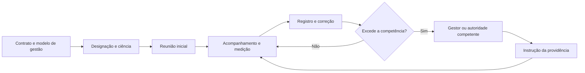

# Gestão e fiscalização contratual na IN nº 5/2017

## 1. Delimitação e leitura atualizada

A gestão contratual transforma o contrato formalizado em resultados efetivamente entregues. Na Instrução Normativa SEGES/MP nº 5/2017, os arts. 39 a 48 organizam as funções de gestão e fiscalização, a escolha dos agentes, a representação da contratada, o início da execução, os registros e os instrumentos de controle. O Anexo VIII detalha a fiscalização técnica e administrativa.

Esse modelo deve ser lido em três camadas:

1. **Lei nº 14.133/2021:** contém as normas gerais vigentes, especialmente nos arts. 115 a 123 e 140;
2. **regulamentação federal atual:** o Decreto nº 11.246/2022 disciplina gestores e fiscais no Executivo federal e foi alterado pelo Decreto nº 13.031/2026;
3. **IN nº 5/2017:** permanece como disciplina operacional federal dos serviços, aplicada sob a nova lei somente **no que couber**, conforme a IN SEGES/ME nº 98/2022.

Referências da IN à Lei nº 8.666/1993 devem ser substituídas pelo fundamento vigente. O dever de registrar ocorrências e escalar decisões, por exemplo, hoje encontra fundamento direto no art. 117 da Lei nº 14.133/2021.

> **Âmbito:** a Lei nº 14.133/2021 contém normas gerais aplicáveis aos entes abrangidos por ela. Já as instruções da SEGES e os Decretos nº 11.246/2022 e nº 13.031/2026 disciplinam a Administração Pública federal indicada em cada ato. Eles não se tornam automaticamente regulamento interno do TCE-MA, embora possam servir de referência técnica ou ser adotados por norma competente.

Este assunto não antecipa os procedimentos detalhados de medição, glosa, pagamento, obrigações trabalhistas, repactuação e equilíbrio econômico-financeiro, reservados ao Assunto 134. Também não substitui o estudo aplicado dos papéis do fiscal e do preposto previsto no item 2 do edital.

## 2. Finalidade da gestão e da fiscalização

O art. 39 da IN nº 5/2017 define gestão e fiscalização como um **conjunto coordenado de ações**, e não como simples conferência de notas fiscais. Seus objetivos são:

- aferir se a Administração recebeu os resultados previstos;
- acompanhar a execução das obrigações contratuais;
- verificar a regularidade administrativa pertinente;
- instruir procedimentos de prorrogação, alteração, reequilíbrio, pagamento, sanção e extinção;
- encaminhar a documentação ao setor competente;
- prevenir e solucionar problemas relativos ao objeto.

O ciclo básico pode ser representado assim:

As atividades devem ser **preventivas, rotineiras e sistemáticas**. Fiscalizar apenas depois da falha elimina a dimensão preventiva; agir sem registro compromete a prova; acompanhar sem indicadores transforma a avaliação em impressão subjetiva.

## 3. Arquitetura de papéis

O art. 40 da IN separa funções para que cada aspecto produza evidência especializada e o gestor coordene o conjunto.

| Papel | Núcleo da atuação | Não se confunde com |
|---|---|---|
| Gestor do contrato | Coordenação das fiscalizações e preparação da instrução processual | Fiscalização técnica cotidiana |
| Fiscal técnico | Quantidade, qualidade, tempo, modo e resultados do objeto | Controle global de todos os procedimentos |
| Fiscal administrativo | Aspectos administrativos e controles próprios do contrato | Avaliação material da qualidade do serviço |
| Fiscal setorial | Acompanhamento técnico ou administrativo em setores ou unidades distintos | Superior hierárquico dos demais fiscais |
| Público usuário | Percepção qualitativa por pesquisa de satisfação ou instrumento equivalente | Substituto da fiscalização técnica |

### 3.1 Gestor

O gestor coordena os fiscais, acompanha registros, organiza o histórico do contrato e prepara o envio dos documentos ao setor competente. No Decreto nº 11.246/2022, suas atribuições incluem:

- coordenar a fiscalização técnica, administrativa e setorial;
- acompanhar ocorrências e medidas adotadas;
- informar à autoridade superior o que ultrapassar sua competência;
- manter o histórico de gerenciamento;
- coordenar a atualização do relatório de riscos;
- preparar procedimentos de alteração, prorrogação, reequilíbrio, pagamento, responsabilização e extinção;
- elaborar o relatório final da contratação;
- realizar o recebimento definitivo, ressalvada a competência também atribuída ao gestor setorial ou à comissão no modelo federal atual.

O gestor **não absorve automaticamente** a conferência especializada feita pelos fiscais. Sua responsabilidade de coordenação exige examinar as evidências produzidas, cobrar providências e evitar que registros permaneçam sem tratamento.

### 3.2 Fiscal técnico

O fiscal técnico observa a execução do objeto tal como contratado. Verifica quantidade, qualidade, tempo, modo, materiais, pessoas exigidas e resultados. Pode notificar a contratada para corrigir rotinas ou irregularidades, definir prazo, registrar o atendimento e informar tempestivamente o gestor.

O fiscal técnico não pode:

- alterar informalmente o objeto;
- conceder vantagem não prevista;
- substituir o preposto na direção dos empregados;
- decidir matéria reservada ao gestor ou à autoridade competente;
- atestar genericamente sem evidência da execução.

### 3.3 Fiscal administrativo

Na redação atual do Decreto nº 11.246/2022, a fiscalização administrativa acompanha obrigações previdenciárias, fiscais e trabalhistas e o controle relativo a revisões, reajustes, repactuações e inadimplemento. Também apoia prazos, apostilamentos, termos aditivos, empenho, pagamento, garantias e glosas.

Neste assunto importa a **arquitetura**: conferir documentos e prazos, registrar riscos, atuar dentro da competência e reportar ao gestor. As comprovações trabalhistas, as retenções e os efeitos financeiros serão estudados no Assunto 134.

### 3.4 Fiscal setorial

A fiscalização setorial é adequada quando a prestação ocorre simultaneamente em setores distintos ou unidades desconcentradas. O fiscal setorial acompanha, em seu local, os aspectos técnicos ou administrativos pertinentes e exerce, no modelo federal, atribuições correspondentes às fiscalizações técnica e administrativa.

Ele não é uma instância superior aos outros fiscais. É uma solução de capilaridade: aproxima o controle do ponto real de execução.

### 3.5 Fiscalização pelo público usuário

A IN nº 5/2017 prevê pesquisa de satisfação junto ao usuário para aferir resultados, materiais, procedimentos e outros aspectos qualitativos. Essa evidência é complementar: satisfação elevada não sana descumprimento objetivo, e satisfação baixa precisa ser analisada à luz dos indicadores e dos fatos.

## 4. Distinção de atividades e segregação de funções

A gestão e as fiscalizações podem ser exercidas por servidores, equipe de fiscalização ou, se a estrutura e o volume permitirem, por um único agente. A concentração não elimina a necessidade de **distinguir as atividades** nem pode comprometer o desempenho de todas elas.

No Decreto nº 11.246/2022, o princípio da segregação veda a atuação simultânea do mesmo agente em funções mais suscetíveis a riscos quando isso ampliar a possibilidade de ocultação de erros ou fraudes. A aplicação considera o caso concreto, as linhas de defesa, o valor e a complexidade.

Assim, não existem duas regras absolutas:

- não é sempre proibido concentrar atividades em um agente;
- não é sempre permitido concentrá-las por falta de pessoal.

A decisão deve preservar distinção funcional, competência, capacidade, controle e tratamento dos riscos.

## 5. Indicação, ciência e designação

Na IN nº 5/2017, o setor requisitante indica gestor, fiscais e substitutos, salvo norma interna diversa. A designação é formal e ocorre depois da ciência expressa sobre a indicação e as atribuições.

O regulamento federal atual determina designação pela autoridade máxima do órgão ou entidade, ou por quem a norma de organização administrativa indicar. Portanto, a atribuição histórica ao “setor de licitações” não deve ser transposta mecanicamente para todos os regimes.

### 5.1 Critérios de escolha

Devem ser considerados:

- compatibilidade das funções com as atribuições do cargo;
- complexidade da fiscalização;
- quantidade de contratos atribuídos ao agente;
- capacidade para o desempenho;
- formação, qualificação ou experiência pertinente;
- independência e ausência de conflito de interesses.

A eventual necessidade de desenvolver competências deve ser identificada no Estudo Técnico Preliminar e sanada, quando cabível, antes da celebração do contrato.

### 5.2 Substitutos e continuidade

O substituto atua nas ausências e impedimentos do titular. Em atraso ou falta de indicação, desligamento ou afastamento extemporâneo e definitivo, o Decreto nº 11.246/2022 atribui temporariamente as funções ao responsável pela indicação, salvo regra interna diferente. A omissão administrativa não cria um espaço sem responsável.

Quando houver troca definitiva, o agente que sai deve registrar as ocorrências do período de sua atuação. A transição deve preservar o histórico e as providências pendentes.

### 5.3 Documentos essenciais

Os fiscais precisam receber os documentos indispensáveis, entre eles:

- ETP, TR ou projeto básico;
- edital e anexos;
- contrato, alterações e garantia;
- proposta aceita e planilhas aplicáveis;
- modelo de gestão e matriz de riscos;
- indicadores e Instrumento de Medição de Resultado (IMR);
- ordens de serviço, atas, comunicações e registros anteriores.

Designar sem fornecer informação, tempo ou acesso não produz controle efetivo.

## 6. O encargo e as limitações do agente

O encargo de gestor ou fiscal não pode ser recusado livremente. Isso não autoriza uma designação imprudente. Se houver deficiência técnica, excesso de carga, conflito ou limitação material capaz de impedir atuação diligente, o agente deve comunicar formalmente o superior.

A Administração deve então:

1. avaliar a limitação;
2. fornecer qualificação ou suporte;
3. redistribuir a carga; ou
4. designar agente com capacidade adequada.

A comunicação documentada protege a execução e permite correção institucional. O silêncio do agente diante de incapacidade conhecida e a inércia da autoridade diante do alerta são situações distintas, ambas relevantes para responsabilização.

## 7. Preposto e canais de comunicação

O preposto representa a contratada durante a execução. Pela IN nº 5/2017, deve ser formalmente designado antes do início dos serviços, com poderes e deveres expressos. Pela Lei nº 14.133/2021, sua manutenção depende da aceitação da Administração.

Regras principais:

- a Administração pode recusar indicação ou manutenção do preposto, mas deve motivar, e a empresa indicará outro;
- comunicações formais são feitas por escrito; mensagem eletrônica pode ser admitida excepcionalmente conforme a disciplina aplicável;
- o preposto pode ser convocado para providência imediata;
- a permanência no local pode ser exigida se a natureza do serviço justificar;
- ordens aos empregados terceirizados devem, em regra, passar pelo preposto, evitando ingerência na organização da contratada.

O preposto não é fiscal público, nem o fiscal se torna chefe dos trabalhadores da empresa.

## 8. Reunião inicial e organização da execução

Após a assinatura, quando a natureza da prestação exigir, realiza-se reunião inicial para apresentar o plano de fiscalização. Devem ser alinhados:

- obrigações e resultados contratuais;
- estratégia de execução;
- mecanismos de fiscalização;
- comunicação e escalonamento;
- indicadores e método de aferição;
- documentos, periodicidade e responsáveis;
- riscos e respostas;
- consequências contratuais previstas.

Os assuntos são registrados em ata. Participam, preferencialmente, gestor, fiscais ou equipe, preposto e, se pertinente, integrantes do planejamento. Reuniões periódicas ajudam a antecipar desvios, mas não substituem registros específicos de ocorrência.

Mudança excepcional do prazo inicial ou de etapa deve ser requerida antes da data prevista, justificada e autorizada pela autoridade competente. A análise deve preservar edital, isonomia, interesse público e qualidade; o pagamento permanece vinculado ao que foi efetivamente prestado.

## 9. Registros, correção e escalonamento

O art. 117 da Lei nº 14.133/2021 exige registro próprio das ocorrências, determinação do necessário à regularização e comunicação tempestiva à autoridade quando a decisão ultrapassar a competência do fiscal.

Um registro útil contém:

1. data, local e agente responsável;
2. obrigação ou indicador aplicável;
3. fato e evidência observados;
4. impacto ou risco;
5. providência solicitada e prazo;
6. manifestação da contratada;
7. verificação do atendimento;
8. encaminhamento ao gestor ou à autoridade, se necessário.

O fiscal deve resolver dentro de sua competência, mas não pode improvisar alteração, sanção, prorrogação ou reequilíbrio. A providência que excede sua alçada é registrada e encaminhada em tempo hábil ao gestor, que a leva à instância competente.

## 10. Instrumentos de controle

O art. 47 da IN nº 5/2017 exige controles capazes de mensurar, quando pertinente:

- resultados e prazos;
- qualidade demandada;
- recursos humanos e formação exigidos;
- qualidade e quantidade dos materiais;
- aderência à rotina de execução;
- demais obrigações contratuais;
- satisfação dos usuários.

Materiais merecem controle desde o início. A relação apresentada pela contratada deve ser comparada com quantidades, marcas, qualidade, especificações e forma de uso previstas. Esse histórico também melhora o planejamento de contratações futuras.

O instrumento deve ser proporcional ao objeto. Checklist, relatório fotográfico, amostragem, teste, registro de sistema, pesquisa de satisfação e IMR podem coexistir. A pergunta correta não é “qual formulário usar?”, mas “qual evidência demonstra o resultado contratado?”.

## 11. Fiscalização técnica e IMR

O Anexo VIII-A orienta avaliação constante da execução. O IMR ou instrumento substituto converte o padrão de desempenho em critérios verificáveis. Um bom instrumento define:

- indicador;
- forma e fonte de coleta;
- periodicidade;
- nível esperado e tolerância;
- responsável pela medição;
- evidência necessária;
- consequência contratual previamente estabelecida.

O IMR não é sanção. Ele mede o resultado e pode fundamentar o redimensionamento do valor devido quando o contrato assim estabelece. Sanção exige tipificação, competência, contraditório e procedimento próprios.

Durante a execução, o fiscal técnico deve monitorar a qualidade para impedir sua deterioração e exigir correção de faltas, falhas e irregularidades. A avaliação é apresentada ao preposto, que toma ciência. A contratada pode justificar menor conformidade, mas a IN condiciona a aceitação à excepcionalidade decorrente exclusivamente de fatores imprevisíveis e alheios ao controle do prestador.

Se a desconformidade for contínua ou superar níveis mínimos toleráveis, fatores redutores não impedem a aplicação das sanções previstas. É vedado atribuir à própria contratada a avaliação de seu desempenho. A periodicidade pode ser diária, semanal ou mensal, desde que suficiente para aferir a prestação.

Para efeito de recebimento provisório, ao final de cada período mensal, o fiscal técnico apura o resultado das avaliações e registra-o em relatório encaminhado ao gestor. O procedimento financeiro decorrente pertence ao Assunto 134.

## 12. Fiscalização administrativa: estrutura sem antecipar o pagamento

O Anexo VIII-B organiza a fiscalização administrativa dos contratos com dedicação exclusiva de mão de obra. Seus métodos incluem controle inicial, mensal, diário, procedimental e por amostragem.

Para este assunto, retenha a lógica:

- identificar obrigações e documentos exigíveis;
- definir responsáveis, periodicidade e amostra;
- conferir manutenção das condições contratuais;
- registrar indícios e solicitar regularização;
- reportar ao gestor o que ultrapassar a competência;
- produzir relatório para o fluxo contratual.

Não se deve dirigir diretamente a força de trabalho da contratada. Solicitações, cobranças e reclamações passam ordinariamente pelo preposto, preservando a autonomia empresarial.

## 13. Assistência de terceiros e apoio institucional

A Lei nº 14.133/2021 permite contratar terceiros para assistir e subsidiar a fiscalização. No modelo federal:

- o terceiro assume responsabilidade civil objetiva pela veracidade e precisão das informações;
- firma compromisso de confidencialidade;
- não exerce atribuição própria e exclusiva de fiscal;
- sua contratação não exonera o fiscal, nos limites das informações recebidas.

Assistência especializada amplia a capacidade técnica, mas não terceiriza a competência decisória estatal.

Gestor e fiscais também contam com assessoramento jurídico e controle interno para dirimir dúvidas e prevenir riscos. A consulta deve ser específica; o apoio não transfere automaticamente a autoria da decisão.

## 14. Atualização federal de 2026

O Decreto nº 13.031/2026, publicado em 18 de junho de 2026, instituiu o **Sistema Contratos.gov.br** para a Administração Pública federal direta, autárquica e fundacional e alterou o Decreto nº 11.246/2022.

### 14.1 Modelo interno de gestão

Os órgãos federais abrangidos devem estabelecer modelo interno que contenha, no mínimo:

- agentes, substitutos e distribuição das atividades;
- forma de comunicação com o preposto;
- método de avaliação para recebimentos provisório e definitivo;
- prazos para pedidos de repactuação e reequilíbrio;
- procedimentos de sanção, glosa e extinção.

O sistema busca comunicação documentada, padronização, integração, informação gerencial e transparência. Sua utilização obrigatória nesse âmbito não significa obrigatoriedade automática para o TCE-MA.

### 14.2 Gestão setorial

A atualização incluiu a **gestão setorial** no Decreto nº 11.246/2022. Ela coordena atividades de gestão em setores distintos, unidades desconcentradas ou diferentes órgãos e entidades, nas hipóteses federais regulamentadas.

Não confunda:

- **fiscal setorial:** acompanha aspectos técnicos ou administrativos no local ou setor;
- **gestor setorial:** exerce coordenação de gestão no âmbito do órgão ou entidade participante do arranjo.

### 14.3 Recebimentos

No modelo federal vigente no corte:

- recebimento provisório: fiscal técnico, administrativo ou setorial;
- recebimento definitivo: gestor, gestor setorial ou comissão designada.

A distinção é suficiente aqui. Procedimento, documentos e efeitos sobre liquidação e pagamento serão aprofundados no assunto seguinte.

## 15. Decisões sobre a execução

O art. 123 da Lei nº 14.133/2021 impõe decisão explícita sobre solicitações e reclamações relacionadas à execução. O dever ressalva requerimentos manifestamente impertinentes, meramente protelatórios ou sem interesse para a boa execução. Salvo prazo legal ou contratual específico, o prazo de um mês começa **depois da conclusão da instrução** e admite uma prorrogação motivada por igual período.

No âmbito federal, o art. 28 do Decreto nº 11.246/2022 usa redação mais estrita quanto ao termo inicial: conta um mês **do protocolo do requerimento**, ressalvado prazo específico, e também admite uma prorrogação igual e motivada. Em prova literal, identifique a fonte perguntada: conclusão da instrução na Lei; protocolo no Decreto federal.

A decisão cabe ao fiscal, gestor ou autoridade superior **nos limites da competência de cada um**. O prazo não autoriza o fiscal a decidir matéria que a lei ou o contrato reservem a outra instância.

## 16. Exemplo integrado

Considere um contrato federal de atendimento em três unidades:

1. o modelo de gestão distribui funções e substitutos;
2. fiscais setoriais registram fatos em cada unidade;
3. o fiscal técnico consolida indicadores de tempo e qualidade;
4. usuários respondem pesquisa de satisfação;
5. o fiscal administrativo acompanha os controles de sua área;
6. o gestor coordena registros, riscos e providências;
7. o preposto recebe comunicações dirigidas à empresa;
8. irregularidade corrigível gera notificação e prazo;
9. matéria fora da competência do fiscal é escalada;
10. evidências subsidiam recebimento e demais procedimentos.

Se a prestação ocorrer em órgãos diferentes de um arranjo federal compatível, gestores setoriais podem coordenar a gestão em cada órgão. Isso não elimina fiscais setoriais nem transforma pesquisa de usuário em fiscalização exclusiva.

## 17. Pegadinhas de prova

| Afirmação | Avaliação |
|---|---|
| Gestor e fiscal técnico são sinônimos. | Errada. Coordenação e verificação especializada são funções distintas. |
| Fiscalização pelo usuário substitui a técnica. | Errada. É complementar. |
| Um único agente jamais pode exercer mais de uma atividade. | Errada. A concentração é excepcionalmente possível se houver distinção e capacidade. |
| Falta de pessoal autoriza concentração automática. | Errada. Riscos e desempenho precisam ser avaliados. |
| O encargo pode ser recusado sem justificativa. | Errada. Limitações devem ser comunicadas. |
| Terceiro especializado assume a função exclusiva do fiscal. | Errada. Apenas assiste e subsidia. |
| Preposto é representante da Administração. | Errada. Representa a contratada. |
| O fiscal pode dirigir empregados terceirizados como chefe. | Errada. A comunicação ordinária passa pelo preposto. |
| IMR e sanção são a mesma coisa. | Errada. Medição e responsabilização têm pressupostos distintos. |
| Recebimento provisório equivale a pagamento. | Errada. São etapas diferentes. |
| Gestão setorial e fiscalização setorial são idênticas. | Errada. A primeira coordena; a segunda acompanha. |
| Contratos.gov.br é automaticamente obrigatório para o TCE-MA. | Errada. O decreto delimita âmbito federal. |

## 18. Checklist de revisão

- [ ] norma e âmbito identificados;
- [ ] aplicação da IN limitada ao que for compatível;
- [ ] gestor separado dos fiscais especializados;
- [ ] titular e substituto formalmente designados e cientificados;
- [ ] capacidade, complexidade e carga avaliadas;
- [ ] documentos essenciais entregues;
- [ ] preposto formalizado e canal de comunicação definido;
- [ ] reunião inicial registrada quando necessária;
- [ ] indicadores e evidências definidos;
- [ ] ocorrências, prazo e resposta documentados;
- [ ] decisões fora da competência escaladas;
- [ ] assistência de terceiros sem transferência da função estatal;
- [ ] gestão setorial diferenciada da fiscalização setorial;
- [ ] procedimentos financeiros preservados para a etapa própria.

## Referências

- BRASIL. Presidência da República. [Lei nº 14.133, de 1º de abril de 2021 — Lei de Licitações e Contratos Administrativos](https://www.planalto.gov.br/ccivil_03/_ato2019-2022/2021/lei/l14133.htm). Texto consolidado vigente no corte de 15 jul. 2026. Acesso em: 16 jul. 2026.
- BRASIL. Ministério da Gestão e da Inovação em Serviços Públicos. [Instrução Normativa SEGES/MP nº 5, de 26 de maio de 2017](https://www.gov.br/compras/pt-br/acesso-a-informacao/legislacao/instrucoes-normativas/instrucao-normativa-no-5-de-26-de-maio-de-2017-atualizada). Arts. 39 a 48 e Anexo VIII, em texto atualizado. Acesso em: 16 jul. 2026.
- BRASIL. Ministério da Economia. [Instrução Normativa SEGES/ME nº 98, de 26 de dezembro de 2022](https://www.gov.br/compras/pt-br/acesso-a-informacao/legislacao/instrucoes-normativas/instrucao-normativa-seges-me-no-98-de-26-de-dezembro-de-2022). Aplicação da IN nº 5/2017 no que couber. Acesso em: 16 jul. 2026.
- BRASIL. Presidência da República. [Decreto nº 11.246, de 27 de outubro de 2022](https://www.planalto.gov.br/ccivil_03/_ato2019-2022/2022/decreto/d11246.htm). Atuação de gestores e fiscais no âmbito federal, em texto consolidado. Acesso em: 16 jul. 2026.
- BRASIL. Presidência da República. [Decreto nº 13.031, de 17 de junho de 2026](https://www.planalto.gov.br/ccivil_03/_ato2023-2026/2026/decreto/d13031.htm). Sistema Contratos.gov.br, modelo interno de gestão e alterações do Decreto nº 11.246/2022; publicado no DOU de 18 jun. 2026. Acesso em: 16 jul. 2026.
- BRASIL. Tribunal de Contas da União. [Fiscalização técnica e recebimento provisório](https://licitacoesecontratos.tcu.gov.br/6-1-4-fiscalizacao-tecnica-e-recebimento-provisorio-2/). Licitações e Contratos: Orientações e Jurisprudência do TCU. Acesso em: 16 jul. 2026.
- BRASIL. Tribunal de Contas da União. [Gestão do contrato e recebimento definitivo](https://licitacoesecontratos.tcu.gov.br/6-1-6-gestao-do-contrato-e-recebimento-definitivo-2/). Licitações e Contratos: Orientações e Jurisprudência do TCU. Acesso em: 16 jul. 2026.
