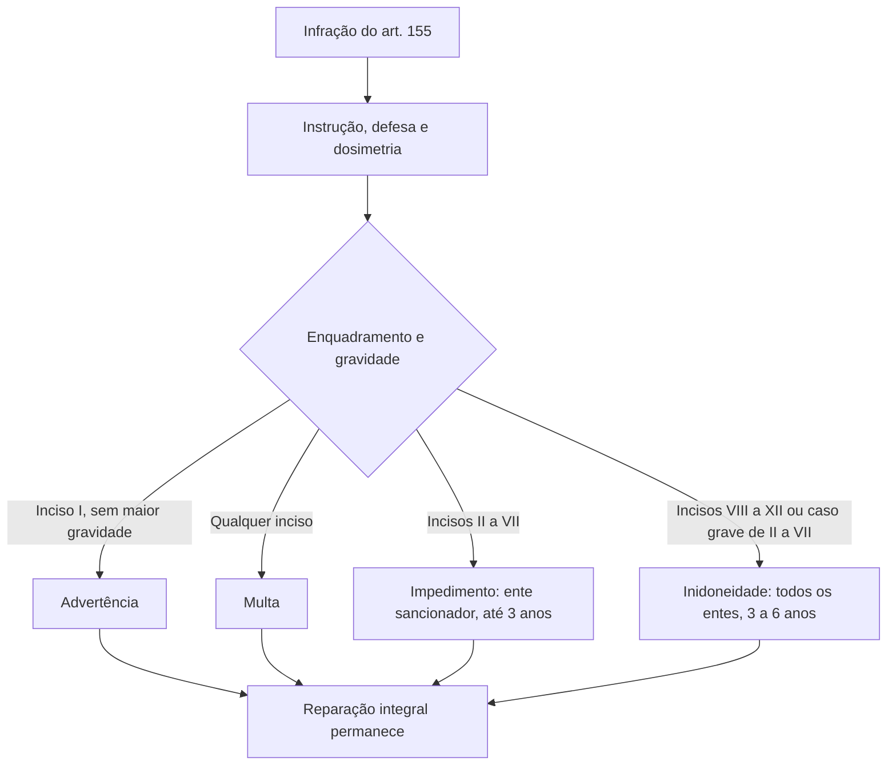

# Infrações, sanções, controle, PNCP e regras finais

## Delimitação do assunto

Este assunto conclui o estudo normativo da Lei nº 14.133/2021 aplicado à contratação de bens e serviços. O recorte principal abrange os arts. 147 a 194: nulidade dos contratos; meios alternativos de prevenção e resolução de controvérsias; infrações e sanções; impugnações e recursos; controle das contratações; Portal Nacional de Contratações Públicas (PNCP); alterações legislativas; transição e disposições finais.

Os Assuntos 124 a 129 estudaram fundamentos, planejamento, seleção, formalização e execução contratual. Aqui, esses institutos aparecem apenas quando necessários para compreender as consequências de irregularidades, a publicidade, o controle e o encerramento do regime de transição.

O texto legal consolidado é a referência normativa central. Orientações do Tribunal de Contas da União (TCU) e regulamentos do Poder Executivo federal são referências qualificadas, mas não constituem automaticamente regras de organização ou procedimento do TCE-MA. O art. 187 permite que Estados, Distrito Federal e Municípios apliquem regulamentos da União; não estabelece incorporação automática.

> **Corte jurídico:** 15 de julho de 2026. **Fontes consultadas em:** 16 de julho de 2026.

## 1. Visão geral do percurso final da Lei

| Faixa | Núcleo |
| --- | --- |
| arts. 147 a 150 | nulidade e efeitos patrimoniais |
| arts. 151 a 154 | meios alternativos de controvérsias |
| arts. 155 a 163 | infrações, sanções e reabilitação |
| arts. 164 a 168 | impugnações, esclarecimentos e recursos |
| arts. 169 a 173 | linhas de defesa e controle |
| arts. 174 a 176 | PNCP e divulgação eletrônica |
| arts. 177 a 180 | alterações em outras leis |
| arts. 181 a 194 | disposições transitórias e finais |

Essa sequência separa planos que podem coexistir. Uma irregularidade contratual pode exigir saneamento, responsabilização, reparação do dano, sanção, controle e, em certos casos, nulidade. Uma providência não substitui automaticamente as demais.

## 2. Nulidade orientada pelo interesse público

### 2.1 Primeiro sanear; depois avaliar a medida

Constatada irregularidade no procedimento licitatório ou na execução, o art. 147 determina uma ordem decisória:

1. verificar se o vício pode ser saneado;
2. se o saneamento não for possível, avaliar se suspender a execução ou declarar a nulidade constitui medida de interesse público;
3. motivar a solução a partir das consequências concretas;
4. manter a apuração de responsabilidades e as penalidades cabíveis, qualquer que seja a solução contratual.

A nulidade não decorre mecanicamente da identificação do vício. A avaliação considera, entre outros fatores:

- impactos econômicos e financeiros do atraso nos benefícios do objeto;
- riscos sociais, ambientais e à segurança da população local;
- motivação social e ambiental do contrato;
- deterioração ou perda do que já foi executado;
- preservação de instalações e serviços;
- desmobilização e posterior retorno;
- medidas de saneamento já adotadas;
- custo total e estágio físico-financeiro;
- fechamento de postos de trabalho;
- custo de nova licitação ou novo contrato;
- custo de oportunidade do capital durante a paralisação.

Se paralisação ou anulação não forem de interesse público, o poder público deve optar pela continuidade do contrato e solucionar a irregularidade por indenização por perdas e danos, sem afastar responsabilização e penalidades. Manter o contrato não apaga o vício nem imuniza seus responsáveis.

### 2.2 Efeitos da declaração de nulidade

O art. 148 estabelece como regra a retroatividade: a nulidade impede os efeitos que o contrato deveria produzir ordinariamente e desconstitui os já produzidos. Há duas acomodações relevantes:

- se for impossível retornar à situação fática anterior, a nulidade resolve-se por indenização por perdas e danos;
- para preservar a continuidade administrativa, a autoridade pode definir eficácia futura suficiente para nova contratação, por até **seis meses**, prorrogável **uma única vez**.

A eficácia futura não transforma o contrato nulo em válido. Ela posterga os efeitos da declaração pelo período legalmente delimitado para evitar ruptura administrativa.

### 2.3 Indenização e pressupostos mínimos da contratação

Pelo art. 149, a nulidade não exonera a Administração de indenizar:

- o que o contratado executou até a declaração ou até a data em que ela se tornou eficaz;
- outros prejuízos regularmente comprovados;
- desde que o vício não seja imputável ao contratado.

Quem deu causa à nulidade deve ser responsabilizado. Não há indenização protetiva para o contratado culpado pelo vício.

O art. 150 proíbe contratação sem caracterização adequada do objeto e sem indicação dos créditos orçamentários para pagar as parcelas vincendas no exercício da contratação. A falta desses pressupostos gera nulidade do ato e responsabilização de quem lhe deu causa.

## 3. Meios alternativos de prevenção e resolução de controvérsias

Os arts. 151 a 154 admitem, entre outros, quatro meios:

| Meio | Função essencial |
| --- | --- |
| conciliação | terceiro imparcial facilita o acordo e pode sugerir soluções |
| mediação | terceiro sem poder decisório restabelece o diálogo para que as partes construam a solução |
| comitê de resolução de disputas | colegiado técnico acompanha o contrato e atua conforme função consultiva, decisória ou híbrida definida pelas partes |
| arbitragem | árbitro ou tribunal arbitral profere decisão vinculante sobre o litígio |

Esses meios alcançam controvérsias relativas a **direitos patrimoniais disponíveis**, como restabelecimento do equilíbrio econômico-financeiro, inadimplemento de obrigações por qualquer das partes e cálculo de indenizações.

Na contratação pública:

- a arbitragem será sempre **de direito**, nunca por equidade;
- o procedimento arbitral observará a **publicidade**;
- o contrato pode ser aditado para permitir meios não previstos originalmente;
- a escolha de árbitros, colegiados arbitrais e comitês deve seguir critérios isonômicos, técnicos e transparentes;
- a solução alternativa não afasta o controle externo sobre recursos públicos.

## 4. Infrações administrativas

O art. 155 responsabiliza licitante ou contratado por doze condutas:

1. causar inexecução parcial;
2. causar inexecução parcial com grave dano à Administração, aos serviços públicos ou ao interesse coletivo;
3. causar inexecução total;
4. não entregar documentação exigida para o certame;
5. não manter a proposta, salvo fato superveniente devidamente justificado;
6. não celebrar o contrato ou não entregar documentação de contratação quando convocado no prazo da proposta;
7. retardar injustificadamente a execução ou a entrega;
8. apresentar declaração ou documentação falsa ou prestar declaração falsa;
9. fraudar a licitação ou praticar ato fraudulento na execução;
10. comportar-se de modo inidôneo ou cometer fraude de qualquer natureza;
11. praticar ato ilícito para frustrar os objetivos da licitação;
12. praticar ato lesivo do art. 5º da Lei nº 12.846/2013.

Tipificar a conduta é diferente de escolher a sanção. A Administração ainda deve instruir o processo, assegurar defesa, avaliar a gravidade e motivar a dosimetria.

## 5. Quatro sanções e sua dosimetria

### 5.1 Mapa de aplicação

| Sanção | Infrações de referência | Alcance e prazo |
| --- | --- | --- |
| advertência | exclusivamente art. 155, I, quando não couber medida mais grave | censura formal sem prazo territorial de impedimento |
| multa | qualquer infração do art. 155 | de **0,5% a 30%** do valor do contrato licitado ou da contratação direta, conforme edital ou contrato |
| impedimento de licitar e contratar | art. 155, II a VII, quando não couber inidoneidade | Administração direta e indireta do **ente federativo sancionador**, por até **três anos** |
| declaração de inidoneidade | art. 155, VIII a XII; também II a VII quando a gravidade exigir | Administração direta e indireta de **todos os entes federativos**, de **três a seis anos** |

Advertência, impedimento e inidoneidade podem ser cumulados com multa. Nenhuma sanção exclui a obrigação de reparar integralmente o dano.

### 5.2 Critérios e competência

Na aplicação, devem ser considerados:

- natureza e gravidade da infração;
- peculiaridades do caso concreto;
- agravantes e atenuantes;
- danos causados à Administração;
- implantação ou aperfeiçoamento de programa de integridade, conforme normas e orientações dos órgãos de controle.

A declaração de inidoneidade exige análise jurídica prévia. No Executivo, a competência é exclusiva de ministro de Estado, secretário estadual ou municipal ou, em autarquia e fundação, da autoridade máxima da entidade. Nos Poderes Legislativo e Judiciário, Ministério Público e Defensoria Pública, cabe à autoridade de nível hierárquico equivalente, na forma do regulamento. A autoridade aplicável ao TCE-MA deve ser identificada segundo sua disciplina própria; não se presume pela simples leitura de regulamento federal.

## 6. Defesa, processo e prescrição

### 6.1 Multa

Para aplicar multa, o interessado tem defesa em **15 dias úteis** da intimação. O percentual deve estar previsto no edital ou contrato e permanecer entre 0,5% e 30%.

Se multa e indenizações superarem eventual pagamento devido, perde-se esse crédito e a diferença é descontada da garantia ou cobrada judicialmente.

### 6.2 Impedimento e inidoneidade

Essas duas sanções exigem processo de responsabilização conduzido por comissão de **dois ou mais servidores estáveis**. Se o quadro não for estatutário, a comissão terá dois ou mais empregados públicos permanentes, preferencialmente com ao menos três anos no órgão ou entidade.

O interessado dispõe de **15 dias úteis** para defesa escrita e especificação de provas. Se houver produção de novas provas ou juntada de prova considerada indispensável, poderá apresentar alegações finais em outros **15 dias úteis**. A comissão pode indeferir motivadamente provas ilícitas, impertinentes, desnecessárias, protelatórias ou intempestivas.

A prescrição ocorre em **cinco anos**, contados da ciência da infração pela Administração:

- interrompe-se com a instauração do processo de responsabilização;
- suspende-se com acordo de leniência;
- suspende-se por decisão judicial que impeça concluir a apuração administrativa.

Interrupção e suspensão não são sinônimos: a primeira reinicia a contagem segundo o regime aplicável; a segunda paralisa a contagem enquanto subsistir a causa.

## 7. Regras sancionatórias correlatas

### 7.1 Lei Anticorrupção e desconsideração

Conduta que também constitua ato lesivo da Lei nº 12.846/2013 será apurada e julgada conjuntamente, nos mesmos autos, conforme rito e autoridade daquela lei.

A personalidade jurídica pode ser desconsiderada quando usada com abuso para facilitar, encobrir ou dissimular ilícito ou provocar confusão patrimonial. Os efeitos da sanção podem alcançar:

- administradores e sócios com poderes de administração;
- pessoa jurídica sucessora;
- empresa do mesmo ramo que mantenha coligação ou controle, de fato ou de direito, com a sancionada.

Não há extensão automática a qualquer sócio ou empresa do grupo. São indispensáveis contraditório, ampla defesa, análise jurídica prévia e comprovação do abuso ou da confusão patrimonial.

### 7.2 CEIS, CNEP e multa de mora

Todos os Poderes e entes devem informar e manter atualizados os dados das sanções no Cadastro Nacional de Empresas Inidôneas e Suspensas (CEIS) e no Cadastro Nacional de Empresas Punidas (CNEP), em até **15 dias úteis da aplicação da sanção**.

O atraso injustificado na execução sujeita o contratado à multa de mora prevista no edital ou contrato. A Administração pode convertê-la em compensatória, extinguir unilateralmente o contrato e cumular outras sanções cabíveis. Mora, extinção e demais sanções continuam exigindo seus fundamentos e procedimentos.

### 7.3 Reabilitação

A reabilitação ocorre perante a própria autoridade que aplicou a penalidade e exige cumulativamente:

1. reparação integral do dano;
2. pagamento da multa;
3. ao menos um ano desde o impedimento ou três anos desde a inidoneidade;
4. cumprimento das condições fixadas no ato punitivo;
5. análise jurídica prévia conclusiva.

Para infrações de declaração ou documentação falsa (art. 155, VIII) e ato lesivo anticorrupção (art. 155, XII), também se exige implantação ou aperfeiçoamento de programa de integridade. O simples decurso do prazo da sanção não produz reabilitação automática.

## 8. Impugnação, esclarecimento e recursos

### 8.1 Edital e atos licitatórios

Qualquer pessoa pode impugnar edital por irregularidade ou pedir esclarecimento até **três dias úteis antes** da abertura. A resposta deve ser divulgada em sítio oficial em até três dias úteis, limitada ao último dia útil anterior à abertura.

Cabe recurso em **três dias úteis** contra:

- decisão sobre pré-qualificação ou registro cadastral;
- julgamento de propostas;
- habilitação ou inabilitação;
- anulação ou revogação da licitação;
- extinção unilateral e escrita do contrato.

Também cabe pedido de reconsideração, em três dias úteis, contra ato sem recurso hierárquico. No julgamento e na habilitação, a intenção de recorrer deve ser manifestada imediatamente, sob pena de preclusão, e a apreciação ocorre em fase única. Contrarrazões têm o mesmo prazo do recurso.

A autoridade recorrida dispõe de três dias úteis para reconsiderar; se mantiver a decisão, remete à superior, que decide em até dez dias úteis. O acolhimento invalida apenas o ato que não puder ser aproveitado.

### 8.2 Recursos contra sanções

| Sanção | Instrumento | Prazo do interessado | Decisão |
| --- | --- | --- | --- |
| advertência, multa e impedimento | recurso | 15 dias úteis | reconsideração em 5 dias úteis ou decisão superior em até 20 dias úteis |
| inidoneidade | apenas pedido de reconsideração | 15 dias úteis | decisão em até 20 dias úteis |

Recurso e pedido de reconsideração têm efeito suspensivo até a decisão final. A autoridade decisora será auxiliada pelo assessoramento jurídico.

## 9. Controle das contratações

### 9.1 Gestão de riscos e três linhas de defesa

As contratações submetem-se continuamente à gestão de riscos, ao controle preventivo, inclusive por tecnologia da informação, e ao controle social. O art. 169 organiza três linhas:

1. **primeira linha:** servidores, empregados, agentes de licitação e autoridades da governança;
2. **segunda linha:** assessoramento jurídico e controle interno do próprio órgão ou entidade;
3. **terceira linha:** órgão central de controle interno e tribunal de contas.

Controle social não é uma quarta linha. A alta administração responde por implementar as práticas conforme regulamento e deve ponderar custos e benefícios, integridade, confiabilidade, segurança jurídica, vantajosidade, eficiência, eficácia e efetividade.

Órgãos de controle têm acesso irrestrito aos documentos necessários, inclusive aos classificados segundo a Lei de Acesso à Informação. Ao receber informação sigilosa, o órgão de controle torna-se corresponsável por preservar o sigilo.

### 9.2 Impropriedade e irregularidade com dano

| Constatação | Providência legal |
| --- | --- |
| simples impropriedade formal | saneamento, mitigação de recorrência, aperfeiçoamento de controles e capacitação |
| irregularidade com dano | providências anteriores + apuração individualizada, segregação de funções e remessa cabível ao Ministério Público |

Na fiscalização, os órgãos de controle adotam critérios de oportunidade, materialidade, relevância e risco, consideram as razões dos gestores e os resultados da contratação. Razões devem chegar até o fim da instrução e permanecer nos autos; a omissão não impede deliberação nem paralisa prazos. Qualquer licitante, contratado ou pessoa física ou jurídica pode representar ao controle interno ou ao tribunal de contas competente.

### 9.3 Cautelar do tribunal de contas

Ao suspender cautelarmente uma licitação, o tribunal de contas deve:

- delimitar as causas da suspensão;
- indicar como preservar o interesse público em objeto essencial ou emergência;
- decidir definitivamente o mérito em **25 dias úteis do recebimento das informações**, prorrogáveis uma única vez por igual período.

Intimado, o órgão ou entidade tem **dez dias úteis**, admitida prorrogação, para informar as medidas de cumprimento, prestar informações e apurar responsabilidade, se cabível. A decisão de mérito define saneamento ou anulação. O descumprimento do dever de resposta gera apuração de responsabilidade e reparação do prejuízo ao erário.

O art. 172 foi vetado. O art. 173 atribui às escolas dos tribunais de contas a promoção de capacitação dos agentes que exercem funções essenciais à Lei.

## 10. PNCP: publicidade centralizada e infraestrutura nacional

### 10.1 Finalidades, gestão e conteúdo

O PNCP é sítio eletrônico oficial destinado a:

- **divulgação centralizada e obrigatória** dos atos exigidos pela Lei;
- realização **facultativa** das contratações dos órgãos e entidades de todos os Poderes e entes.

O Comitê Gestor da Rede Nacional de Contratações Públicas é presidido por representante indicado pelo Presidente da República e possui representantes da União, dos Estados e Distrito Federal e dos Municípios.

Entre as informações do portal estão planos de contratação anual, catálogos de padronização, editais de credenciamento e pré-qualificação, avisos de contratação direta, editais e anexos, atas de registro de preços, contratos, aditivos e notas fiscais eletrônicas, quando cabíveis.

Entre suas funcionalidades estão:

- registro cadastral unificado;
- painéis e bases de preços;
- planejamento e gerenciamento de contratações;
- sessões públicas eletrônicas;
- acesso ao CEIS e ao CNEP;
- gestão compartilhada com a sociedade sobre execução contratual;
- Sistema de Compras Expressas (Sicx), incluído pela Lei nº 15.266/2025.

As funcionalidades do § 3º do art. 174 são os sistemas adotados e oferecidos pelo Poder Executivo federal. O PNCP usa formato de dados abertos e observa a Lei de Acesso à Informação.

### 10.2 Divulgação, eficácia e sistemas integrados

Divulgar no PNCP e realizar a contratação pelo PNCP são coisas diferentes. A primeira função é obrigatória para os atos exigidos; a segunda é facultativa.

Regra correlata decisiva está no art. 94: como regra, a divulgação no PNCP é condição indispensável de eficácia do contrato e de seus aditamentos, em até **20 dias úteis** da assinatura quando decorrentes de licitação e **dez dias úteis** quando decorrentes de contratação direta. Contratos celebrados em caso de urgência produzem efeitos desde a assinatura, mas devem ser publicados nesses mesmos prazos, sob pena de nulidade.

Os entes podem manter sítios oficiais complementares. Desde que preservada a integração com o PNCP, contratações podem usar sistema eletrônico fornecido por pessoa jurídica de direito público ou privado, conforme regulamento do Poder Executivo federal.

### 10.3 Municípios com até 20 mil habitantes

O art. 176 concedeu seis anos desde a publicação da Lei, portanto até **1º de abril de 2027**, para que esses Municípios cumpram requisitos específicos sobre agentes, licitação eletrônica e divulgação em sítio oficial. Não é adiamento geral da aplicação da Lei.

Enquanto não adotarem o PNCP, devem publicar em diário oficial as informações exigidas em sítio eletrônico, admitido extrato, e disponibilizar documentos fisicamente sem cobrança, salvo custo de reprodução. A regra complementar e específica do art. 175, § 2º, para Municípios vigorou apenas até 31 de dezembro de 2023. Seu término não afastou a obrigação autônoma e permanente do art. 54, § 1º: publicar extrato do edital no diário oficial competente e em jornal diário de grande circulação.

## 11. Alterações legislativas e crimes

O art. 177 incluiu no Código de Processo Civil prioridade de tramitação para processos que discutam normas gerais de licitação e contratação. Os arts. 179 e 180 ajustaram, respectivamente, a Lei de Concessões e a Lei das Parcerias Público-Privadas para admitir concorrência ou diálogo competitivo.

O art. 178 inseriu os tipos penais licitatórios nos arts. 337-E a 337-O do Código Penal e a regra de cálculo da multa no art. 337-P. Para distinguir os crimes em casos concretos, observe a conduta, o objeto e eventual finalidade especial:

| Artigo | Tipo e núcleo distintivo | Pena principal |
| --- | --- | --- |
| 337-E | contratação direta ilegal: admitir, possibilitar ou causar contratação direta fora das hipóteses legais | reclusão de 4 a 8 anos e multa |
| 337-F | frustração do caráter competitivo: frustrar ou fraudar a competição para obter vantagem decorrente da adjudicação | reclusão de 4 a 8 anos e multa |
| 337-G | patrocínio de contratação indevida: defender interesse privado e causar licitação ou contrato cuja invalidação seja decretada judicialmente | reclusão de 6 meses a 3 anos e multa |
| 337-H | modificação ou pagamento irregular: conceder vantagem contratual sem amparo ou preterir a ordem cronológica de pagamento | reclusão de 4 a 8 anos e multa |
| 337-I | perturbação de processo licitatório: impedir, perturbar ou fraudar qualquer ato do processo | detenção de 6 meses a 3 anos e multa |
| 337-J | violação de sigilo: devassar proposta sigilosa ou permitir que terceiro a devasse | detenção de 2 a 3 anos e multa |
| 337-K | afastamento de licitante: afastar ou tentar afastar concorrente por violência, ameaça, fraude ou vantagem; também alcança quem se abstém ou desiste pela vantagem | reclusão de 3 a 5 anos, multa e pena correspondente à violência |
| 337-L | fraude em licitação ou contrato: prejudicar a Administração por entrega, substituição, adulteração ou outro meio fraudulento que onere injustamente a proposta ou a execução | reclusão de 4 a 8 anos e multa |
| 337-M | contratação inidônea: admitir inidôneo na licitação ou celebrar contrato com ele; também pune o próprio inidôneo que participa ou contrata | admitir: reclusão de 1 a 3 anos; contratar: 3 a 6 anos; ambas com multa |
| 337-N | impedimento indevido: obstar injustamente inscrição cadastral ou alterar, suspender ou cancelar registro de modo indevido | reclusão de 6 meses a 2 anos e multa |
| 337-O | omissão grave por projetista: omitir, modificar ou entregar levantamento ou condição de contorno em dissonância relevante com a realidade, nos procedimentos indicados pelo tipo | reclusão de 6 meses a 3 anos e multa; pena em dobro se houver fim de obter benefício direto ou indireto, próprio ou alheio |
| 337-P | regra da multa: segue o cálculo do Código Penal e não pode ficar abaixo de 2% do valor do contrato licitado ou celebrado diretamente | aplicável aos crimes do capítulo |

Pegadinhas frequentes: o art. 337-F exige finalidade de obter vantagem decorrente da adjudicação, enquanto o art. 337-I pune interferência em qualquer ato do processo; o art. 337-G exige invalidação decretada pelo Judiciário; e o art. 337-K equipara ao autor quem aceita vantagem para se abster ou desistir. Sanção administrativa e crime são esferas distintas: tipificação administrativa não gera condenação penal automática.

## 12. Disposições transitórias e finais

### 12.1 Organização, atualização e contagem

- **Art. 181:** entes instituirão centrais de compras; Municípios com até dez mil habitantes formarão preferencialmente consórcios públicos para compras em grande escala.
- **Art. 182:** o Executivo federal atualiza em cada 1º de janeiro, pelo IPCA-E ou substituto, os valores fixados na Lei e os divulga no PNCP.
- **Art. 183:** exclui-se o dia do começo e inclui-se o do vencimento; dias corridos contam continuamente; meses e anos contam de data a data; dias úteis consideram expediente administrativo.

Salvo disposição contrária, o prazo começa no primeiro dia útil após a disponibilização da informação na internet ou na data de juntada do aviso de recebimento postal. Vencimento sem expediente, com encerramento antecipado ou indisponibilidade eletrônica prorroga-se ao primeiro dia útil seguinte. Se não houver data equivalente no mês final, usa-se o último dia do mês.

### 12.2 Convênios e regime simplificado

O art. 184 aplica a Lei, no que couber e na ausência de norma específica, a convênios, acordos, ajustes e instrumentos congêneres, conforme regulamento federal. Alterações de 2023 passaram a admitir, sob requisitos legais, uso de saldos e rendimentos, novos aportes, redução não prejudicial de metas e ajustes objetivos em transferências voluntárias.

O art. 184-A cria regime simplificado para convênios, contratos de repasse e congêneres com participação da União até o limite atualizado. Em 2026, o Decreto nº 12.807/2025 fixou **R$ 1.646.430,90**. O regime prevê parâmetros objetivos no plano, minuta simplificada, parcela única, verificação da execução e regras próprias de acompanhamento no Transferegov. Esse valor é anual e não deve ser memorizado como permanente.

### 12.3 Aplicação subsidiária e regulamentos

- **Art. 185:** os crimes do Capítulo II-B do Código Penal também se aplicam às licitações e contratos da Lei das Estatais.
- **Art. 186:** a Lei nº 14.133/2021 aplica-se subsidiariamente às Leis nº 8.987/1995, nº 11.079/2004 e nº 12.232/2010.
- **Art. 187:** Estados, Distrito Federal e Municípios podem aplicar regulamentos da União.
- **Arts. 188 e 192:** o art. 188 foi vetado; contratos de imóveis da União, autarquias e fundações federais seguem a legislação pertinente, com aplicação subsidiária da Lei nº 14.133/2021.
- **Art. 189:** referências legais expressas às antigas Leis nº 8.666/1993 e nº 10.520/2002 e aos arts. 1º a 47-A do RDC passam a ser entendidas como referências à Lei nº 14.133/2021.

### 12.4 Transição, revogação e vigência

Contratos assinados antes da entrada em vigor da nova Lei continuam regidos pela legislação anterior durante toda sua vigência (art. 190). Durante a transição, a Administração podia escolher expressamente entre o regime novo e o antigo, sem combinação, e o contrato resultante permanecia no regime escolhido (art. 191).

Essa janela encerrou-se em 30 de dezembro de 2023. Em 2026, o art. 191 não autoriza iniciar novas licitações pelo regime revogado; ele ajuda a compreender por que contratos validamente originados sob a legislação antiga continuam submetidos a ela.

O art. 193 separou duas revogações:

1. arts. 89 a 108 da Lei nº 8.666/1993, revogados na publicação da Lei nº 14.133/2021, com os crimes deslocados ao Código Penal;
2. Lei nº 8.666/1993, Lei nº 10.520/2002 e arts. 1º a 47-A da Lei do RDC, revogados em **30 de dezembro de 2023**, por redação da Lei Complementar nº 198/2023.

A Medida Provisória nº 1.167/2023 perdeu eficácia; a data definitiva decorre da Lei Complementar nº 198/2023. A Lei nº 14.133/2021 entrou em vigor na data de sua publicação, **1º de abril de 2021**.

## 13. Pegadinhas recorrentes

| Afirmação incorreta | Regra correta |
| --- | --- |
| todo vício impõe anulação imediata | primeiro se busca saneamento; suspensão ou nulidade exige avaliação do interesse público |
| nulidade sempre produz efeitos imediatos | a autoridade pode diferir a eficácia por até seis meses, prorrogáveis uma vez |
| arbitragem pública pode decidir por equidade e permanecer sigilosa | será de direito e observará publicidade |
| impedimento e inidoneidade têm o mesmo alcance | impedimento limita-se ao ente sancionador; inidoneidade alcança todos os entes |
| qualquer sócio recebe automaticamente a sanção da empresa | desconsideração exige abuso ou confusão, defesa e análise jurídica |
| fim do prazo gera reabilitação automática | os cinco requisitos cumulativos devem ser comprovados |
| controle social é a quarta linha de defesa | há três linhas; o controle social também subordina as contratações |
| o tribunal conta 25 dias desde a cautelar | o prazo começa no recebimento das informações do órgão |
| toda contratação deve ocorrer dentro do PNCP | divulgação é centralizada e obrigatória; realização pelo portal é facultativa |
| art. 176 adiou toda a Lei para pequenos Municípios | adiou apenas requisitos específicos por seis anos |
| a transição ainda permite escolher a Lei nº 8.666 em 2026 | a janela terminou em 30 de dezembro de 2023 |
| regulamento federal sempre vincula o TCE-MA | é preciso verificar competência, adoção e disciplina própria |

## Referências

- BRASIL. Presidência da República. [Lei nº 14.133, de 1º de abril de 2021, texto consolidado](https://www.planalto.gov.br/ccivil_03/_ato2019-2022/2021/lei/l14133.htm). Arts. 147 a 194 e remissões aos arts. 54 e 94. Versão vigente consultada em 16 jul. 2026.
- BRASIL. Presidência da República. [Lei Complementar nº 198, de 28 de junho de 2023](https://www.planalto.gov.br/ccivil_03/leis/lcp/lcp198.htm). Redação definitiva do art. 193, II, consultada em 16 jul. 2026.
- BRASIL. Presidência da República. [Lei nº 14.770, de 22 de dezembro de 2023](https://www.planalto.gov.br/ccivil_03/_ato2023-2026/2023/lei/l14770.htm). Alterações dos arts. 184 e 184-A, consultadas em 16 jul. 2026.
- BRASIL. Presidência da República. [Lei nº 15.266, de 21 de novembro de 2025](https://www.planalto.gov.br/ccivil_03/_ato2023-2026/2025/lei/l15266.htm). Alterações sobre Sicx, PNCP e sistemas integrados, consultadas em 16 jul. 2026.
- BRASIL. Presidência da República. [Decreto nº 12.807, de 29 de dezembro de 2025](https://www.planalto.gov.br/ccivil_03/_ato2023-2026/2025/decreto/d12807.htm). Valores vigentes desde 1º jan. 2026, consultados em 16 jul. 2026.
- BRASIL. Câmara dos Deputados. [Medida Provisória nº 1.167, de 31 de março de 2023](https://www2.camara.leg.br/legin/fed/medpro/2023/medidaprovisoria-1167-31-marco-2023-793984-norma-pe.html). Situação de vigência encerrada consultada em 16 jul. 2026.
- BRASIL. Portal Nacional de Contratações Públicas. [Portal institucional do PNCP](https://www.gov.br/pncp/pt-br). Funções e serviços oficiais consultados em 16 jul. 2026.
- BRASIL. Tribunal de Contas da União. [Licitações e Contratos: 6.1.8 Infrações e sanções administrativas](https://licitacoesecontratos.tcu.gov.br/6-1-8-infracoes-e-sancoes-administrativas-contratado/). Orientação federal consultada em 16 jul. 2026.
- BRASIL. Tribunal de Contas da União. [Licitações e Contratos: 6.1.9 Meios alternativos de resolução de controvérsias](https://licitacoesecontratos.tcu.gov.br/6-1-9-meios-alternativos-de-resolucao-de-controversias/). Orientação federal consultada em 16 jul. 2026.
