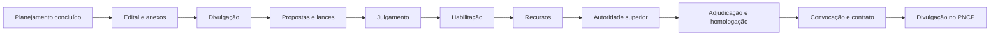

# Interface com a seleção do fornecedor na IN nº 5/2017

## 1. Delimitação e método de leitura

A seleção do fornecedor transforma o planejamento em uma disputa ou contratação direta capaz de produzir um contrato válido, exequível e vantajoso. Na sistemática da Instrução Normativa SEGES/MP nº 5/2017, a fase começa com o encaminhamento do Termo de Referência (TR) ou Projeto Básico ao setor de licitações e termina com a publicação do resultado do julgamento após adjudicação e homologação (art. 33).

O texto da IN deve ser lido em duas camadas:

1. **camada estrutural**, ainda útil: ato convocatório coerente com o TR, proposta detalhada, análise de exequibilidade, habilitação proporcional, controle jurídico, encerramento, contrato e publicidade;
2. **camada legal histórica**, que precisa ser substituída ou adaptada: referências às Leis nº 8.666/1993 e nº 10.520/2002, ao Decreto nº 2.271/1997 e a procedimentos próprios do regime revogado.

No âmbito federal, a IN SEGES/ME nº 98/2022 autorizou a aplicação da IN nº 5/2017 às contratações sob a Lei nº 14.133/2021 **no que couber**. Essa expressão impede a transposição automática de regra incompatível. Além disso, normas da SEGES dirigidas à Administração Pública federal direta, autárquica e fundacional não se tornam, por si sós, regulamento interno do TCE-MA. Para uma questão sobre outro ente, é preciso identificar se há adoção expressa ou usar a norma federal apenas como referência técnica.

> **Regra de prova:** a Lei nº 14.133/2021 prevalece sobre a remissão histórica da IN. Preserva-se a técnica operacional compatível; substitui-se o fundamento revogado.

Este assunto concentra a interface entre os arts. 33 a 38 e o Anexo VII da IN nº 5/2017. O planejamento, o gerenciamento de riscos e o TR foram desenvolvidos nos assuntos anteriores; aqui interessa verificar como esses documentos comandam a seleção.

## 2. Visão integrada da fase

O rito ordinário da Lei nº 14.133/2021 segue, em regra, esta sequência:

A habilitação pode anteceder a apresentação de propostas e o julgamento, mas somente mediante ato motivado que explicite os benefícios dessa inversão e desde que a previsão conste do edital (art. 17, § 1º, da Lei nº 14.133/2021).

Cada passagem depende da anterior:

- o TR define objeto, resultados, medição, obrigações, riscos e critérios de seleção;
- o edital converte essas decisões em regras vinculantes e isonômicas;
- a proposta responde às exigências e precifica todos os custos;
- o julgamento aplica apenas os critérios divulgados;
- a habilitação verifica capacidade suficiente, sem criar barreiras desnecessárias;
- a autoridade superior controla a regularidade e encerra o certame;
- o contrato reflete edital, proposta vencedora, riscos e modelo de gestão;
- a divulgação produz a eficácia exigida pela lei.

## 3. Arts. 33 a 38 da IN: o que permanece e o que muda

| Dispositivo da IN nº 5/2017 | Conteúdo estrutural | Leitura sob a Lei nº 14.133/2021 |
| --- | --- | --- |
| Art. 33 | Delimita a seleção entre o recebimento do TR/PB e a publicação do resultado | Útil como marco gerencial; o rito e o encerramento seguem especialmente os arts. 17 e 71 |
| Art. 34 | Exige adaptação dos instrumentos à contratação | Preservado o dever de coerência, mas as remissões às leis revogadas são substituídas pela Lei nº 14.133/2021 e pelo regulamento aplicável |
| Art. 35 | Orienta o uso de modelos da AGU, Anexo VII e Cadernos de Logística | Compatível com a padronização; a não utilização dos modelos deve ser justificada por escrito, conforme art. 19, § 2º, da nova lei |
| Art. 36 | Prevê lista de conformidade e exame jurídico | A lista continua sendo controle útil; o controle prévio de legalidade rege-se pelo art. 53, inclusive suas hipóteses atuais de dispensa |
| Art. 37 | Remete adjudicação e homologação ao regime da modalidade | O encerramento passa a seguir o art. 71 da Lei nº 14.133/2021 |
| Art. 38 | Remete formalização e publicação ao Anexo VII-G | A técnica subsiste, mas forma, substituição do instrumento e eficácia seguem os arts. 91, 94 e 95 |

### 3.1 Modelos padronizados não dispensam adaptação

Padronização reduz erros, acelera a análise jurídica e promove tratamento isonômico. Não autoriza copiar cláusulas incompatíveis com o objeto. A equipe deve:

- selecionar o modelo vigente e adequado;
- adaptar campos variáveis às decisões do ETP, do TR e da matriz de riscos;
- registrar alterações relevantes;
- justificar por escrito a não utilização de modelo aplicável;
- conferir se edital, anexos e minuta não se contradizem.

### 3.2 Lista de verificação e controle jurídico

A lista de verificação é evidência de controle, não substituto do raciocínio. Ela deve ser adaptada ao momento processual e juntada aos autos. Antes do envio ao órgão de assessoramento jurídico, a unidade responsável corrige lacunas e identifica as questões jurídicas efetivas.

O art. 53 da Lei nº 14.133/2021 submete o processo ao controle prévio de legalidade ao final da fase preparatória e admite a dispensa de análise jurídica nas hipóteses previamente definidas em ato da autoridade jurídica máxima competente, considerados o baixo valor, a baixa complexidade, a entrega imediata do bem ou o uso de minutas e instrumentos previamente padronizados pelo órgão de assessoramento jurídico. Portanto, o antigo parecer referencial mencionado na IN não é uma dispensa automática e autônoma: deve encaixar-se no regime jurídico atual e nas regras do órgão.

## 4. Ato convocatório: tradução do planejamento

O edital deve conter o objeto e as regras relativas a convocação, julgamento, habilitação, recursos, penalidades, fiscalização e gestão, entrega e pagamento. Todos os seus elementos, inclusive TR e minuta, devem ser divulgados na mesma data, em sítio eletrônico oficial, sem exigir cadastro para acesso.

O Anexo VII-A da IN organiza os principais blocos:

### 4.1 Preâmbulo, objeto e participação

O preâmbulo identifica o certame, o órgão, a forma de realização, a legislação e os marcos de apresentação. A nomenclatura antiga de “tipo de licitação” deve ser convertida para os institutos atuais: **modalidade**, **critério de julgamento**, **modo de disputa** e **forma eletrônica ou presencial**.

O objeto deve remeter expressamente ao TR e permitir que o mercado compreenda a prestação, a unidade de medida, a duração, os resultados e as condições relevantes. Exigências de participação precisam ter fundamento legal ou relação objetiva com o risco do objeto.

A segregação de funções pode justificar que a mesma empresa não execute serviços incompatíveis, como executar o objeto e assistir sua fiscalização. Se serviços forem licitados em itens distintos, o edital deve preservar a participação em ambos e definir como resolverá a incompatibilidade na adjudicação.

### 4.2 Vistoria

A Administração somente pode exigir, sob pena de inabilitação, a comprovação de conhecimento do local quando essa informação for imprescindível ao pleno conhecimento das condições. O edital não pode tornar a visita presencial obrigatória: deve permitir que o licitante ateste o conhecimento mediante declaração formal de seu responsável técnico. Além disso:

- o licitante tem direito de realizar a vistoria, se preferir;
- quem optar pela visita recebe data e horário distintos dos demais interessados.

Exigir visita obrigatória sem alternativa viola o art. 63, §§ 2º a 4º, da Lei nº 14.133/2021 e pode restringir a competição.

### 4.3 Declarações e documentos

As declarações históricas do Anexo VII-A devem ser atualizadas. Entre as exigências vigentes, destacam-se:

- declaração de atendimento aos requisitos de habilitação, se exigida;
- declaração de cumprimento da reserva legal de cargos para pessoa com deficiência e reabilitado da Previdência Social;
- declaração, sob pena de desclassificação, de que a proposta compreende a integralidade dos custos trabalhistas;
- comprovação do cumprimento da proibição constitucional de trabalho noturno, perigoso ou insalubre a menor de 18 anos e de qualquer trabalho a menor de 16, salvo aprendiz a partir de 14;
- declaração pertinente ao tratamento favorecido de microempresa (ME) ou empresa de pequeno porte (EPP), quando aplicável.

Em regra, os documentos de habilitação são apresentados apenas pelo vencedor. Os documentos de regularidade fiscal são exigidos depois do julgamento e somente do mais bem classificado, sem prejuízo da inversão motivada da fase.

## 5. Forma de seleção e critério de julgamento

O planejamento deve justificar a combinação entre modalidade, critério, modo de disputa e forma. Não basta repetir “menor preço” por hábito.

### 5.1 Serviços comuns

O pregão é adotado sempre que os padrões de desempenho e qualidade possam ser objetivamente definidos pelo edital por especificações usuais de mercado. Menor preço e maior desconto devem considerar o **menor dispêndio**, respeitados os padrões mínimos de qualidade. Preço baixo não permite reduzir o resultado obrigatório.

Na Administração Pública federal direta, autárquica e fundacional, a IN SEGES/ME nº 73/2022 disciplina menor preço e maior desconto e adota preferencialmente a forma eletrônica, com exceção motivada para a forma presencial e registro da sessão em ata e áudio e vídeo.

### 5.2 Técnica e preço

Técnica e preço não é prêmio genérico à empresa mais experiente. O ETP deve demonstrar que a avaliação da qualidade técnica acima dos requisitos mínimos é relevante para os fins da contratação e que o objeto se enquadra nas hipóteses do art. 36 da Lei nº 14.133/2021. A proposta técnica pode receber, no máximo, 70% da valoração total.

No âmbito federal, a IN SEGES/MGI nº 2/2023 regulamenta esse critério. Os fatores e pesos precisam ser objetivos, proporcionais e ligados a ganhos mensuráveis. Não se pode usar na pontuação o mesmo requisito que já opera apenas como barreira de habilitação, nem acumular pontos sem relação com a qualidade esperada.

## 6. Proposta e planilha de custos

O Anexo VII-C oferece modelo de proposta, e o Anexo VII-D, modelo de planilha de custos e formação de preços. Eles são referências adaptáveis, não formulários imutáveis.

A proposta deve ser clara, objetiva e compatível com o edital. Conforme o objeto, apresenta:

- preços unitário, mensal e global;
- custos da execução;
- instrumento coletivo, sindicato, categoria, data-base e vigência pertinentes;
- produtividade adotada e demonstração de exequibilidade quando se afastar da referência admitida;
- pessoal a ser alocado;
- materiais e equipamentos, com quantidades e especificações;
- prazo de validade e demais condições requeridas.

Nos serviços com dedicação exclusiva de mão de obra, a planilha adaptada ao objeto integra o edital e auxilia a análise da proposta final. O licitante deve incluir todos os custos necessários, inclusive os direitos trabalhistas assegurados na data de entrega da proposta.

### 6.1 Erro sanável não é preço insuficiente

Erro de preenchimento da planilha não causa, sozinho, desclassificação quando:

1. o ajuste não aumenta o preço ofertado;
2. o preço continua suficiente para todos os custos;
3. não há alteração substancial da proposta nem quebra da isonomia.

Em contraste, custo obrigatório omitido sem possibilidade de absorção revela inexequibilidade. A Administração não pode converter diligência em oportunidade para o licitante formular proposta nova.

### 6.2 Formação de preços privados e custos mínimos

Como regra, a Administração não interfere na estratégia empresarial nem fixa custos mínimos estranhos à exequibilidade, aos encargos legais ou à disciplina normativa aplicável. A IN SEGES/MGI nº 176/2024 atualizou o item 7.11 do Anexo VII-A para ressalvar também a aplicação do Decreto nº 12.174/2024, que trata de garantias trabalhistas em contratos federais contínuos com dedicação exclusiva ou predominância de mão de obra.

A mesma alteração incluiu no Anexo VII-C declaração de responsabilidade pelo enquadramento sindical. O licitante responde pela veracidade do instrumento coletivo indicado e pelos ônus de eventual enquadramento incorreto. Isso não autoriza a Administração a escolher arbitrariamente o sindicato da empresa.

## 7. Aceitabilidade, julgamento e exequibilidade

O art. 59 da Lei nº 14.133/2021 permite verificar a conformidade exclusivamente da proposta mais bem classificada. A proposta será desclassificada se tiver vício insanável, contrariar especificação técnica pormenorizada, tiver preço inexequível ou acima do orçamento, não demonstrar exequibilidade quando exigida ou apresentar outra desconformidade insanável.

### 7.1 Sequência de análise

Uma análise robusta percorre:

1. conformidade com o objeto e os requisitos mínimos;
2. respeito ao preço máximo ou ao critério de aceitabilidade;
3. consistência entre preço global, unitários e planilha;
4. cobertura de salários, encargos, benefícios e demais custos obrigatórios;
5. coerência da produtividade e dos recursos prometidos;
6. diligência diante de indício, antes de conclusão precipitada;
7. decisão motivada, com indicação dos elementos aceitos ou rejeitados.

É legítimo obter manifestação técnica da área requisitante ou especializada quando a conformidade depender de conhecimento específico. A decisão continua pertencendo ao agente competente e deve ser documentada.

### 7.2 Indício não é presunção absoluta

A diligência pode examinar instrumentos coletivos, notas fiscais, contratos comparáveis, soluções técnicas, condições excepcionalmente favoráveis e justificativas do proponente. O objetivo é verificar se o preço cobre o custo real da solução, e não reconstruir a margem empresarial desejada pela Administração.

A regra do item 9.6 do Anexo VII-A, que tornava obrigatória a diligência quando o preço fosse inferior a 30% da média das propostas, pertence ao regime histórico. Para bens e serviços em geral no âmbito federal, a IN SEGES/ME nº 73/2022 considera indício de inexequibilidade valor inferior a 50% do estimado pela Administração. Trata-se de **indício sujeito a diligência**, não de desclassificação matemática automática.

Os percentuais de 75% para inexequibilidade e de 85% para garantia adicional do art. 59, §§ 4º e 5º, da Lei nº 14.133/2021 referem-se a obras e serviços de engenharia. Não devem ser transportados para um serviço administrativo em geral.

A inexequibilidade de um item isolado da planilha não basta para desclassificar se o preço global cobre a execução e não há violação legal. Salário, encargo ou outro custo legal obrigatório, entretanto, não pode ser compensado por mera ficção contábil.

### 7.3 Negociação

Definido o julgamento, a Administração pode negociar condições mais vantajosas com o primeiro colocado. Se ele permanecer acima do preço máximo e for desclassificado, a negociação pode seguir com os demais, respeitada a ordem inicial. O resultado deve ser divulgado e juntado aos autos.

## 8. Habilitação proporcional

Habilitação verifica capacidade necessária e suficiente. Não é instrumento para escolher antecipadamente quem parece “mais forte”. Divide-se em jurídica, técnica, fiscal, social e trabalhista, e econômico-financeira.

### 8.1 Qualificação técnica

Pelo art. 67 da Lei nº 14.133/2021:

- atestados ficam restritos às parcelas de maior relevância ou valor significativo, assim consideradas as de valor individual igual ou superior a 4% do valor estimado;
- quantitativos mínimos podem alcançar até 50% dessas parcelas;
- são vedadas limitações temporais de emissão e locais específicos relativas aos atestados;
- em serviço contínuo, pode-se exigir experiência similar por períodos sucessivos ou não, mas o prazo mínimo não pode superar três anos;
- exigências e percentuais precisam ser motivados na fase preparatória.

Esses limites corrigem duas leituras perigosas do Anexo VII-A:

- a antiga exigência de experiência mínima de três anos não se converte em piso obrigatório; a lei atual diz **até** três anos;
- a antiga exigência de 100% dos postos para contratação com até 40 postos excede o teto atual de 50% da parcela relevante e não deve ser reproduzida.

Não se confunde experiência acumulada com idade do atestado. A Administração pode exigir até três anos de execução similar em períodos sucessivos ou não, mas não restringir a comprovação a contratos realizados em certa cidade ou em janela recente arbitrária.

### 8.2 Qualificação econômico-financeira

O art. 69 exige demonstração objetiva da aptidão econômica e restringe a documentação a balanço, DRE e demais demonstrações contábeis dos dois últimos exercícios, além de certidão negativa de feitos sobre falência. Para empresa constituída há menos de dois anos, limita-se ao último exercício.

Os índices devem estar no edital e ser justificados no processo. É vedado exigir:

- faturamento anterior mínimo;
- índice de rentabilidade ou lucratividade;
- índice ou valor não usual sem relação com a capacidade de executar.

Podem ser exigidos capital mínimo ou patrimônio líquido mínimo de até 10% do valor estimado e relação de compromissos que reduzam a capacidade econômico-financeira, excluídas parcelas já executadas. O Anexo VII-E é um modelo histórico para declaração de contratos firmados; seu uso atual deve ser ajustado ao art. 69, § 3º.

Os índices fixos e o capital circulante líquido de 16,66% previstos no Anexo VII-A não devem ser copiados sem exame de compatibilidade, usualidade e motivação à luz da lei atual.

### 8.3 Saneamento documental

Após a entrega dos documentos, a diligência pode complementar informações sobre documentos já apresentados, para apurar fatos existentes à época da abertura, ou atualizar documento cuja validade expirou depois do recebimento das propostas. Erros que não alterem a substância nem a validade jurídica podem ser sanados por decisão fundamentada e acessível a todos.

Não se admite criar, depois da disputa, uma condição de habilitação que não existia na data exigida.

## 9. Microempresas e empresas de pequeno porte

A Lei Complementar nº 123/2006 permanece central, apesar de aparecer ao lado de leis revogadas no art. 34 da IN. Entre os efeitos relevantes:

- regularidade fiscal e trabalhista é exigida para assinatura, mas a ME/EPP deve apresentar a documentação mesmo com restrição;
- declarada vencedora, recebe cinco dias úteis, prorrogáveis por igual período, para regularizar, pagar ou parcelar débito e emitir certidões;
- empate ficto alcança proposta de ME/EPP até 10% superior à melhor; no pregão, a faixa é de até 5%;
- a ME/EPP mais bem classificada na faixa pode apresentar preço inferior ao da primeira colocada;
- a Lei nº 14.133/2021 aplica os benefícios com as limitações de seu art. 4º, inclusive quanto à receita bruta e aos valores estimados.

Tratamento favorecido não elimina requisitos técnicos indispensáveis nem autoriza contratar proposta inexequível.

## 10. Credenciamento

O item 3 do Anexo VII-B admitia credenciamento quando a natureza do serviço tornasse inviável a competição, o interesse público fosse melhor atendido por vários prestadores, houvesse preço fixado, igualdade de condições e contratação de todos os aptos.

O regime atual está no art. 79 da Lei nº 14.133/2021. O credenciamento pode ocorrer nas hipóteses:

1. **paralela e não excludente**: contratações simultâneas em condições padronizadas são viáveis e vantajosas;
2. **seleção a critério de terceiros**: o beneficiário direto escolhe o prestador;
3. **mercados fluidos**: oscilações constantes de valor e condições inviabilizam uma seleção por licitação;
4. **comércio eletrônico**: contratação de bens e serviços comuns padronizados no Sistema de Compras Expressas (Sicx), hipótese incluída em 2025.

O edital de chamamento deve permanecer disponível para cadastramento permanente. Na contratação paralela, se não for possível contratar todos imediatamente, aplicam-se critérios objetivos de distribuição da demanda. Nas duas primeiras hipóteses, o edital define condições padronizadas e o valor. Em mercado fluido, registram-se as cotações vigentes no momento da contratação.

O Decreto nº 11.878/2024 regulamenta, na Administração federal direta, autárquica e fundacional, as três primeiras hipóteses. A inclusão posterior do Sicx depende de disciplina própria. O credenciamento é procedimento auxiliar e pode fundamentar inexigibilidade; não é modalidade de licitação, não garante demanda a cada credenciado e não autoriza escolha arbitrária.

## 11. Controles, recursos e encerramento

Antes da decisão final, o processo precisa demonstrar:

- edital e anexos coerentes com o planejamento;
- publicidade e prazos cumpridos;
- critérios aplicados sem inovação;
- decisões de aceitabilidade, diligência e habilitação motivadas;
- tratamento isonômico;
- recursos e contrarrazões processados;
- riscos atualizados após a seleção, quando novos eventos ou responsáveis surgirem;
- disponibilidade orçamentária e providências para formalização.

Encerradas as fases de julgamento e habilitação e exauridos os recursos, o art. 71 permite à autoridade superior:

| Decisão | Pressuposto essencial |
| --- | --- |
| Retornar para saneamento | Irregularidade corrigível |
| Revogar | Conveniência e oportunidade decorrentes de fato superveniente comprovado |
| Anular | Ilegalidade insanável |
| Adjudicar e homologar | Regularidade e conveniência de concluir a licitação |

Na anulação, a autoridade indica os atos viciados e os atos subsequentes dependentes. Na revogação e na anulação, assegura-se manifestação prévia dos interessados. Adjudicação atribui o objeto ao vencedor; homologação confirma a regularidade e encerra o certame. Nenhuma delas equivale à assinatura do contrato.

## 12. Formalização e publicidade

O Anexo VII-G precisa ser atualizado integralmente para o regime atual.

### 12.1 Antes da assinatura

A Administração convoca formalmente o vencedor nas condições e no prazo do edital. Antes de formalizar ou prorrogar, deve:

- verificar regularidade fiscal;
- consultar Ceis e Cnep;
- emitir e juntar certidões negativas de inidoneidade, impedimento e débitos trabalhistas;
- conferir manutenção das condições de habilitação;
- confirmar garantia, quando exigida, e demais condições precedentes.

### 12.2 Instrumento e cláusulas

Contratos e aditamentos são escritos, juntados ao processo e divulgados em sítio oficial. O instrumento contratual é obrigatório, salvo:

- dispensa em razão do valor;
- compra com entrega imediata e integral, sem obrigações futuras.

Mesmo quando substituído por nota de empenho, ordem de execução ou instrumento equivalente, aplicam-se, no que couber, as cláusulas necessárias do art. 92. Para serviço contínuo licitado, a regra prática é o termo de contrato.

A minuta deve refletir objeto, preço, medição, pagamento, reajuste ou repactuação, prazos, responsabilidades, sanções, matriz de riscos quando cabível, garantia, manutenção da habilitação e modelo de gestão. O Anexo VII-F continua útil como inventário temático, mas seus fundamentos, percentuais e prazos históricos não substituem os arts. 92 e 96 a 102 da Lei nº 14.133/2021.

### 12.3 Eficácia no PNCP

A divulgação no Portal Nacional de Contratações Públicas é condição indispensável de eficácia do contrato e dos aditamentos:

- até 20 dias úteis da assinatura, em contratação decorrente de licitação;
- até 10 dias úteis, em contratação direta.

Contrato urgente tem eficácia desde a assinatura, mas deve ser publicado no prazo legal, sob pena de nulidade. A antiga publicação de resumo na imprensa oficial, prevista no Anexo VII-G, não substitui o PNCP.

## 13. Mapa dos anexos VII

| Anexo | Função principal | Uso cuidadoso no regime atual |
| --- | --- | --- |
| VII-A | Diretrizes gerais do edital | Atualizar modalidade, julgamento, habilitação e remissões |
| VII-B | Controles trabalhistas, vedações e credenciamento | Compatibilizar com leis e regulamentos supervenientes |
| VII-C | Modelo de proposta | Adaptar ao objeto e ao enquadramento sindical vigente |
| VII-D | Planilha de custos e formação de preços | Adaptar rubricas sem ocultar custos obrigatórios |
| VII-E | Declaração de contratos firmados | Usar como suporte à análise de compromissos, conforme art. 69 |
| VII-F | Modelo de minuta contratual | Atualizar cláusulas, garantias, sanções e fundamentos |
| VII-G | Formalização e publicação | Aplicar arts. 91, 94 e 95 da Lei nº 14.133/2021 |

## 14. Exemplo integrado

Imagine contratação federal de apoio administrativo contínuo, com dedicação exclusiva de mão de obra:

1. o TR define resultados, jornada necessária, perfis, unidade de medição, IMR, riscos e regime de dedicação;
2. o planejamento classifica o serviço como comum e justifica pregão eletrônico por menor preço;
3. o edital inclui planilha adaptada, declaração de integralidade dos custos trabalhistas, regras de vistoria substituível e qualificação proporcional;
4. os licitantes oferecem lances; o primeiro readequa a proposta e a planilha sem elevar o preço;
5. a Administração verifica instrumento coletivo, salários, encargos, produtividade e materiais;
6. um preço abaixo do parâmetro gera diligência, não exclusão instantânea;
7. confirmada a exequibilidade, examina-se a habilitação do vencedor;
8. após recursos, a autoridade adjudica e homologa;
9. a Administração verifica regularidade e sanções, recebe a garantia exigida e assina;
10. o contrato é divulgado no PNCP em até 20 dias úteis para adquirir eficácia.

Se a planilha omitir encargo obrigatório e o licitante só conseguir corrigi-la elevando o preço, a proposta é inexequível. Se houver mero erro de soma e o valor global cobrir integralmente o custo, o ajuste pode ser saneado sem alteração do preço.

## 15. Pegadinhas recorrentes

- **“No que couber” não significa vigência integral:** exige teste de compatibilidade.
- **IN federal não é automaticamente norma interna do TCE-MA:** verifique âmbito e adoção.
- **Credenciamento não é modalidade:** é procedimento auxiliar.
- **Cadastro não garante contrato:** especialmente quando a demanda depende de distribuição ou escolha de terceiro.
- **30% da média é regra histórica:** o parâmetro federal atual para bens e serviços em geral é indício abaixo de 50% do estimado.
- **75% não vale para todo serviço:** a presunção legal refere-se a obras e serviços de engenharia.
- **Erro de planilha pode ser sanável:** desde que não aumente preço nem esconda insuficiência.
- **Três anos é teto, não piso automático:** a exigência em serviço contínuo deve ser justificada.
- **100% dos postos é incompatível:** o quantitativo mínimo atual limita-se a até 50% da parcela relevante.
- **Vistoria não pode ser a única via:** deve haver declaração substitutiva.
- **Adjudicação e homologação não formam contrato:** ainda há convocação, verificação e assinatura.
- **Publicação no PNCP é condição de eficácia:** não simples formalidade posterior.

## 16. Checklist final

Antes de considerar pronta a interface com a seleção, confirme:

- [ ] âmbito normativo e regulamento aplicável identificados;
- [ ] modalidade, critério, modo e forma motivados;
- [ ] edital, TR, planilha e minuta coerentes;
- [ ] modelos vigentes usados ou desvio justificado;
- [ ] exigências de participação proporcionais;
- [ ] vistoria substituível por declaração;
- [ ] tratamento de ME/EPP previsto quando aplicável;
- [ ] proposta exige integralidade dos custos trabalhistas;
- [ ] parâmetros de aceitabilidade e diligência objetivos;
- [ ] qualificação técnica limitada às parcelas relevantes e até 50%;
- [ ] qualificação econômico-financeira objetiva e justificada;
- [ ] saneamento não cria condição inexistente;
- [ ] recursos exauridos antes do encerramento;
- [ ] decisão da autoridade superior motivada;
- [ ] regularidade e cadastros verificados antes da assinatura;
- [ ] contrato divulgado no PNCP no prazo correto.

## Referências

- BRASIL. Presidência da República. [Lei nº 14.133, de 1º de abril de 2021 — Lei de Licitações e Contratos Administrativos](https://www.planalto.gov.br/ccivil_03/_ato2019-2022/2021/lei/l14133.htm). Texto consolidado vigente no corte de 15 jul. 2026. Acesso em: 16 jul. 2026.
- BRASIL. Presidência da República. [Lei Complementar nº 123, de 14 de dezembro de 2006 — Estatuto Nacional da Microempresa e da Empresa de Pequeno Porte](https://www.planalto.gov.br/ccivil_03/leis/lcp/lcp123.htm). Texto consolidado vigente no corte de 15 jul. 2026. Acesso em: 16 jul. 2026.
- BRASIL. Presidência da República. [Lei nº 15.266, de 21 de novembro de 2025 — Sistema de Compras Expressas](https://www.planalto.gov.br/ccivil_03/_ato2023-2026/2025/lei/l15266.htm). Incluiu o comércio eletrônico pelo Sicx no art. 79 da Lei nº 14.133/2021; publicada no DOU de 24 nov. 2025 e vigente desde a publicação. Acesso em: 16 jul. 2026.
- BRASIL. Ministério da Gestão e da Inovação em Serviços Públicos. [Instrução Normativa SEGES/MP nº 5, de 26 de maio de 2017](https://www.gov.br/compras/pt-br/acesso-a-informacao/legislacao/instrucoes-normativas/instrucao-normativa-no-5-de-26-de-maio-de-2017-atualizada). Texto atualizado, inclusive Anexo VII. Acesso em: 16 jul. 2026.
- BRASIL. Ministério da Economia. [Instrução Normativa SEGES/ME nº 73, de 30 de setembro de 2022](https://www.gov.br/compras/pt-br/acesso-a-informacao/legislacao/instrucoes-normativas/instrucao-normativa-seges-me-no-73-de-30-de-setembro-de-2022). Menor preço e maior desconto. Acesso em: 16 jul. 2026.
- BRASIL. Ministério da Economia. [Instrução Normativa SEGES/ME nº 98, de 26 de dezembro de 2022](https://www.gov.br/compras/pt-br/acesso-a-informacao/legislacao/instrucoes-normativas/instrucao-normativa-seges-me-no-98-de-26-de-dezembro-de-2022). Aplicação da IN nº 5/2017 no que couber. Acesso em: 16 jul. 2026.
- BRASIL. Ministério da Gestão e da Inovação em Serviços Públicos. [Instrução Normativa SEGES/MGI nº 2, de 7 de fevereiro de 2023](https://www.gov.br/compras/pt-br/acesso-a-informacao/legislacao/instrucoes-normativas/instrucao-normativa-seges-mgi-no-2-de-7-de-fevereiro-de-2023). Técnica e preço. Acesso em: 16 jul. 2026.
- BRASIL. Presidência da República. [Decreto nº 11.878, de 9 de janeiro de 2024](https://www.planalto.gov.br/ccivil_03/_ato2023-2026/2024/decreto/d11878.htm). Regulamentação federal do credenciamento. Acesso em: 16 jul. 2026.
- BRASIL. Presidência da República. [Decreto nº 12.174, de 11 de setembro de 2024](https://www.planalto.gov.br/ccivil_03/_ato2023-2026/2024/decreto/d12174.htm). Garantias trabalhistas em contratos federais de serviços contínuos. Acesso em: 16 jul. 2026.
- BRASIL. Ministério da Gestão e da Inovação em Serviços Públicos. [Instrução Normativa SEGES/MGI nº 176, de 25 de novembro de 2024](https://www.gov.br/compras/pt-br/acesso-a-informacao/legislacao/instrucoes-normativas/instrucao-normativa-seges-mgi-no-176-de-25-de-novembro-de-2024). Atualizações da IN nº 5/2017. Acesso em: 16 jul. 2026.
- BRASIL. Ministério da Gestão e da Inovação em Serviços Públicos. [Instrução Normativa SEGES/MGI nº 147, de 13 de abril de 2026](https://www.gov.br/compras/pt-br/acesso-a-informacao/legislacao/instrucoes-normativas/instrucao-normativa-seges-mgi-no-147-de-13-de-abril-de-2026). Atualizações da IN nº 5/2017. Acesso em: 16 jul. 2026.
