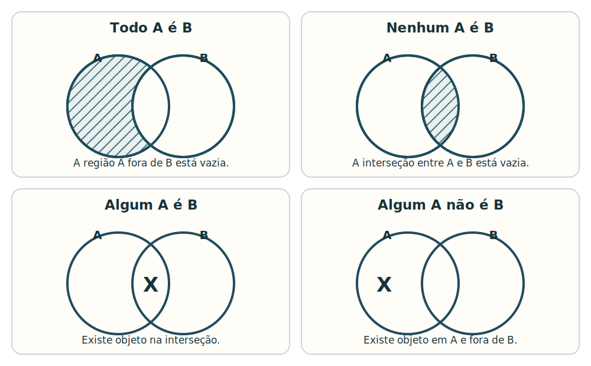

## 1. Escopo

Este assunto ensina duas ferramentas complementares de raciocínio lógico:

- **equivalências proposicionais**, que permitem substituir uma fórmula por outra com a mesma coluna final em todas as atribuições;
- **diagramas lógicos**, que representam relações de inclusão, exclusão e existência entre classes para testar conclusões categóricas.

O recorte inclui:

- definição e teste de equivalência lógica;
- leis algébricas das proposições;
- equivalências da condicional e da bicondicional;
- leis de De Morgan e negação correta de fórmulas compostas;
- diagramas de classes do tipo Venn/Euler;
- proposições categóricas com “todo”, “nenhum”, “algum” e “algum não”;
- conclusões necessárias, apenas possíveis ou incompatíveis com as premissas.

As regras básicas dos conectivos e a construção completa de tabelas-verdade foram estudadas no assunto anterior e são usadas aqui como pré-requisito. Ficam para assuntos próprios a sintaxe formal de predicados e quantificadores, as relações de primeira ordem em geral e as operações algébricas ou de contagem com conjuntos. Neste assunto, a linguagem de classes aparece somente na medida necessária para construir e interpretar os diagramas cobrados em Raciocínio Lógico.

## 2. O que é equivalência lógica

Duas fórmulas $P$ e $Q$ são **logicamente equivalentes** quando recebem o mesmo valor lógico em **todas** as atribuições possíveis de suas proposições simples.

Escreve-se:

$$
P \equiv Q.
$$

Isso significa que as colunas finais das tabelas-verdade de $P$ e $Q$ são idênticas, linha por linha.

Exemplo fundamental:

$$
p \to q \equiv \neg p \lor q.
$$

| $p$ | $q$ | $p \to q$ | $\neg p \lor q$ |
|:---:|:---:|:---:|:---:|
| V | V | V | V |
| V | F | F | F |
| F | V | V | V |
| F | F | V | V |

As duas colunas finais coincidem nas quatro linhas; portanto, as fórmulas são equivalentes.

### 2.1. Coincidência em uma linha não basta

Se duas fórmulas valem V em determinada atribuição, isso prova apenas uma coincidência naquela linha. Equivalência exige igualdade em **todas** as linhas.

Por exemplo, $p$ e $q$ coincidem quando ambas são verdadeiras e quando ambas são falsas, mas não são equivalentes, pois divergem nas atribuições V/F e F/V.

### 2.2. Equivalência não é identidade gráfica

Fórmulas equivalentes podem ter símbolos e estruturas diferentes. A equivalência compara o comportamento lógico completo, não a aparência da expressão.

Também é possível escrever a mesma estrutura com letras diferentes, mas isso não estabelece equivalência entre fórmulas que usam as letras em papéis distintos. Sempre compare as atribuições correspondentes.

## 3. Três noções que não devem ser confundidas

### 3.1. Equivalência

$P \equiv Q$ significa que $P$ e $Q$ possuem sempre o mesmo valor. A relação é simétrica: se $P$ é equivalente a $Q$, então $Q$ é equivalente a $P$.

### 3.2. Condicional dentro da linguagem

$P \to Q$ é uma fórmula que pode ser verdadeira ou falsa conforme os valores de $P$ e $Q$. Uma condicional isolada não afirma equivalência.

### 3.3. Consequência lógica

Dizer que $Q$ é consequência lógica de $P$ significa que não existe atribuição em que $P$ seja verdadeira e $Q$ seja falsa. Esse compromisso pode valer em uma direção sem valer na outra.

Exemplo:

$$
p \land q \models p,
$$

pois uma conjunção verdadeira exige $p$ verdadeiro. Contudo, $p$ não garante $p \land q$; logo, $p \land q$ e $p$ não são equivalentes.

## 4. Como testar uma equivalência

Há dois testes clássicos.

### 4.1. Comparar colunas finais

1. Liste todas as proposições simples distintas das duas fórmulas.
2. Construa uma única tabela com todas as atribuições.
3. Calcule as subfórmulas necessárias.
4. Compare as duas colunas finais.
5. Se houver uma única divergência, não há equivalência.

### 4.2. Testar a bicondicional

As fórmulas $P$ e $Q$ são equivalentes exatamente quando

$$
P \leftrightarrow Q
$$

é uma tautologia. A bicondicional é verdadeira quando os lados têm o mesmo valor; ser tautológica significa que essa igualdade ocorre em todas as atribuições.

### 4.3. Contraexemplo à equivalência

Para mostrar que duas fórmulas **não** são equivalentes, basta encontrar uma atribuição em que uma seja V e a outra seja F.

Considere $p \to q$ e $q \to p$. Com $p=V$ e $q=F$:

- $p \to q=F$;
- $q \to p=V$.

Essa única divergência refuta a equivalência entre a condicional e sua conversa.

## 5. Princípio de substituição

Se $P \equiv Q$, uma ocorrência completa de $P$ pode ser substituída por $Q$ dentro de uma fórmula maior, desde que se preserve o agrupamento.

Como $p \to q \equiv \neg p \lor q$:

$$
r \land (p \to q)
\equiv
r \land (\neg p \lor q).
$$

Os parênteses são indispensáveis. Substituir uma subfórmula não autoriza mover conectivos, apagar termos ou alterar o alcance de uma negação.

## 6. Leis fundamentais de equivalência

Nas tabelas a seguir, $\top$ representa uma tautologia e $\bot$ representa uma contradição.

### 6.1. Dupla negação

$$
\neg\neg p \equiv p.
$$

Negar duas vezes restaura o valor original.

### 6.2. Idempotência

$$
p \land p \equiv p
$$

$$
p \lor p \equiv p.
$$

Repetir a mesma proposição por “e” ou por “ou” não altera seu valor.

### 6.3. Comutatividade

$$
p \land q \equiv q \land p
$$

$$
p \lor q \equiv q \lor p.
$$

A ordem das parcelas pode ser trocada na conjunção e na disjunção. Essa propriedade não vale, em geral, para a condicional:

$$
p \to q \not\equiv q \to p.
$$

### 6.4. Associatividade

$$
(p \land q) \land r \equiv p \land (q \land r)
$$

$$
(p \lor q) \lor r \equiv p \lor (q \lor r).
$$

Quando há somente conjunções ou somente disjunções, o reagrupamento não altera o valor. Misturar conectivos exige outras leis.

### 6.5. Distributividade

$$
p \land (q \lor r)
\equiv
(p \land q) \lor (p \land r)
$$

$$
p \lor (q \land r)
\equiv
(p \lor q) \land (p \lor r).
$$

Na lógica proposicional, tanto a conjunção distribui sobre a disjunção quanto a disjunção distribui sobre a conjunção.

### 6.6. Identidade

$$
p \land \top \equiv p
$$

$$
p \lor \bot \equiv p.
$$

Conjuntar com algo sempre verdadeiro ou disjuntar com algo sempre falso preserva $p$.

### 6.7. Dominação

$$
p \lor \top \equiv \top
$$

$$
p \land \bot \equiv \bot.
$$

Uma verdade já satisfaz a disjunção; uma falsidade já derruba a conjunção.

### 6.8. Complemento

$$
p \lor \neg p \equiv \top
$$

$$
p \land \neg p \equiv \bot.
$$

A primeira forma expressa o terceiro excluído; a segunda, a impossibilidade de $p$ e sua negação serem ambas verdadeiras na mesma interpretação clássica.

### 6.9. Absorção

$$
p \lor (p \land q) \equiv p
$$

$$
p \land (p \lor q) \equiv p.
$$

Se $p$ já basta para a disjunção, acrescentar o caso mais restrito $p \land q$ não amplia o resultado. Se a conjunção já exige $p$, o fator $p \lor q$ não acrescenta nova exigência quando $p$ é verdadeiro.

## 7. Equivalências da condicional

### 7.1. Eliminação da seta

$$
p \to q \equiv \neg p \lor q.
$$

Essa é a equivalência central da condicional material. Ela também pode ser escrita como:

$$
p \to q \equiv \neg(p \land \neg q).
$$

A condicional proíbe exatamente o caso em que $p$ é verdadeira e $q$ é falsa.

### 7.2. Contrapositiva

$$
p \to q \equiv \neg q \to \neg p.
$$

Exemplo:

> Se o processo foi arquivado, então houve decisão.

Forma contrapositiva equivalente:

> Se não houve decisão, então o processo não foi arquivado.

### 7.3. Conversa e inversa

Partindo de $p \to q$:

- **conversa:** $q \to p$;
- **inversa:** $\neg p \to \neg q$;
- **contrapositiva:** $\neg q \to \neg p$.

A original é equivalente à contrapositiva. A conversa é equivalente à inversa, mas nenhuma delas é, em geral, equivalente à original.

### 7.4. Negação da condicional

$$
\neg(p \to q) \equiv p \land \neg q.
$$

Negar “se $p$, então $q$” é afirmar o único caso que viola a promessa: $p$ ocorre e $q$ não ocorre.

Não confunda:

$$
\neg(p \to q)
\not\equiv
\neg p \to \neg q.
$$

A expressão da direita é a inversa da condicional, não sua negação.

### 7.5. Distribuições úteis envolvendo a seta

As seguintes formas podem ser derivadas pela eliminação da condicional e pelas leis distributivas:

$$
p \to (q \land r)
\equiv
(p \to q) \land (p \to r)
$$

$$
(p \lor q) \to r
\equiv
(p \to r) \land (q \to r).
$$

Essas relações não autorizam distribuir a seta mecanicamente em qualquer posição. Quando houver dúvida, elimine a seta e simplifique passo a passo.

## 8. Equivalências da bicondicional

A bicondicional exige as duas direções:

$$
p \leftrightarrow q
\equiv
(p \to q) \land (q \to p).
$$

Ao eliminar as setas:

$$
p \leftrightarrow q
\equiv
(\neg p \lor q) \land (\neg q \lor p).
$$

Também se pode destacar a igualdade dos valores:

$$
p \leftrightarrow q
\equiv
(p \land q) \lor (\neg p \land \neg q).
$$

Ou ambos são verdadeiros, ou ambos são falsos.

### 8.1. Negação da bicondicional

$$
\neg(p \leftrightarrow q)
\equiv
(p \land \neg q) \lor (\neg p \land q).
$$

Essa é a disjunção exclusiva: exatamente um dos lados é verdadeiro.

## 9. Leis de De Morgan

As leis de De Morgan transformam a negação de conjunções e disjunções.

$$
\neg(p \land q)
\equiv
\neg p \lor \neg q
$$

$$
\neg(p \lor q)
\equiv
\neg p \land \neg q.
$$

A regra operacional possui dois movimentos simultâneos:

1. a negação alcança cada componente;
2. o conectivo troca de $\land$ para $\lor$, ou de $\lor$ para $\land$.

### 9.1. Negação de uma conjunção

Negar que as duas afirmações sejam verdadeiras em conjunto permite que uma ou ambas falhem:

> Não é verdade que Ana protocolou o pedido **e** Bruno emitiu o recibo.

Equivale a:

> Ana não protocolou o pedido **ou** Bruno não emitiu o recibo.

O “ou” é inclusivo: também é possível que nenhuma das ações tenha ocorrido.

### 9.2. Negação de uma disjunção

Negar que ao menos uma afirmação seja verdadeira exige que ambas sejam falsas:

> Não é verdade que Ana protocolou o pedido **ou** Bruno emitiu o recibo.

Equivale a:

> Ana não protocolou o pedido **e** Bruno não emitiu o recibo.

### 9.3. Mais de duas componentes

As leis se estendem a cadeias:

$$
\neg(p \land q \land r)
\equiv
\neg p \lor \neg q \lor \neg r
$$

$$
\neg(p \lor q \lor r)
\equiv
\neg p \land \neg q \land \neg r.
$$

Para negar “todos os requisitos foram atendidos”, basta que pelo menos um não tenha sido. Para negar “algum dos três requisitos foi atendido”, é preciso que nenhum tenha sido.

### 9.4. De Morgan em fórmulas aninhadas

Considere:

$$
\neg\bigl(p \lor (q \land r)\bigr).
$$

Primeiro aplique De Morgan à disjunção externa:

$$
\neg p \land \neg(q \land r).
$$

Depois aplique a lei à conjunção interna:

$$
\neg p \land (\neg q \lor \neg r).
$$

O procedimento respeita a estrutura dos parênteses e avança da negação externa para as subfórmulas.

### 9.5. “Nem... nem...”

Na leitura proposicional usual:

> Nem $p$ nem $q$

significa:

$$
\neg p \land \neg q,
$$

equivalente a $\neg(p \lor q)$.

## 10. Negação e linguagem categórica

As quatro formas verbais dos diagramas também possuem negações úteis:

| Afirmação | Negação correta |
|---|---|
| Todo $A$ é $B$ | Algum $A$ não é $B$ |
| Nenhum $A$ é $B$ | Algum $A$ é $B$ |
| Algum $A$ é $B$ | Nenhum $A$ é $B$ |
| Algum $A$ não é $B$ | Todo $A$ é $B$ |

Negar uma universal produz um contraexemplo existencial; negar uma existência elimina todos os casos daquele tipo.

Neste assunto, essas relações são usadas verbal e diagramaticamente. A notação formal dos quantificadores, seu escopo e as demais regras do cálculo de predicados ficam para lógica de primeira ordem.

## 11. Estratégia de transformação

Uma transformação segura deve justificar cada passo por uma lei.

Exemplo:

$$
\neg(p \to q).
$$

Elimine a seta:

$$
\neg(\neg p \lor q).
$$

Aplique De Morgan:

$$
\neg\neg p \land \neg q.
$$

Aplique dupla negação:

$$
p \land \neg q.
$$

Outro exemplo:

$$
(p \land q) \lor (p \land \neg q).
$$

Coloque $p$ em evidência pela distributividade:

$$
p \land (q \lor \neg q).
$$

Use complemento:

$$
p \land \top.
$$

Use identidade:

$$
p.
$$

Logo:

$$
(p \land q) \lor (p \land \neg q) \equiv p.
$$

## 12. Como conferir uma simplificação

1. Preserve os parênteses no primeiro registro.
2. Identifique o conectivo principal.
3. Elimine $\to$ e $\leftrightarrow$ se isso simplificar a expressão.
4. Empurre negações para dentro com De Morgan.
5. Elimine duplas negações.
6. Procure complementos, identidades, repetições e absorções.
7. Registre a lei usada em cada passagem.
8. Se o resultado parecer duvidoso, compare tabelas-verdade ou busque uma atribuição divergente.

Não “cancele” letras como em uma fração. Fórmulas lógicas obedecem às leis de equivalência, não a cancelamentos informais.

## 13. O que são diagramas lógicos

No uso de Raciocínio Lógico adotado pelo CEBRASPE, **diagramas lógicos** representam classes e proposições categóricas. Eles não são diagramas de portas digitais.

Uma classe reúne os objetos que possuem determinada característica:

- $A$: auditores;
- $B$: servidores;
- $C$: pessoas capacitadas.

Os círculos ou regiões mostram quais combinações de características são permitidas, proibidas ou expressamente existentes.

Diagramas de **Euler** costumam desenhar diretamente relações como inclusão e separação. Diagramas de **Venn** particionam todas as regiões possíveis e usam hachura e marcas de existência. Em questões de concurso, o essencial é interpretar corretamente as regiões; o enunciado pode usar “diagrama lógico” sem exigir distinção histórica entre as duas técnicas.

## 14. Convenção usada neste material

Para evitar ambiguidades, adotaremos:

- região **hachurada**: região vazia, proibida pelas premissas;
- marca **X**: existe ao menos um objeto naquela região;
- região em branco: nenhuma informação suficiente para afirmar que está vazia ou ocupada;
- X sobre uma fronteira: o objeto existe, mas as premissas não determinam em qual das regiões adjacentes ele está.

## 15. As quatro formas categóricas

### 15.1. Todo $A$ é $B$

$$
A \subseteq B.
$$

A região de $A$ fora de $B$ deve estar vazia. Todo objeto que pertença a $A$ também pertence a $B$.

Exemplo:

> Todo auditor do setor é servidor.

Isso não autoriza a conversa “todo servidor é auditor”. Pode haver servidores fora da classe dos auditores.

### 15.2. Nenhum $A$ é $B$

$$
A \cap B=\varnothing.
$$

A interseção deve estar vazia. As classes podem existir separadamente, mas não compartilham objeto.

Exemplo:

> Nenhum relatório sigiloso é de acesso irrestrito.

A exclusão é simétrica: se nenhum $A$ é $B$, então nenhum $B$ é $A$.

### 15.3. Algum $A$ é $B$

$$
A \cap B\neq\varnothing.
$$

Há pelo menos um objeto na interseção. A marca X registra essa existência.

Exemplo:

> Algum servidor é auditor.

A proposição também garante “algum auditor é servidor”, pois o mesmo objeto pertence às duas classes.

### 15.4. Algum $A$ não é $B$

$$
A \setminus B\neq\varnothing.
$$

Há pelo menos um objeto em $A$ e fora de $B$.

Exemplo:

> Algum servidor não é auditor.

Isso não equivale a “algum auditor não é servidor”: a posição das classes importa.

## 16. Universais não garantem existência

Na interpretação moderna adotada para esses problemas, as proposições universais não afirmam, sozinhas, que a classe inicial possua membros.

> Todo unicórnio é mamífero.

Essa universal apenas proíbe unicórnios fora da classe dos mamíferos. Ela não afirma que unicórnios existam.

Consequências importantes:

- de “todo $A$ é $B$” não se conclui “algum $A$ é $B$” sem premissa existencial;
- “todo $A$ é $B$” e “nenhum $A$ é $B$” podem ser simultaneamente satisfeitas se $A$ estiver vazia;
- uma marca X só pode ser introduzida por afirmação existencial ou por informação individual equivalente.

Se uma questão declarar outra convenção de importação existencial, siga o enunciado. Sem declaração, não invente existência a partir de universal.

## 17. Conversões seguras e inseguras

| Forma original | Conversão | Situação |
|---|---|---|
| Nenhum $A$ é $B$ | Nenhum $B$ é $A$ | válida |
| Algum $A$ é $B$ | Algum $B$ é $A$ | válida |
| Todo $A$ é $B$ | Todo $B$ é $A$ | inválida em geral |
| Algum $A$ não é $B$ | Algum $B$ não é $A$ | inválida em geral |

Interseção e exclusão são simétricas; inclusão e diferença orientada não são.

## 18. Diagramas com três classes

Com três classes $A$, $B$ e $C$, o diagrama distingue oito regiões básicas: dentro ou fora de cada uma das três classes. Nem sempre será necessário nomear todas; o importante é não fundir regiões que as premissas deixam diferentes.

### 18.1. Ordem de lançamento das premissas

1. Desenhe as classes necessárias com todas as sobreposições ainda possíveis.
2. Lance primeiro as premissas universais, hachurando regiões vazias.
3. Lance depois as premissas existenciais, colocando X apenas em região permitida.
4. Se a posição exata do X não for determinada, mantenha-o sobre a fronteira relevante.
5. Verifique a conclusão sem acrescentar informação.

Começar pelas universais reduz as posições possíveis dos objetos existenciais.

### 18.2. X em região determinada

Premissas:

1. Todo cientista é estudioso.
2. Algum cientista é inventor.

O objeto da segunda premissa está na interseção “cientista e inventor”. Como todo cientista é estudioso, o mesmo X também deve ficar dentro de “estudioso”. Logo:

> Algum estudioso é inventor.

A conclusão é necessária.

### 18.3. X sobre fronteira

Premissas:

1. Algum $A$ é $B$.
2. Nenhuma informação relaciona esse objeto a $C$.

O X deve ficar na interseção $A \cap B$, mas pode estar dentro ou fora de $C$. Se o desenho separa essas duas sub-regiões, marque o X sobre a fronteira de $C$. Não escolha uma delas por conveniência.

## 19. Teste de conclusões categóricas

Uma conclusão é **necessária** quando aparece em todos os diagramas compatíveis com as premissas. É apenas **possível** quando aparece em pelo menos um desenho admissível, mas falta em outro. É **incompatível** quando viola alguma região vazia ou exigência existencial.

### 19.1. Encadeamento válido de inclusões

Premissas:

1. Todo auditor é servidor.
2. Todo servidor é capacitado.

Então todo auditor é capacitado, pois:

$$
A \subseteq S \quad\text{e}\quad S \subseteq C
\quad\Longrightarrow\quad
A \subseteq C.
$$

Não se conclui que existam auditores.

### 19.2. Existência transferida por inclusão

Premissas:

1. Todo auditor é servidor.
2. Algum auditor é gestor.

O objeto que é auditor e gestor também é servidor. Logo, algum servidor é gestor.

### 19.3. Existência no conjunto maior não volta ao menor

Premissas:

1. Todo auditor é servidor.
2. Algum servidor é gestor.

O servidor gestor pode estar fora da classe dos auditores. Portanto, não é necessário que algum auditor seja gestor.

### 19.4. Exclusão combinada com existência

Premissas:

1. Nenhum auditor é terceirizado.
2. Algum analista é auditor.

O analista indicado pela segunda premissa não pode ser terceirizado. Logo, algum analista não é terceirizado.

### 19.5. Inclusão seguida de exclusão

Premissas:

1. Todo $A$ é $B$.
2. Nenhum $B$ é $C$.

Todo membro de $A$, se houver, pertence a $B$ e, por isso, fica fora de $C$. Logo, nenhum $A$ é $C$.

### 19.6. Conclusão que exige existência indevida

Premissas:

1. Todo $A$ é $B$.
2. Algum $B$ existe.

O membro de $B$ pode estar fora de $A$. Não se conclui que algum $A$ exista.

## 20. Diagrama e validade de argumentos

O diagrama não pergunta se as classes correspondem a fatos reais. Ele testa se a conclusão decorre da forma das premissas.

Procedimento:

1. aceite provisoriamente todas as premissas;
2. represente exatamente as restrições e existências que elas fornecem;
3. mantenha abertas as regiões sobre as quais nada foi dito;
4. procure um diagrama alternativo compatível em que a conclusão seja falsa;
5. se esse contraexemplo existir, a conclusão não é necessária;
6. se todos os diagramas admissíveis contiverem a conclusão, o argumento é válido quanto à forma.

Uma figura conveniente não prova validade. O desenho deve representar todas as possibilidades ainda abertas, ou a análise deve verificar cada arranjo admissível.

## 21. Relação entre equivalências e diagramas

Os dois blocos usam a mesma disciplina de preservação semântica:

- em equivalências, uma transformação é válida se preserva o valor em todas as atribuições;
- em argumentos diagramáticos, uma conclusão é válida se é preservada em todos os diagramas compatíveis com as premissas.

Em ambos os casos, um único contraexemplo basta para refutar a pretensão universal:

- uma linha divergente refuta uma equivalência;
- um diagrama admissível sem a conclusão refuta a validade categórica.

Não se deve, porém, misturar os níveis. Letras proposicionais representam afirmações inteiras; círculos representam classes de objetos. A expressão $p \to q$ não é desenhada como se $p$ e $q$ fossem automaticamente conjuntos de pessoas.

## 22. Erros recorrentes de prova

### 22.1. Trocar “equivalente” por “verdadeiro na linha”

Equivalência exige todas as atribuições. Uma coincidência pontual não basta.

### 22.2. Tratar conversa como contrapositiva

$q \to p$ é a conversa. A contrapositiva de $p \to q$ é $\neg q \to \neg p$.

### 22.3. Negar a condicional como outra condicional

A negação de $p \to q$ é $p \land \neg q$, e não $\neg p \to \neg q$.

### 22.4. Aplicar De Morgan sem trocar o conectivo

$$
\neg(p \lor q) \not\equiv \neg p \lor \neg q.
$$

A forma correta troca $\lor$ por $\land$.

### 22.5. Negar apenas uma parcela

Ao negar uma conjunção ou disjunção completa, a negação alcança todas as componentes segundo De Morgan.

### 22.6. Cancelar letras informalmente

Não existe cancelamento algébrico geral de ocorrências proposicionais. Use distributividade, absorção, complemento e demais leis identificáveis.

### 22.7. Inverter inclusão

De “todo $A$ é $B$” não segue “todo $B$ é $A$”. O círculo menor pode ocupar apenas parte do maior.

### 22.8. Criar existência a partir de universal

Uma região não hachurada não contém automaticamente um objeto. Somente uma premissa existencial justifica X.

### 22.9. Colocar X em região arbitrária

Se as premissas deixam duas posições possíveis, mantenha a ambiguidade. Escolher a posição que favorece a conclusão acrescenta informação.

### 22.10. Confundir possível com necessário

Uma conclusão desenhável pode ser apenas compatível. Para ser necessária, deve aparecer em todo arranjo admitido.

## 23. Roteiro de resolução

### 23.1. Questão de equivalência

1. Identifique as fórmulas comparadas.
2. Preserve o agrupamento.
3. Elimine setas e bicondicionais quando útil.
4. Aplique De Morgan e dupla negação com alcance correto.
5. Simplifique por leis nomeáveis.
6. Confira se a transformação preserva todas as atribuições.
7. Para refutar, procure uma linha divergente.

### 23.2. Questão de diagrama

1. Defina uma classe para cada termo.
2. Traduza “todo”, “nenhum”, “algum” e “algum não”.
3. Hachure primeiro as regiões proibidas pelas universais.
4. Posicione depois os X exigidos pelas existenciais.
5. Não introduza X sem premissa.
6. Preserve posições indeterminadas sobre fronteiras.
7. Verifique se a conclusão vale em todos os desenhos admissíveis.

## 24. Síntese

- Equivalência lógica exige colunas finais idênticas em todas as atribuições.
- $P \equiv Q$ se e somente se $P \leftrightarrow Q$ é tautologia.
- Uma atribuição divergente refuta a equivalência.
- $p \to q \equiv \neg p \lor q \equiv \neg q \to \neg p$.
- $\neg(p \to q) \equiv p \land \neg q$.
- $p \leftrightarrow q$ exige as duas condicionais e valores iguais.
- De Morgan nega cada componente e troca $\land$ por $\lor$, ou $\lor$ por $\land$.
- “Todo $A$ é $B$” esvazia $A$ fora de $B$, mas não afirma que $A$ exista.
- “Nenhum” esvazia a interseção; “algum” exige X na região indicada.
- Conclusão diagramática necessária aparece em todos os diagramas compatíveis.
- Uma linha ou um diagrama contraexemplo basta para refutar uma pretensão universal.

## Referências

- CEBRASPE. [Edital do concurso público do TCE/MA 2026](https://cdn.cebraspe.org.br/concursos/TCE_MA_26/arquivos/5FADC380CB030A07F557A9C5EEA6D063017A2CA675E683F39C50B65E6D70F57B.pdf). Centro Brasileiro de Pesquisa em Avaliação e Seleção e de Promoção de Eventos. Conteúdo programático vigente consultado em 18 jul. 2026.
- CEBRASPE. [Caderno CB1 de nível superior da Prefeitura de São Cristóvão/SE](https://cdn.cebraspe.org.br/concursos/PREF_SAO_CRISTOVAO_SE_23/arquivos/823_PREF_SAO_CRISTOVAO_CB1_01_%28NVEL_SUPERIOR%29.PDF). Questões 19 e 20 sobre representação diagramática de argumento categórico. Consultado em 18 jul. 2026.
- PONTIFÍCIA UNIVERSIDADE CATÓLICA DE SÃO PAULO. [O cálculo de predicados de primeira ordem](https://www4.pucsp.br/~logica/CalculodePredicados.htm). Material de Celina Abar sobre enunciados categóricos, diagramas de Venn e validade. Consultado em 18 jul. 2026.
- UNIVERSIDADE FEDERAL DE MINAS GERAIS. [Fundamentos da lógica](https://homepages.dcc.ufmg.br/~loureiro/md/md_1FundamentosDaLogica.pdf). Departamento de Ciência da Computação. Material didático sobre equivalências, condicionais e leis de De Morgan consultado em 18 jul. 2026.
