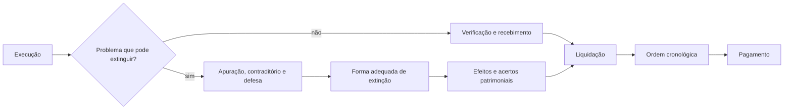

# Extinção, recebimento e pagamento

Quando a execução se aproxima do encerramento, três perguntas precisam ser separadas:

1. **o vínculo deve continuar ou existe causa para extingui-lo?**
2. **o que foi entregue atende ao contrato e pode ser recebido?**
3. **qual valor é devido e em que ordem pode ser pago?**

Há dois trilhos. No percurso normal, a prestação é verificada, recebida, <abbr title="verificação do direito do credor com base nos documentos do crédito">liquidada</abbr> e paga. Se surge causa de encerramento antecipado, é preciso apurar o fato, assegurar defesa, escolher a forma cabível de extinção e acertar seus efeitos. Extinguir não apaga o que foi regularmente executado; receber não significa pagar imediatamente; pagar não elimina responsabilidades remanescentes.

Em um **exemplo hipotético**, a Administração constata falha em parte de uma execução mensurável. Antes de concluir que “o contrato acabou” ou que “nada pode ser pago”, deve identificar a parcela conforme, a causa do problema, quem lhe deu origem e os atos formais exigidos.

> **Corte de prova:** legislação vigente em **6 de julho de 2026**, data de publicação do Edital nº 1 do <abbr title="Tribunal de Contas do Estado do Maranhão">TCE/MA</abbr>. Este capítulo concentra os arts. 137 a 146 da Lei nº 14.133/2021. Infrações, sanções, nulidade e meios de solução de controvérsias só aparecem aqui na medida necessária para distinguir institutos; seu desenvolvimento pertence ao assunto seguinte.

## 1. Extinção: causa, processo, forma e efeitos são etapas diferentes

O contrato pode terminar pelo cumprimento das obrigações ou pelo fim do prazo. Os arts. 137 a 139 disciplinam situações em que um fato durante a relação pode justificar sua **extinção** por uma das formas legais:

**fato relevante → apuração e defesa → decisão motivada → forma de extinção → efeitos patrimoniais**.

Extinção e sanção são planos diferentes: **a extinção encerra o vínculo; a sanção pune uma infração**. O mesmo inadimplemento pode sustentar ambas, mas uma não substitui a outra.

### 1.1 Os nove motivos do art. 137

O art. 137 exige que o motivo seja **formalmente motivado nos autos**, com contraditório — possibilidade de conhecer e contestar o que está sendo imputado — e ampla defesa — possibilidade de utilizar os meios de defesa admitidos no processo. A mera ocorrência do fato não produz extinção automática.

Depois de entender essa regra, vale organizar os nove motivos pela origem do problema:

| Onde está o problema? | Motivo legal |
| --- | --- |
| execução do objeto | não cumprimento ou cumprimento irregular de normas do edital, cláusulas, especificações, projetos ou prazos |
| comando fiscalizatório | desatendimento de determinação regular de quem acompanha e fiscaliza a execução ou de autoridade superior |
| capacidade empresarial | alteração social, da finalidade ou da estrutura da empresa que restrinja sua capacidade de concluir o contrato |
| existência do contratado | falência, <abbr title="situação patrimonial em que pessoa não empresária não consegue satisfazer suas dívidas">insolvência civil</abbr>, dissolução da sociedade ou falecimento do contratado |
| evento impeditivo | <abbr title="eventos inevitáveis ou alheios à vontade que, comprovados, impedem a execução">caso fortuito ou força maior</abbr>, regularmente comprovados e impeditivos da execução |
| licença ambiental | atraso ou impossibilidade de obtê-la, ou alteração substancial do <abbr title="documento técnico preliminar que define a concepção da obra ou serviço de engenharia">anteprojeto</abbr> dela resultante, ainda que a licença saia no prazo |
| disponibilidade de áreas | atraso ou impossibilidade de liberar área sujeita a <abbr title="retirada compulsória de propriedade para finalidade pública, conforme requisitos legais">desapropriação</abbr>, desocupação ou <abbr title="ônus imposto a imóvel para permitir uso público específico">servidão administrativa</abbr> |
| interesse público | razões justificadas pela autoridade máxima do órgão ou entidade contratante |
| reserva de cargos | descumprimento das reservas previstas em lei ou normas específicas para pessoa com deficiência, reabilitado da Previdência Social ou aprendiz |

Um regulamento pode detalhar critérios e procedimentos de verificação, sem eliminar os requisitos legais. No exemplo hipotético, prestação defeituosa pode se enquadrar no primeiro motivo, mas isso ainda não define se haverá correção, extinção ou sanção: os fatos precisam ser instruídos e a decisão, fundamentada.

### 1.2 Quando a própria Administração cria a situação

A origem do problema altera a resposta jurídica. Se o descumprimento decorre da **própria conduta da Administração**, ela não pode usar contra o contratado a forma unilateral do art. 138, I, fundada nesse mesmo descumprimento.

Além disso, o § 2º do art. 137 reconhece ao contratado direito à extinção em cinco hipóteses ligadas a atos ou atrasos administrativos:

| Hipótese | Marco legal |
| --- | --- |
| supressão administrativa | alteração do valor inicial além do limite permitido pelo art. 125 |
| suspensão contínua | ordem escrita por prazo superior a **3 meses** |
| suspensões repetidas | total de **90 dias úteis** |
| atraso de pagamento | superior a **2 meses**, contado da emissão da nota fiscal, sobre pagamentos ou parcelas devidos por obras, serviços ou fornecimentos |
| não liberação | área, local, objeto ou fonte de material natural necessários à execução não liberados no prazo contratual, inclusive por obrigações administrativas ligadas a <abbr title="retirada compulsória de propriedade para finalidade pública, conforme requisitos legais">desapropriação</abbr>, desocupação ou licenciamento ambiental |

Nas três hipóteses temporais — suspensão contínua, suspensões repetidas e atraso de pagamento — há um regime especial. Elas não são admitidas em calamidade pública, grave perturbação da ordem interna ou guerra, nem quando o fato decorreu de ato do contratado, com sua participação ou contribuição. Fora dessas exceções, o contratado pode optar por **suspender suas próprias obrigações até a normalização**, e a lei admite o restabelecimento do <abbr title="recomposição da relação econômica originalmente pactuada entre encargos e remuneração">equilíbrio econômico-financeiro</abbr>.

Esse é um ponto de prova importante: **direito à extinção não equivale a poder do contratado de produzir, por simples declaração, o mesmo ato unilateral escrito que a lei atribui à Administração**. A lei separa a existência do direito da forma pela qual o encerramento será formalizado.

Nas suspensões repetidas, a lei ainda preserva o pagamento das sucessivas e contratualmente imprevistas <abbr title="retirada de equipes, estruturas ou recursos mobilizados para a execução">desmobilizações</abbr>, mobilizações e outras consequências previstas.

### 1.3 A garantia entra no processo desde o início da apuração

Quando houver garantia prevista no art. 96, o contratante deve notificar **seus emitentes** sobre o início do processo administrativo que apura descumprimento de cláusulas contratuais. A regra não se limita ao seguro-garantia e não manda esperar a decisão final.

A comunicação antecede eventual execução da garantia para as finalidades delimitadas pela lei.

## 2. A forma de extinção depende de quem decide e de como o conflito é encerrado

Depois de apurada a causa, o art. 138 prevê três caminhos:

| Forma | Como se produz |
| --- | --- |
| unilateral | ato escrito da Administração, exceto quando o descumprimento decorre de sua própria conduta |
| consensual | acordo, conciliação, mediação ou comitê de resolução de disputas, desde que haja interesse da Administração |
| por decisão externa | decisão arbitral ou decisão judicial |

Na arbitragem, **cláusula compromissória** remete futuras controvérsias à via arbitral; **compromisso arbitral** submete a ela uma controvérsia já existente.

A extinção unilateral e a consensual exigem, em comum, **autorização escrita e fundamentada da autoridade competente** e redução a termo no processo.

### 2.1 Culpa exclusiva da Administração: encerrar exige acertar os prejuízos

Se a extinção decorrer de culpa exclusiva da Administração, o contratado tem direito ao ressarcimento dos prejuízos regularmente comprovados e, expressamente, a:

- devolução da garantia;
- pagamentos devidos pelo que executou até a data da extinção;
- pagamento do custo da desmobilização.

A lógica é reparatória: o prejuízo precisa ser comprovado; não há lucro futuro presumido.

### 2.2 O que a Administração pode fazer após a extinção unilateral

Na extinção unilateral, o art. 139 permite medidas de continuidade e proteção patrimonial:

1. **assunção imediata do objeto** — a Administração toma para si a continuidade do objeto no estado e local em que ele se encontra;
2. ocupação e uso de local, instalações, equipamentos, material e pessoal empregados na execução e necessários à continuidade;
3. execução da garantia contratual para ressarcir prejuízos da não execução, pagar verbas trabalhistas, <abbr title="relativas ao Fundo de Garantia do Tempo de Serviço">fundiárias</abbr> e previdenciárias quando cabível, pagar multas ou exigir que a seguradora assuma e conclua o objeto quando essa solução se aplicar;
4. retenção dos créditos decorrentes **daquele contrato**, até o limite dos prejuízos causados e das multas aplicadas.

Assunção e ocupação ficam a critério da Administração, que pode continuar obra ou serviço por <abbr title="execução feita pela própria Administração">execução direta</abbr> ou <abbr title="execução realizada por terceiro contratado">execução indireta</abbr>. A ocupação e utilização do inciso II exigem autorização expressa do ministro de Estado, secretário estadual ou secretário municipal competente, conforme o caso.

A retenção tem limite, e medidas de continuidade não substituem o processo próprio de sanção ou responsabilidade patrimonial.

## 3. Recebimento: a entrega passa por uma porta de verificação

Se o contrato segue para a entrega, surge outra pergunta: **a prestação corresponde ao contratado?** O recebimento verifica e formaliza essa conformidade; entrega física, recebimento e pagamento não são equivalentes.

Em obras e serviços, o provisório verifica exigências técnicas e o definitivo confirma as exigências contratuais. Em compras, o provisório pode ser sumário porque a conformidade material será verificada depois.

| Objeto | Provisório | Definitivo |
| --- | --- | --- |
| obras e serviços | responsável pelo acompanhamento e fiscalização, mediante termo detalhado, após verificar exigências técnicas | servidor ou comissão designada pela autoridade competente, mediante termo detalhado que comprove as exigências contratuais |
| compras | forma sumária, pelo responsável pelo acompanhamento e fiscalização, para posterior verificação da conformidade | servidor ou comissão designada, mediante termo detalhado que comprove as exigências contratuais |

Se o objeto estiver em desacordo com o contrato, pode ser rejeitado total ou parcialmente. Os prazos e métodos do recebimento serão definidos em regulamento ou no contrato; o art. 140 não cria um único prazo nacional para toda obra, serviço ou compra.

Salvo disposição contrária do edital ou de ato normativo, ensaios, testes e demais provas exigidos por normas técnicas oficiais para comprovar a boa execução correm por conta do contratado.

### 3.1 O termo definitivo encerra a verificação, não todas as responsabilidades

O recebimento provisório ou definitivo não exclui a responsabilidade civil pela solidez e segurança da obra ou serviço nem a <abbr title="dever profissional de responder pela correção técnica da execução">responsabilidade ético-profissional</abbr> pela perfeita execução, nos limites legais e contratuais.

Em projeto de obra, o recebimento definitivo não exime projetista ou consultor da **responsabilidade objetiva** pelos danos causados por falha de projeto. Objetiva significa que a responsabilização não depende de provar culpa, embora continue sendo necessário ligar o dano à falha imputada.

Em obra executada, a responsabilidade objetiva pela solidez e segurança dos materiais e serviços e pela funcionalidade da construção, reforma, recuperação ou ampliação permanece por prazo **mínimo de 5 anos** contado do recebimento definitivo; edital e contrato podem prever garantia superior. Se surgir vício, defeito ou incorreção, cabem reparação, correção, reconstrução ou substituição necessárias.

### 3.2 Medição, ateste, recebimento, liquidação e pagamento ocupam posições diferentes

Retome o exemplo. Se 80 unidades foram executadas, a equipe **mede** a quantidade; ao confirmar documentalmente a prestação para o processamento da despesa, realiza o **ateste**; o **recebimento** formaliza a verificação contratual; a **liquidação** verifica o direito do credor com base nos documentos do crédito; e o **pagamento** satisfaz a obrigação pecuniária.

A sequência mental é:

**medir o que foi feito → confirmar a prestação → receber conforme o regime do objeto → liquidar o que é devido → pagar segundo as regras aplicáveis**.

Em prestações continuadas, essas etapas podem se repetir parcialmente. O mapa serve para impedir que um ato seja tomado como substituto de outro.

## 4. Pagamento: reconhecer a dívida não autoriza escolher livremente quem recebe primeiro

A liquidação responde **se, quanto e a quem** se deve pagar. O art. 63 da Lei nº 4.320/1964 define-a como a verificação do direito adquirido pelo credor com base nos títulos e documentos comprobatórios do crédito.

O art. 141 organiza o pagamento por ordem cronológica. Não há fila única: existe sequência para **cada fonte diferenciada de recursos**, subdividida em quatro categorias:

1. fornecimento de bens;
2. locações;
3. prestação de serviços;
4. realização de obras.

Fonte diferenciada separa recursos conforme sua origem ou destinação; a regulamentação competente detalha a operação das filas.

Os arts. 141 a 146 da Lei nº 14.133/2021 **não fixam um prazo nacional máximo geral de pagamento**. A <abbr title="Instrução Normativa">IN</abbr> <abbr title="Secretaria de Gestão do Ministério da Economia">SEGES/ME</abbr> nº 77/2022 disciplina prazos e procedimentos no âmbito federal e alcança, em situação específica, entes que executem recursos da União transferidos voluntariamente. Isso não a transforma em prazo operacional automaticamente aplicável ao <abbr title="Tribunal de Contas do Estado do Maranhão">TCE/MA</abbr> fora de seu âmbito de incidência.

### 4.1 A fila só pode ser alterada nas hipóteses legais

A alteração da ordem exige **justificativa prévia da autoridade competente** e **comunicação posterior** ao controle interno e ao tribunal de contas competente. Além dessas formalidades, o caso precisa caber em uma das cinco hipóteses exclusivas:

1. grave perturbação da ordem, situação de emergência ou calamidade pública;
2. pagamento a microempresa, empresa de pequeno porte, agricultor familiar, produtor rural pessoa física, microempreendedor individual ou sociedade cooperativa, desde que demonstrado risco de descontinuidade do objeto;
3. pagamento de serviços necessários ao funcionamento de <abbr title="sistemas centrais que sustentam funções administrativas">sistemas estruturantes</abbr>, com demonstração do risco de descontinuidade;
4. pagamento de direitos oriundos de contratos em caso de falência, <abbr title="processo judicial de reorganização de empresa em crise">recuperação judicial</abbr> ou dissolução da empresa contratada;
5. pagamento de contrato imprescindível à integridade do patrimônio público ou ao funcionamento das atividades finalísticas, quando demonstrado o risco de descontinuidade de serviço público relevante ou o cumprimento da missão institucional.

A condição econômica do credor, isoladamente, não cria preferência; quando a hipótese exige risco de descontinuidade, ele precisa ser demonstrado. A inobservância imotivada da ordem enseja apuração de responsabilidade, e o órgão ou entidade deve divulgar **mensalmente** a ordem dos pagamentos e as justificativas de eventual alteração em seção específica de acesso à informação.

### 4.2 Controvérsia parcial não autoriza bloquear o que já é reconhecido

O art. 143 resolve um problema frequente: e se há discussão apenas sobre parte da prestação? A **parcela incontroversa** — a parte cuja dimensão, qualidade e quantidade não estão em disputa — deve ser liberada no prazo previsto para pagamento.

Se 80 unidades são reconhecidas e 20 seguem em discussão, a divergência não autoriza reter, só por esse motivo, o valor das 80. A parte reconhecida segue os controles e a ordem aplicáveis.

### 4.3 Conta vinculada e fato gerador são técnicas previamente previstas, não retenções improvisadas

O art. 142 permite que o edital ou o contrato preveja pagamento em **conta vinculada**, cuja movimentação fica ligada à finalidade definida, ou pagamento pela efetiva comprovação do **fato gerador**, isto é, do evento que torna a parcela exigível segundo o modelo contratual.

A palavra-chave é **previsão expressa**: essas técnicas não surgem de ordem informal. Nos serviços contínuos com dedicação exclusiva de mão de obra, conectam-se aos mecanismos preventivos estudados no capítulo anterior.

## 5. O preço pode variar por desempenho, mas o critério nasce antes da execução

O art. 144 permite remuneração variável em obras, fornecimentos e serviços, inclusive de engenharia. A variação pode ser ligada a:

- metas;
- padrões de qualidade;
- critérios de sustentabilidade ambiental;
- prazos de entrega definidos no edital e no contrato.

A lógica não é “pagar quanto a Administração quiser depois”. O desempenho é medido por critérios prévios e objetivos. Quando o objeto busca implantar processo de racionalização, voltado a economizar determinada despesa, o pagamento também pode ser ajustado em percentual sobre o valor economizado em determinada despesa; nesse caso, as despesas correm à conta dos mesmos créditos orçamentários, conforme regulamentação específica.

Em qualquer hipótese, a utilização da remuneração variável deve ser **motivada** e respeitar o limite orçamentário fixado pela Administração.

## 6. Pagamento antecipado é exceção construída antes da contratação

A regra do art. 145 é a **proibição** de pagamento antecipado, total ou parcial, de parcelas vinculadas a bens, obras ou serviços.

A antecipação só é admitida quando houver uma das duas justificativas materiais:

- proporcionar **sensível economia de recursos**; ou
- ser **condição indispensável** para obter o bem ou assegurar a prestação do serviço.

Além disso, a hipótese precisa ser previamente justificada no processo e expressamente prevista no edital ou no instrumento formal de <abbr title="contratação sem licitação nas hipóteses autorizadas pela lei">contratação direta</abbr>. Portanto, um pedido posterior do fornecedor ou um desconto irrelevante não bastam por si sós.

A Administração pode exigir garantia adicional como condição para antecipar o pagamento. Se o objeto não for executado no prazo contratual, o valor antecipado deve ser devolvido.

## 7. A liquidação ainda produz uma comunicação tributária

No ato de liquidação da despesa, o art. 146 determina que os serviços de contabilidade comuniquem aos órgãos da administração tributária as características da despesa e os valores pagos, conforme o art. 63 da Lei nº 4.320/1964.

Essa regra não muda a função da liquidação. Ela continua sendo a verificação do direito do credor; o pagamento é etapa posterior. O dispositivo apenas acrescenta um dever de comunicação ligado ao momento da liquidação.

## 8. Como os dois trilhos se reencontram

O capítulo pode ser reconstruído por um único mapa:

A seta da extinção para a liquidação lembra que encerrar o vínculo não apaga o que foi regularmente executado e devido. Três testes fecham o modelo:

- **suspensão administrativa superior a 3 meses:** pode gerar direito à extinção e, nas condições legais, suspensão das obrigações até a normalização; não há extinção automática;
- **80 unidades reconhecidas e 20 discutidas:** a parte incontroversa segue para pagamento no prazo e na ordem aplicáveis;
- **obra recebida definitivamente:** a responsabilidade objetiva por solidez, segurança e funcionalidade permanece pelo prazo mínimo legal de 5 anos.

Quando uma questão mistura “extinguir”, “receber”, “liquidar” e “pagar”, identifique primeiro **qual dessas perguntas jurídicas está em jogo**.
