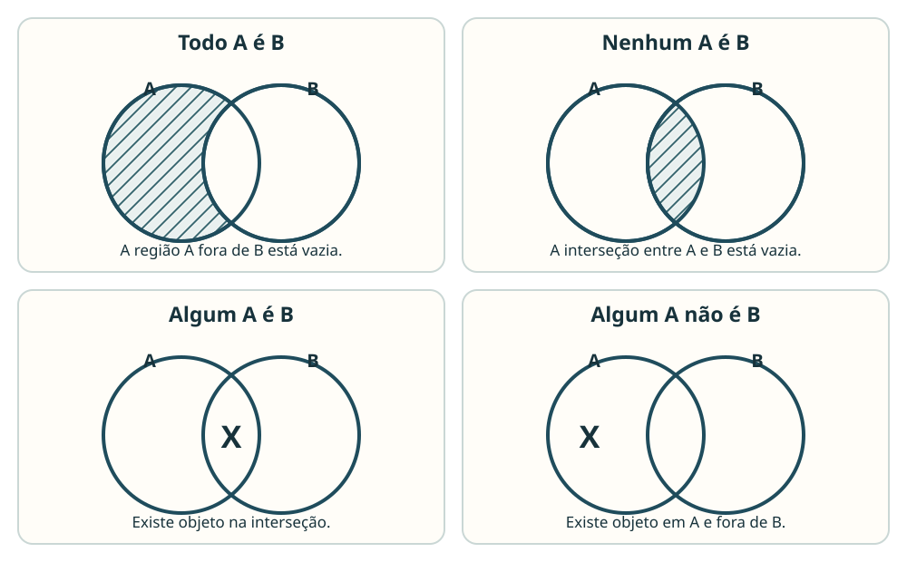

## 1. Mesma regra, outra forma

Considere duas maneiras de escrever uma condição:

$$
p \to q
$$

$$
\neg p \lor q.
$$

À primeira vista, as expressões parecem diferentes. Mas a pergunta importante em lógica é outra: **há alguma atribuição de valores em que uma seja verdadeira e a outra falsa?** Se a resposta for não, elas dizem exatamente a mesma coisa do ponto de vista lógico.

Duas fórmulas $P$ e $Q$ são **logicamente equivalentes** quando recebem o mesmo valor lógico em **todas** as atribuições possíveis de suas proposições simples:

$$
P \equiv Q.
$$

A tabela-verdade confirma isso linha por linha:

| $p$ | $q$ | $p \to q$ | $\neg p \lor q$ |
|:---:|:---:|:---:|:---:|
| V | V | V | V |
| V | F | F | F |
| F | V | V | V |
| F | F | V | V |

Portanto,

$$
p \to q \equiv \neg p \lor q.
$$

Esse critério produz dois hábitos úteis para prova:

- para **provar** equivalência por tabela-verdade, é preciso verificar todas as linhas;
- para **refutar** equivalência, basta uma atribuição em que os valores finais sejam diferentes.

Há ainda um teste equivalente: $P$ e $Q$ são equivalentes exatamente quando $P\leftrightarrow Q$ é uma <abbr title="Fórmula verdadeira em todas as atribuições">tautologia</abbr>.

## 2. Trocar uma parte sem mudar o todo

Uma equivalência funciona como uma substituição segura. Se duas subexpressões têm sempre o mesmo valor, uma pode substituir a outra dentro de uma fórmula maior, desde que o agrupamento seja preservado.

Como

$$
p \to q \equiv \neg p \lor q,
$$

segue que

$$
r \land (p \to q)
\equiv
r \land (\neg p \lor q).
$$

O cuidado é estrutural: equivalência não autoriza apagar termos, mudar conectivos por semelhança visual ou mover parênteses sem uma regra que justifique a transformação. Os parênteses mostram o alcance dos conectivos e, por isso, fazem parte do problema.

## 3. A condicional: transforme a partir do único caso falso

A condicional material $p\to q$ é falsa somente quando $p$ é verdadeira e $q$ é falsa. Logo, dizer que a condicional vale é excluir justamente esse caso:

$$
p\to q
\equiv
\neg(p\land\neg q).
$$

Aplicando De Morgan, que será desenvolvido adiante:

$$
\neg(p\land\neg q)
\equiv
\neg p\lor q.
$$

Assim, as três formas centrais são:

$$
p\to q
\equiv
\neg p\lor q
\equiv
\neg(p\land\neg q).
$$

Essa cadeia é mais segura de memorizar quando se entende o mecanismo: todas as formas proíbem exatamente $p=V$ e $q=F$.

### 3.1. Contrapositiva, conversa e inversa

Parta de:

> Se o processo foi arquivado, então houve decisão.

A <abbr title="Condicional obtida invertendo e negando os dois termos">contrapositiva</abbr> é:

> Se não houve decisão, então o processo não foi arquivado.

Formalmente,

$$
p\to q
\equiv
\neg q\to\neg p.
$$

Compare as três transformações usuais:

| Forma | Expressão | Equivale a $p\to q$? |
|---|---:|:---:|
| <abbr title="Condicional obtida trocando antecedente e consequente">conversa</abbr> | $q\to p$ | não, em geral |
| <abbr title="Condicional obtida negando os termos sem inverter a ordem">inversa</abbr> | $\neg p\to\neg q$ | não, em geral |
| contrapositiva | $\neg q\to\neg p$ | **sim** |

Para ver por que a conversa pode falhar, tome $p=V$ e $q=F$. Nesse caso, $p\to q$ é F, enquanto $q\to p$ é V. Uma única divergência já basta para eliminar a equivalência.

### 3.2. Negar a condicional não é fazer a contrapositiva

Negar $p\to q$ significa afirmar o único cenário em que ela é falsa:

$$
\neg(p\to q)
\equiv
p\land\neg q.
$$

Portanto, ao negar “se $p$, então $q$”, mantém-se $p$ e nega-se $q$, ligados por conjunção. Isso é diferente de obter uma condicional equivalente.

## 4. De Morgan: quando a negação atravessa um agrupamento

Considere:

> Não é verdade que Ana protocolou o pedido **e** Bruno emitiu o recibo.

Para a conjunção inteira ser falsa, basta que ao menos uma de suas partes seja falsa. Logo:

> Ana não protocolou o pedido **ou** Bruno não emitiu o recibo.

Em símbolos:

$$
\neg(p\land q)
\equiv
\neg p\lor\neg q.
$$

Agora negue uma disjunção:

> Não é verdade que Ana protocolou o pedido **ou** Bruno emitiu o recibo.

Como o “ou” é inclusivo, negar a frase exige que as duas alternativas sejam falsas:

> Ana não protocolou o pedido **e** Bruno não emitiu o recibo.

Assim,

$$
\neg(p\lor q)
\equiv
\neg p\land\neg q.
$$

As **leis de De Morgan** fazem, simultaneamente, duas coisas:

1. negam cada componente alcançada pela negação externa;
2. trocam $\land$ por $\lor$, ou $\lor$ por $\land$.

Se apenas as parcelas forem negadas, mas o conectivo não for trocado, a transformação estará errada.

### 4.1. Cadeias e expressões aninhadas

O mesmo mecanismo vale para mais de duas componentes:

$$
\neg(p\land q\land r)
\equiv
\neg p\lor\neg q\lor\neg r,
$$

$$
\neg(p\lor q\lor r)
\equiv
\neg p\land\neg q\land\neg r.
$$

Em fórmulas aninhadas, trabalhe de fora para dentro. Por exemplo:

$$
\neg\bigl(p\lor(q\land r)\bigr)
$$

primeiro vira

$$
\neg p\land\neg(q\land r),
$$

e depois

$$
\neg p\land(\neg q\lor\neg r).
$$

A expressão “nem $p$ nem $q$”, na leitura proposicional usual, corresponde a

$$
\neg p\land\neg q
\equiv
\neg(p\lor q).
$$

## 5. Outras equivalências que simplificam fórmulas

Depois de dominar a direção das transformações, as leis algébricas abaixo ajudam a encurtar expressões sem mudar seu valor lógico.

| Lei | Forma |
|---|---|
| dupla negação | $\neg\neg p\equiv p$ |
| idempotência | $p\land p\equiv p$; $p\lor p\equiv p$ |
| comutatividade | $p\land q\equiv q\land p$; $p\lor q\equiv q\lor p$ |
| associatividade | $(p\land q)\land r\equiv p\land(q\land r)$; idem para $\lor$ |
| distributividade | $p\land(q\lor r)\equiv(p\land q)\lor(p\land r)$ |
| distributividade dual | $p\lor(q\land r)\equiv(p\lor q)\land(p\lor r)$ |
| complemento | $p\lor\neg p\equiv\top$; $p\land\neg p\equiv\bot$ |
| identidade | $p\land\top\equiv p$; $p\lor\bot\equiv p$ |
| absorção | $p\lor(p\land q)\equiv p$; $p\land(p\lor q)\equiv p$ |

O nome da lei é menos importante que reconhecer a transformação válida. Se houver dúvida, a tabela-verdade continua sendo o critério final.

Exemplo:

$$
(p\land q)\lor(p\land\neg q)
$$

Pela distributividade,

$$
p\land(q\lor\neg q).
$$

Como $q\lor\neg q$ é tautologia,

$$
p\land\top\equiv p.
$$

## 6. Bicondicional: igualdade de valores nas duas direções

A bicondicional $p\leftrightarrow q$ é verdadeira quando $p$ e $q$ têm o mesmo valor lógico. Isso pode ser expresso exigindo as duas condicionais ao mesmo tempo:

$$
p\leftrightarrow q
\equiv
(p\to q)\land(q\to p).
$$

Também pode ser escrita separando os dois casos em que os valores coincidem:

$$
p\leftrightarrow q
\equiv
(p\land q)\lor(\neg p\land\neg q).
$$

Negá-la seleciona os casos em que os valores são diferentes:

$$
\neg(p\leftrightarrow q)
\equiv
(p\land\neg q)\lor(\neg p\land q).
$$

Essa última expressão é a <abbr title="Disjunção verdadeira quando exatamente uma alternativa é verdadeira">disjunção exclusiva</abbr>.

## 7. Um fluxo seguro para transformar fórmulas

Quando a questão pedir uma forma equivalente, proceda nesta ordem:

1. preserve os parênteses e localize o conectivo principal;
2. elimine $\to$ ou $\leftrightarrow$ se isso aproximar a fórmula do que se deseja;
3. aplique De Morgan respeitando o alcance da negação;
4. elimine duplas negações;
5. procure complementos, identidade, distributividade ou absorção;
6. registre apenas passos apoiados em equivalências válidas;
7. se restar dúvida, compare tabelas-verdade ou busque uma atribuição divergente.

Por exemplo:

$$
\neg(p\to q)
\equiv
\neg(\neg p\lor q)
\equiv
\neg\neg p\land\neg q
\equiv
p\land\neg q.
$$

O valor desse encadeamento não está em decorar quatro linhas, mas em poder justificar cada passagem.

## 8. Diagramas lógicos: de frases para regiões

A segunda parte do assunto muda a unidade representada. Nas fórmulas proposicionais, $p$ e $q$ representam afirmações inteiras. Nos diagramas, $A$, $B$ e $C$ representam **classes de objetos**.

A pergunta deixa de ser “qual é o valor desta fórmula?” e passa a ser: **quais regiões precisam estar vazias, quais precisam conter algum objeto e o que isso obriga a concluir?**

Neste material, a convenção operacional é:

- região **hachurada**: não há objeto naquela região;
- **X**: existe ao menos um objeto naquela região;
- região em branco: a existência não foi determinada;
- X sobre uma fronteira: existe um objeto, mas as premissas não determinam em qual das sub-regiões adjacentes ele está.

## 9. As quatro formas categóricas básicas

As palavras “todo”, “nenhum” e “algum” não servem apenas como rótulos: cada uma impõe uma restrição diferente ao diagrama.

| Afirmação | O que deve aparecer no diagrama |
|---|---|
| Todo $A$ é $B$ | a região de $A$ fora de $B$ fica vazia |
| Nenhum $A$ é $B$ | a região $A\cap B$ fica vazia |
| Algum $A$ é $B$ | há um X em $A\cap B$ |
| Algum $A$ não é $B$ | há um X em $A\setminus B$ |

### 9.1. “Todo A é B”: inclusão, não igualdade

“Todo $A$ é $B$” significa:

$$
A\subseteq B.
$$

A parte de $A$ que ficaria fora de $B$ deve estar vazia. A frase não autoriza inverter a relação. De “todo auditor é servidor” não se conclui “todo servidor é auditor”.

### 9.2. “Nenhum A é B”: interseção vazia

“Nenhum $A$ é $B$” significa:

$$
A\cap B=\varnothing.
$$

A exclusão é simétrica: se nenhum $A$ é $B$, também nenhum $B$ é $A$.

### 9.3. “Algum”: existência efetiva

“Algum $A$ é $B$” exige:

$$
A\cap B\neq\varnothing.
$$

Já “algum $A$ não é $B$” exige:

$$
A\setminus B\neq\varnothing.
$$

Em ambos os casos, a palavra “algum” introduz existência: há pelo menos um objeto na região indicada.

## 10. Universal restringe; existencial coloca X

No método de diagramas de Venn adotado aqui, uma premissa universal como “todo $A$ é $B$” **restringe regiões**, mas não cria um objeto por si só. Portanto, ela não basta para concluir “algum $A$ é $B$”.

Uma premissa existencial, como “algum”, autoriza inserir X. Informação sobre um indivíduo determinado também pode fornecer existência. Se a questão declarar outra convenção, siga expressamente o enunciado.

Essa distinção evita um erro frequente: confundir “não pode haver elemento aqui” com “há necessariamente elemento ali”. Hachura fala de impossibilidade; X fala de existência.

## 11. Negar frases categóricas: procure o que derruba a afirmação

Negar uma universal exige um contraexemplo. Negar uma afirmação existencial exige eliminar todos os casos daquele tipo.

| Afirmação | Negação correta |
|---|---|
| Todo $A$ é $B$ | Algum $A$ não é $B$ |
| Nenhum $A$ é $B$ | Algum $A$ é $B$ |
| Algum $A$ é $B$ | Nenhum $A$ é $B$ |
| Algum $A$ não é $B$ | Todo $A$ é $B$ |

Por exemplo, para tornar falsa a frase “todo auditor é servidor”, não é preciso que nenhum auditor seja servidor. Basta existir **um** auditor que não seja servidor.

## 12. Três classes: restrinja antes de posicionar existência

Com três classes, cada região pode se subdividir conforme pertença ou não à terceira classe. Um X colocado cedo demais pode parecer determinado quando, na verdade, duas posições continuam possíveis.

Use este procedimento:

1. desenhe as sobreposições ainda compatíveis com as premissas;
2. aplique primeiro as universais, hachurando as regiões proibidas;
3. depois posicione os X exigidos pelas premissas existenciais;
4. se um X puder ocupar duas sub-regiões, mantenha-o sobre a fronteira pertinente;
5. não acrescente inclusão, exclusão ou existência que as premissas não forneçam.

A ordem “restrições antes de existências” reduz escolhas artificiais feitas apenas para favorecer uma conclusão.

## 13. Padrões de inferência que o diagrama torna visíveis

### 13.1. Inclusões encadeadas

Se

$$
A\subseteq B
\quad\text{e}\quad
B\subseteq C,
$$

então

$$
A\subseteq C.
$$

Assim, de “todo auditor é servidor” e “todo servidor é capacitado” segue “todo auditor é capacitado”.

### 13.2. Existência no conjunto menor sobe para o maior

Premissas:

1. Todo auditor é servidor.
2. Algum auditor é gestor.

O objeto que é auditor e gestor também precisa ser servidor. Logo, **algum servidor é gestor**.

### 13.3. Existência no conjunto maior não desce para o menor

Premissas:

1. Todo auditor é servidor.
2. Algum servidor é gestor.

O servidor gestor pode estar fora da classe dos auditores. Portanto, não é necessário concluir que algum auditor seja gestor.

### 13.4. Inclusão combinada com exclusão

Se todo $A$ é $B$ e nenhum $B$ é $C$, então nenhum $A$ é $C$: tudo o que pertence a $A$ está dentro de uma classe já excluída de $C$.

### 13.5. Existência combinada com exclusão

Se algum $A$ é $B$ e nenhum $B$ é $C$, o objeto existente em $A\cap B$ necessariamente está fora de $C$. Logo, algum $A$ não é $C$.

## 14. Necessário, possível e incompatível

Um diagrama não serve para mostrar apenas uma configuração conveniente. Ele serve para representar **todas as configurações permitidas pelas premissas**.

Uma conclusão é:

- **necessária**: verdadeira em todos os diagramas compatíveis com as premissas;
- **possível**: verdadeira em pelo menos um diagrama admissível, mas não em todos;
- **incompatível**: viola alguma restrição das premissas.

Para refutar que uma conclusão é necessária, basta construir **um** diagrama compatível em que ela seja falsa. Esse é o equivalente diagramático do contraexemplo usado para refutar uma equivalência lógica.

## 15. Como atacar questões deste assunto

### Quando houver fórmulas

1. identifique o conectivo principal e o alcance das negações;
2. escolha a equivalência que aproxima a expressão do objetivo;
3. transforme uma etapa por vez;
4. preserve os agrupamentos;
5. procure uma linha divergente se quiser refutar uma equivalência.

### Quando houver classes e diagramas

1. identifique quais termos nomeiam classes;
2. traduza “todo”, “nenhum”, “algum” e “algum não” em regiões vazias ou existentes;
3. aplique universais antes das existenciais;
4. preserve X indeterminado quando mais de uma posição continuar possível;
5. teste se a conclusão vale em todos os diagramas compatíveis, não apenas no desenho mais favorável.

O fio comum entre as duas partes do capítulo é o mesmo: **uma conclusão só é necessária quando não existe uma configuração admissível que a derrube**.
